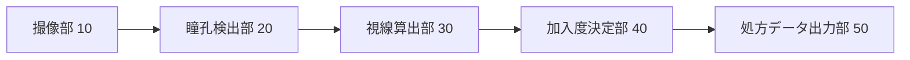

# patent-draft — 明細書の下書きを起こす

**出力は下書きである。法的助言ではない。** 出願の可否と記載の適否は人間が判断する。

## 前提

- `GET $BASE/api/matters/:id/disclosure` — 発明開示（課題・手段・効果・実施形態）
- `GET $BASE/api/matters/:id/elements` — 構成要件
- `GET $BASE/api/matters/:id/evidence` — 典拠（**`quoteCheck='verified'` のものだけ使う**）
- `GET $BASE/api/matters/:id/assessments` — 特許性の判断

## 節と、それぞれの書き方

`PUT $BASE/api/matters/:id/drafts` に `{"section": "...", "markdown": "..."}` で節ごとに保存する。
節の名前は施行規則の見出しに 1:1 で対応している。

| section | 見出し | 書くこと |
|---|---|---|
| `title` | 発明の名称 | 発明の対象を端的に。範囲を狭める語を入れない |
| `technical_field` | 技術分野 | 1〜2 文 |
| `background_art` | 背景技術 | **典拠のある公報だけ**を引く。段落番号まで書く |
| `prior_art_documents` | 先行技術文献 | 【特許文献1】特開2018-134274 の形で列挙 |
| `problem` | 発明が解決しようとする課題 | 背景技術の何が足りないのか。ここが弱いと進歩性が組めない |
| `solution` | 課題を解決するための手段 | **請求項と対応させる。** 構成要件を漏れなく含める |
| `advantageous_effects` | 発明の効果 | 課題と 1:1 で対応させる |
| `brief_description_of_drawings` | 図面の簡単な説明 | 【図1】…の形 |
| `description_of_embodiments` | 発明を実施するための形態 | **実施可能要件（36条4項1号）を満たす具体性**で書く |
| `examples` | 実施例 | 数値・条件を具体的に |
| `industrial_applicability` | 産業上の利用可能性 | 1 文 |
| `reference_signs` | 符号の説明 | 10 撮像部、12 制御部…の形 |
| `claims` | 特許請求の範囲 | 下記の注意を守る |
| `abstract` | 要約 | **400 字以内**（超えると電子出願でエラー）。200 字以上が望ましい |

## 請求項を書くときの注意

- **構成要件の記号（A・B・C…）と 1:1 で対応させる。** 対応が崩れると、
  クレームチャートで積んだ典拠がどの要件のものか言えなくなる
- **マルチマルチクレームを作らない**（施行規則24条の3第5号、令和4年4月1日施行）。
  2 つ以上を択一的に引用する請求項を、2 つ以上を択一的に引用する請求項が引用してはならない
- 請求項を保存すると機械が検査する:
  `PUT $BASE/api/matters/:id/claims` → `multiMultiClaims` が空でないなら直す
- ソフトウェア関連発明では、**ハードウェア資源との協働**が読み取れるように書く
  （審査基準 附属書B 第1章。29条1項柱書の発明該当性）

## 図

Mermaid のコードブロックで書いてよい。装置の構成なら `flowchart`、処理の流れなら
`sequenceDiagram` か `flowchart`。**図に描いたものは必ず本文にも書く**（図だけにある構成は
記載として弱い）。

````markdown

````

## 書いたあとに確かめること

1. **請求項の全構成要件が、実施形態に具体的に書かれているか**（実施可能要件）
2. **請求項の範囲が、実施形態で裏付けられた範囲を超えていないか**（サポート要件）
3. **用語が一義的に読めるか**（明確性要件）
4. 要約が 400 字以内か（画面が字数を出す）
5. 背景技術で引いた公報が、すべて照合済みの典拠から来ているか

## やってはいけないこと

- 典拠のない公報を背景技術に引く
- 実施形態を書かずに請求項だけ広げる
- 「〜が好ましい」だけで数値範囲の裏付けを書かない
- 未出願の発明の本文を外部の LLM へ送る
- 「出願する」「提出する」操作をしようとする（このシステムは書き出すところまでで、
  提出は人間が別の手段で行う）
