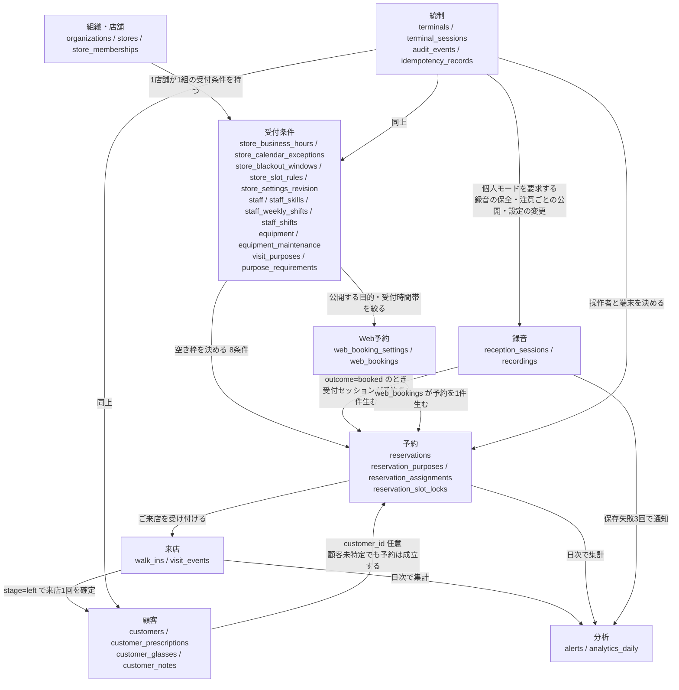
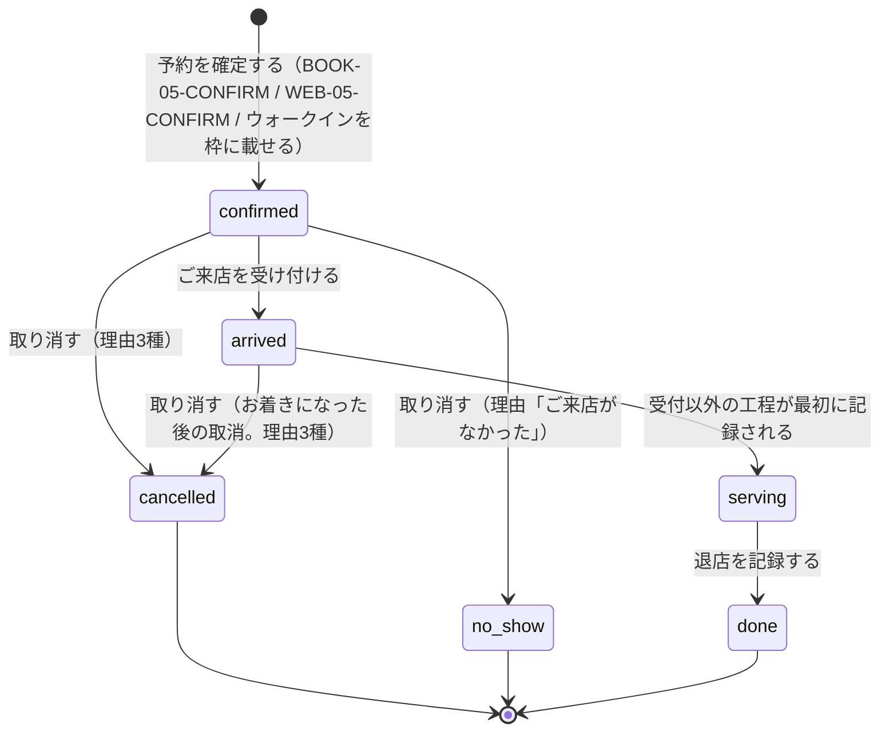
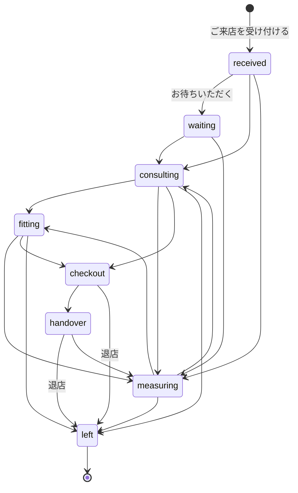
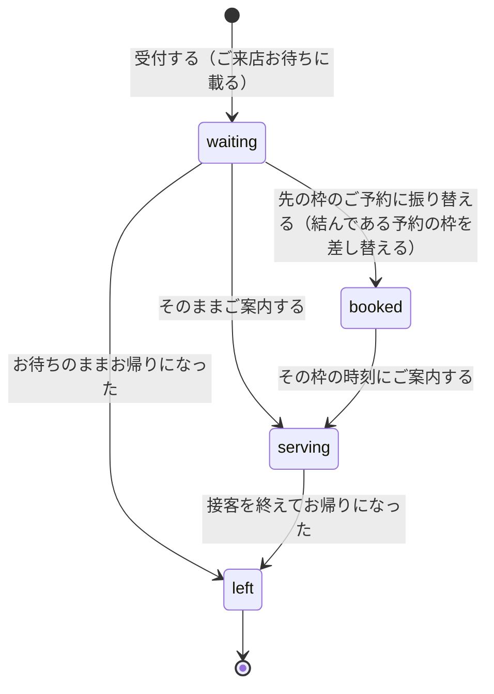
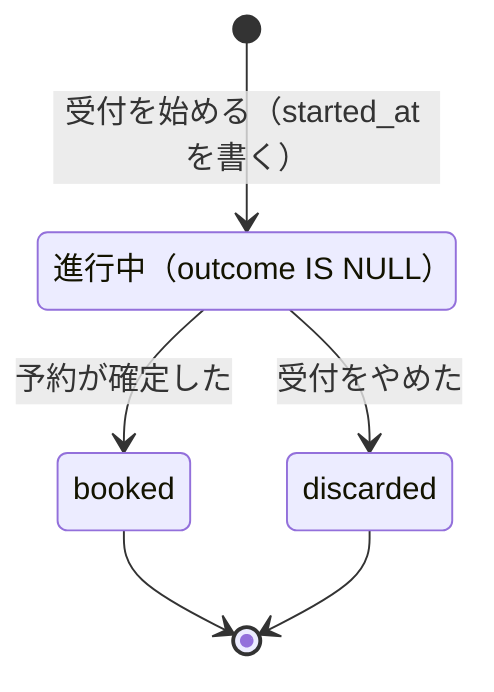
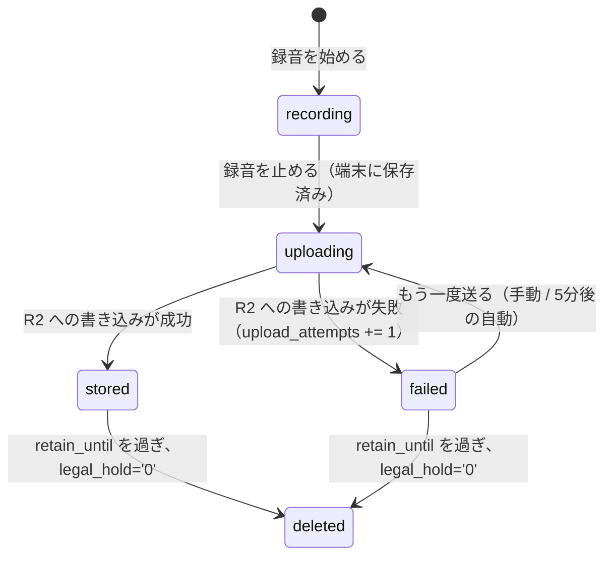
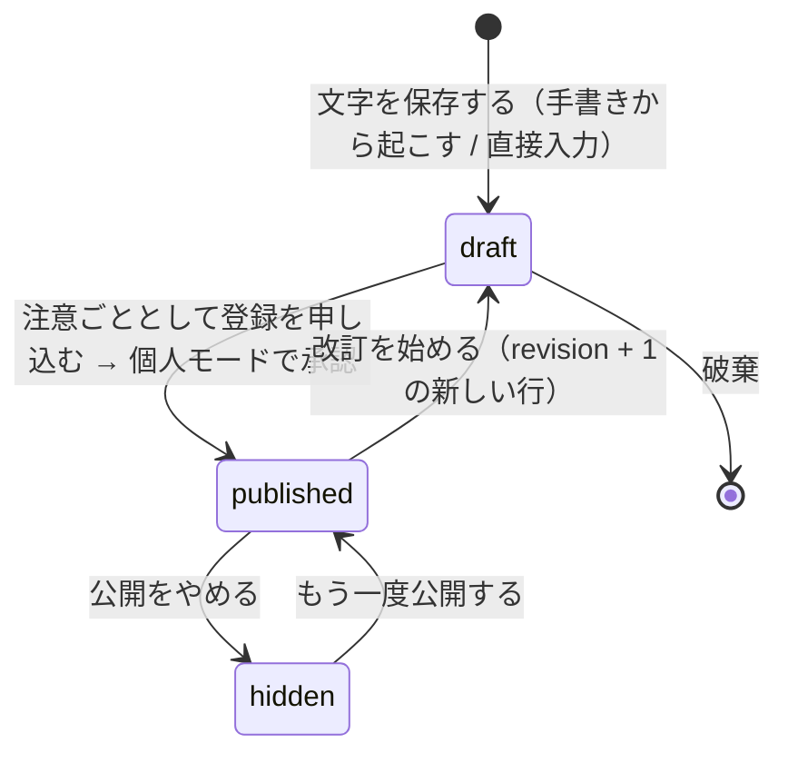
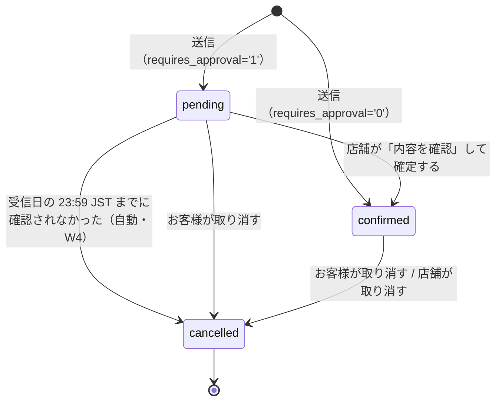
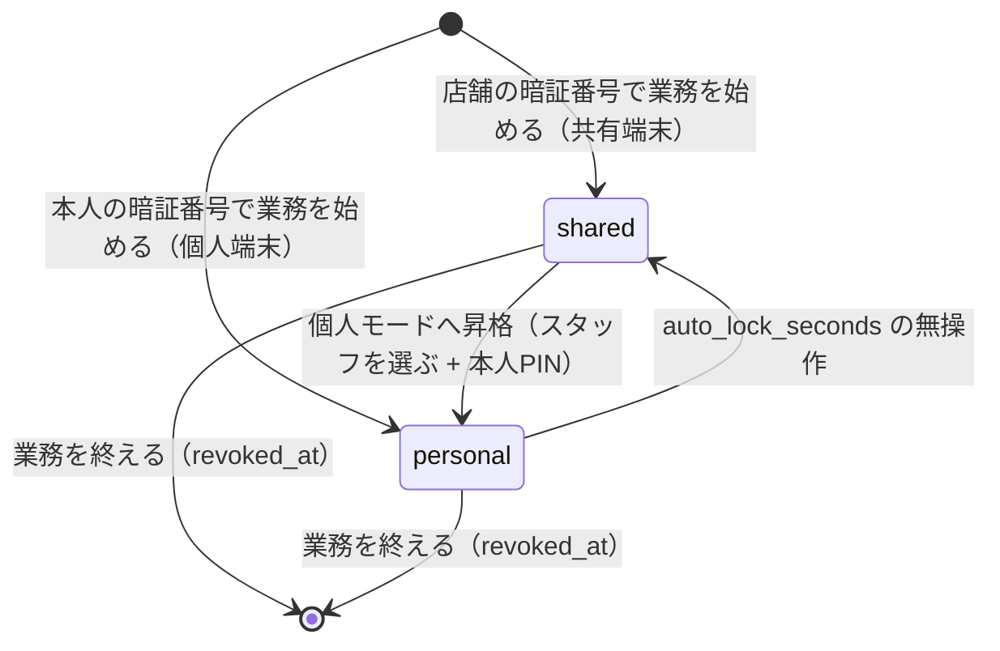

# 02 ドメインモデル — glasses_management（EYE予約）

- サービス: `services/glasses_management` (`@app/glasses_management`)
- 位置づけ: 決定ブリーフ §2「ドメインの言葉」と §3「データモデル」を、実装が迷わない粒度まで展開した文書。
- 上流: `design/01-requirements.md` / 下流: `design/03-data-model.md`（テーブル定義）・`design/04-api.md`（エンドポイントとエラー）・`design/06-use-cases.md`。
- 見た目の根拠: `docs/frontend/mockups/eye/screens/*.html` と `docs/frontend/mockups/eye/images/*.png`。本文で「モック」と言うときはこれを指す。
- UC/AC の**定義**は各 `spec.md` にのみ置く。本書に定義形の bullet（`- UC-XXX-01: ...`）を書かない。参照するときは `UC-XXX-01（本文中で参照）` の形にする。

---

## 1. 全体像

### 1.1 集約と依存



### 1.2 集約の一覧

| 集約 | 集約ルート | 含むテーブル | 一貫性の単位（`db.batch()` の範囲） | 主なフェーズ |
|---|---|---|---|---|
| 組織・店舗 | `organizations` / `stores` | `organizations` `stores` `store_memberships` | 組織スナップショットの upsert 1件／店舗担当の upsert 1件 | P0 |
| 受付条件 | `stores` | `store_business_hours` `store_calendar_exceptions` `store_blackout_windows` `store_slot_rules` `store_settings_revision` `staff` `staff_skills` `staff_weekly_shifts` `staff_shifts` `equipment` `equipment_maintenance` `visit_purposes` `purpose_requirements` | 1画面の「保存」で変わる行すべて ＋ `store_settings_revision` の版を進める1文（§5.4） | P1 |
| 予約 | `reservations` | `reservations` `reservation_purposes` `reservation_assignments` `reservation_slot_locks` | 予約1件＋その目的行＋その割り当て行＋**その枠のロック行**（§4 の「枠の一次排他」） | P2・P3・P6 |
| 来店 | `walk_ins` / `visit_events` | `walk_ins` `visit_events` | 進捗イベント1行＋`reservations.status` の更新 | P5 |
| 顧客 | `customers` | `customers` `customer_prescriptions` `customer_glasses` `customer_notes` | 統合のときだけ2顧客にまたがる | P4 |
| 録音 | `reception_sessions` | `reception_sessions` `recordings` | セッション1件＋録音1件 | P7（表の新設は `reception_sessions` が **P3**・`recordings` が P7） |
| Web予約 | `web_bookings` | `web_booking_settings` `web_bookings` | Web予約1件＋生成する予約1件 | P8 |
| 分析 | なし（読み取り専用の集計） | `alerts` `analytics_daily` | 日次集計1回分 | P9（表の新設は `alerts` が **P7**・`analytics_daily` が P9） |
| 統制 | `terminals` | `terminals` `terminal_sessions` `audit_events` `idempotency_records` | セッション1件、監査1行 | P10 |

**「主なフェーズ」は集約の主用途であって、表を作るフェーズではない。** 表の新設フェーズの正本は
`design/03-data-model.md` §12 のマイグレーション表で、集約の主用途と前後することがある。
ずれるのは 3 つだけ — `reservation_slot_locks`（表は P2。読む側の空き枠エンジンが先に要る。書く側の予約確定は P3）／
`reception_sessions`（表は **P3**。予約 5 工程の下書き `draft_json` の置き場所が P3 で要る。受付履歴の面は P5）／
`alerts`（表は **P7**。録音の失敗を積む先が P7 で要る。分析の面は P9）。
36 表の全量とフェーズは 03 §2 / §12 を見る。

### 1.3 集約をまたぐときの決め

| 決め | 内容 |
|---|---|
| 参照は ID のみ | FK を宣言しない。存在確認が要る箇所は明示的に `SELECT` して確かめる。 |
| 更新は集約1つずつ | 1リクエストで2つ以上の集約ルートを更新してよいのは「来店イベント→予約 status」「Web予約→予約」「顧客統合」の3つだけ。 |
| 監査は横断 | `audit_events` はどの集約の操作でも同じ形で1行残す。集約に属さない。 |
| テナント境界 | 全テーブルの全クエリを `organization_id`（JWT の `org`）でスコープする。body / query / path の組織 ID を認可の根拠にしない。 |
| 店舗境界 | 予約・来店・受付セッション・録音・設定・分析・アラートは、`organization_id` に加えて「選択中店舗」の `store_id` でもスコープする。 |
| 店舗境界の例外 | 次は組織単位で、店舗をまたいで見える。①**顧客**（`customers` / `customer_prescriptions` / `customer_glasses` / `customer_notes`。CUSTOMER-HANDWRITE の3枚目が「丸の内店　記入 中村 彩」、§3.6 の `published` な注意ごとは「その組織の全店舗」で読ませる）②`visit_purposes.store_id IS NULL` のチェーン共通の目的。子テーブルが持つ `store_id` は「どの店舗で記録したか」を表すだけで、絞り込みの条件にしない。 |

---

## 2. 主要な概念の定義

### 2.1 決定ブリーフ §2 の展開

| 用語 | 対応するデータ | 定義（実装が守る条件） | 画面での出方 |
|---|---|---|---|
| 選択中店舗 | `stores.id`（端末セッションが保持） | 予約・台帳・検索・設定・分析の操作対象となる1店舗。切り替えはヘッダーの明示操作のみで、画面遷移では変わらない。 | ヘッダー「EYE 銀座店」 |
| ご来店の目的 | `visit_purposes` | 予約の用件。`duration_minutes` と `purpose_requirements`（必要な技能・必要な設備種別）を持つ。名前を 3 つ持つ — 社内名 `name_internal`／お客様向け名 `name_public`／台帳の帯に出す短い名前 `name_short`。**`name_public` の正本は SETTINGS-PURPOSE の「お客様に見せる名前」列**（新しいメガネを作る／かけ具合の調整／できあがりの受け取り／修理・部品の交換／コンタクトのご相談／視力測定）。初期セットは 6 件で、「フィッティング」は目的ではなく技能である。 | LEDGER-DETAIL「ご用件 メガネを新しく作る」／SETTINGS-PURPOSE |
| 担当 | `staff` ＋ `reservation_assignments(kind='staff')` | 接客するスタッフ。`staff_skills` で技能を持つ。`target_id IS NULL` は「あとで決める」を表し、これも枠を消費する。 | LEDGER-DETAIL「担当が未定」「あとで決める」／LEDGER-LIST の担当列「決めてください」 |
| 設備・場所 | `equipment` ＋ `reservation_assignments(kind='equipment')` | 視力測定機 A・視力測定機 B・検査室 1（`kind='measure'`）／相談カウンター 1・相談カウンター 2・フィッティング台（`kind='counter'`）／加工室（`kind='workbench'`）の 7 件が初期セット（決定ブリーフ §12.3 が正。§11 の 5 件は誤り）。1予約が0本以上を同時に押さえる。 | LEDGER-DETAIL「場所 視力測定機 A ／ 相談カウンター 2」 |
| ウォークイン | `walk_ins` | 予約なしの来店。`customer_id IS NULL` のまま受付・接客を開始・完了できる。`ticket_no` で呼び分ける。 | LEDGER-WALKIN「ウォークイン 004　受付 11:02　お待ち 6分」 |
| 受付セッション | `reception_sessions` | 受付開始から予約確定（`outcome='booked'`）または破棄（`outcome='discarded'`）までの記録単位。破棄でも行を消さない。 | BOOK-01〜04d と CHANGE-DATETIME / CHANGE-DIFF は下帯（`.stepbar` の右端）の「録音中 mm:ss」、BOOK-05-CONFIRM は右下の常駐表示。BOOK-06-DONE には出さない |
| 来店回数 | `customers.visit_count` | その顧客の `reservations.status='done'` の件数。`first_visit_at` / `last_visit_at` も done の予約 `starts_at` の最小・最大。 | 名前の右の札「4回目」「初めて」 |
| 共有端末 | `terminals.kind='shared'` | レジ横などに置く店舗共用 iPad。日常業務（予約を受ける・台帳を見る・ご来店を受け付ける）は個人ログイン不要。 | LOGIN-SHARED-PIN「個人を選ばずにできる」 |
| 個人モード | `terminal_sessions.mode='personal'` | 共有端末で本人 PIN を入れて昇格した状態。`terminals.auto_lock_seconds` の無操作で `shared` に戻る。 | MODE-PERSONAL／HOME-SHARED-LOCKED |

### 2.2 本書で足す言葉

| 用語 | 対応するデータ | 定義 |
|---|---|---|
| 予約コード | `reservations.code` | `EY-YYMM-NNNN`。`YYMM` は `starts_at` の JST 年下2桁＋月2桁、`NNNN` は同一 `organization_id` 内のその年月の連番（4桁ゼロ埋め）。例: `EY-2608-0142`。**採番は作成時の1回だけで、以後 `starts_at` を変えても振り直さない**（CHANGE-DONE「予約番号は変わりません」）。`NNNN` が 9999 に達したら 5 桁へ桁上げする。5 回再試行しても取れなければ 500 ではなく `code_exhausted` を返す。 |
| Web予約コード | `web_bookings.public_code` | `EY-W-YYMM-NNNN`。例: `EY-W-2608-0031`。**`reservations.code` とは別列・別系統で採番する**（同じ連番なら `EY-W-2608-0031` と `EY-2608-0142` が同月に共存しない）。表示のときだけ `W` を足す案は採らない。 |
| 確認番号 | `web_bookings.management_code_hash` | Web予約のお客様が変更・取り消しのときに使う本人確認の番号。**画面とメールに出す語は「確認番号」**に統一する（「管理コード」はモック 68 画面に 1 件も無い。`managementCode` / `management_code_hash` は実装の中だけの名前）。平文は保存せず、発行時の応答とメールにだけ載せる。 |
| お客様番号 | `customers.customer_number` | `G-NNNNN`。組織内の 5 桁連番。例: `G-01842`。統合で使えなくなった番号は再利用しない（CUSTOMER-MERGE「G-02310 は使えなくなります」）。 |
| 録音番号 | `recordings.code` | `EY-R-NNNN`。組織内の 4 桁連番。例: `EY-R-1482`。ALERTS が予約番号ではなくこの番号で録音を指す（予約は成立しているため予約番号では指せない）。 |
| ウォークイン番号 | `walk_ins.ticket_no` | 3桁ゼロ埋め。同一 `store_id` × `arrived_at` の JST 日付ごとに `001` から採番する。例: `ウォークイン 004`。 |
| 空き枠 | 導出値（テーブルを持たない） | 決定ブリーフ §4 の8条件の積。`src/worker/domain/availability.ts` の純関数で、現在時刻は引数で注入する。 |
| 注意ごと | `customer_notes.kind='attention'` かつ `status='published'` | 接客前に必ず読ませる申し送り。`kind='memo'` は接客メモで、注意ごととしては数えない。 |
| 統合 | `customers.merged_into_id` | 同一人物の重複登録を1件へ寄せる操作。取り消せない。 |
| 最低保持期限 | `recordings.retain_until` | この時刻より前の削除要求は拒否する。`legal_hold='1'` の間はこの時刻を過ぎても削除しない。 |
| ご来店中 | 導出値 | `reservations.status ∈ {arrived, serving}` または `walk_ins.status ∈ {waiting, serving}` の集合。RECEPTION-JOURNEY のトグル「ご来店中」と「ご来店中 4名」の分母。 |

### 2.3 来店回数の表示規則（モック根拠）

| `visit_count` | 表示 | 札の色（実装は `packages/ui/src/theme.css` のトークン経由。括弧内はモックの `.visits` クラス） | モック上の例 |
|---|---|---|---|
| 0 | 初めて | 枠 `--color-walkin` / 地 `--color-walkin-soft` / 字 `--color-walkin`（`.visits.first`） | 山口 真央 様・川上 恵 様 |
| 1〜2 | N回目 | 枠 `--color-line-strong` / 地 `--color-surface` / 字 `--color-ink-muted`（`.visits`） | 伊藤 健 様（2回目）・相川 みどり 様（2回目） |
| 3以上 | N回目 | 枠 `--color-pine-line` / 地 `--color-pine-soft` / 字 `--color-pine-deep`（`.visits.many`） | 田中 花子 様（4回目）・松本 一郎 様（7回目） |

CUSTOMER-DETAIL は同じ値を「ご来店 4回」と数詞で出す。表示文言が2通りあるだけで、値は `visit_count` 一つである。

**札の「N回目」の N は当日の来店を含めない。** 田中 花子 様は8月27日 11:00 の予約に対して「4回目」と出るが、CUSTOMER-DETAIL の「ご来店 4回」「最後のご来店 2026年5月12日」と同じ値であり、8月27日はまだ数に入っていない。実装で `visit_count + 1` を出さない。

---

## 3. 状態遷移

### 3.1 予約 `reservations.status`



#### 遷移の表

| # | 遷移 | 起点の画面と操作 | 実行できる者 | 同時に起きること | 逆行 |
|---|---|---|---|---|---|
| R1 | （新規）→ `confirmed` | BOOK-05-CONFIRM「復唱を終えて予約を確定する」／WEB-05-CONFIRM「この内容で予約する」／LEDGER-WALKIN「受付して台帳に載せる」（ウォークインを枠に載せる操作。§3.3 のとおり `walk_ins` の行を同時に作る） | 共有モードで可 | `code` 採番、`reservation_purposes` と `reservation_assignments` の作成、**`reservation_slot_locks` の上限つき条件付き INSERT**（§4「枠の一次排他」。取れなければ 409 `slot_taken`）、`reception_sessions.outcome='booked'`（BOOK フロー経由のとき）。ウォークイン経由なら `walk_ins` も同じ batch（I-33） | — |
| R2 | `confirmed` → `arrived` | LEDGER-DETAIL「ご来店を受け付ける」／LEDGER-LIST 左端「ご来店」／RECEPTION-CHECKIN「ご来店を受け付ける」「お待ちいただく」 | 共有モードで可 | `visit_events(stage='received')` を1行、「お待ちいただく」ならさらに `stage='waiting'` を1行 | 不可（下表 F1） |
| R3 | `arrived` → `serving` | RECEPTION-JOURNEY で `received` / `waiting` 以外の工程が最初に記録されたとき | 共有モードで可 | `visit_events` を1行 | 不可 |
| R4 | `serving` → `done` | 退店の記録 | 共有モードで可 | `visit_events(stage='left')`、`customers.visit_count += 1`、`customers.last_visit_at` 更新 | 不可（下表 F2） |
| R5 | `confirmed` → `cancelled` | CHANGE-CANCEL「この予約を取り消す」で理由が「お客様のご都合」「店舗の都合」「予約の重複」のいずれか | 共有モードで可 | `cancelled_at` と `cancel_reason` を書き、**同じ batch で `reservation_slot_locks` の該当行を DELETE** して枠を即座に解放する（§4「枠の一次排他」。版のガードを全文に配らないと、409 のときにロックだけが消えて二重予約になる） | 不可（下表 F3） |
| R6 | `confirmed` → `no_show` | CHANGE-CANCEL「この予約を取り消す」で理由が「ご来店がなかった」 | 共有モードで可 | 同上。分析では「無断キャンセル」として `cancelled` と別に数える | 不可 |
| R7 | `arrived` → `cancelled` | CHANGE-CANCEL「この予約を取り消す」で理由が「お客様のご都合」「店舗の都合」「予約の重複」のいずれか | 共有モードで可 | R5 と同じ（`cancelled_at` / `cancel_reason` / 枠の解放）。加えて `visit_events` に `stage='left'` を1行足し、来店中の集合から外す。`visit_count` は増やさない（R4 を通っていないため） | 不可（下表 F3） |

- **R7 を許すのは、お着きになった後の取り消しが業務として実際に起こるためである。** 受付を済ませた直後に
  「やはり今日はやめます」と言われる、二重に受け付けたことに気づく、といった場面で CHANGE-CANCEL をその日の予約に使う。
  R7 を禁じると CHANGE-CANCEL が当日の予約に対して 1 件も使えなくなる。`arrived → no_show` は許さない
  （お客様は現に来店されているので「ご来店がなかった」は成立しない）。`serving` からの取消も許さない（下表 F4）。
- R5 と R6 は同じ画面・同じボタンで、選んだ理由だけが `status` を分ける。ANALYTICS-CANCEL が取り消しの内訳を積み上げで出していることが根拠である。
- `cancel_reason` は CHANGE-CANCEL の4択（「お客様のご都合」「店舗の都合」「予約の重複」「ご来店がなかった」）をそのまま持つ。**理由の選択は必須**とし、未選択から始める（任意にすると空欄が最大の分類になる）。
- **ANALYTICS-CANCEL の積み上げは `cancel_reason` で 5 本に割る。** 凡例の文字は CHANGE-CANCEL の 4 択と 1 字も違えない — 「お客様のご都合」（`cancel_reason='customer'`）／「店舗の都合」（`'store'`）／「予約の重複」（`'duplicate'`）／「ご来店がなかった」（`status='no_show'`）／「Webからの取消」（`source='web'` の取消）。モックの凡例「お客様都合」は Web 以外の取消を全部ひとまとめにしてしまい、**店側の都合で取り消した予約が「お客様都合」に化ける**ので採らない。列は既にあるので正しく分けられる。
- `cancel_reason` は R5 / R6 / R7 のときだけ値が入る。それ以外の遷移では `NULL` のままにする。
- R2〜R4 は録音・PIN を要求しない。LOGIN-SHARED-PIN が「個人を選ばずにできる」側に「ご来店を受け付ける」を置いているためである。

#### 禁止する遷移

| # | 禁止する遷移 | 返す結果 | 理由 |
|---|---|---|---|
| F1 | `arrived` / `serving` → `confirmed` | 409 | 受付の取り消し操作がモックに無い。誤操作は監査を残したうえで新しい予約を作り直す。 |
| F2 | `done` → いずれか | 409 | `visit_count` を二重に増やさない。 |
| F3 | `cancelled` / `no_show` → いずれか | 409 | CHANGE-CANCEL に「取り消した予約は元に戻せません」と明記されている。復帰は新しい予約の作成として扱う。 |
| F4 | `serving` → `cancelled` / `no_show`、および `arrived` → `no_show` | 409 | 接客が始まった予約の取り消しはモックに導線が無く、`no_show`（ご来店がなかった）は受付済みの予約と両立しない。受付直後の取り消しは R7 で許す。 |
| F5 | 段飛ばし（`confirmed` → `serving` / `confirmed` → `done`） | 409 | 盤面の「済みました」が受付から順に埋まる前提を壊さない。 |

**F1 は禁止のままにする。** 受付を誤って押した直後の取り消し（`arrived → confirmed`）は許さない。
モックに導線が無く、「取り消して受け直す」で足りるためである。誤操作は監査を残したうえで新しい予約を作り直す。

#### 内容の変更（`status` を変えない更新）

CHANGE-DATETIME / CHANGE-DIFF による日時・担当・場所・用件・メモの変更は `status='confirmed'` のときだけ受け付け、`reservations.version` を +1 する。`arrived` 以降の**内容の**変更は 409 とする（上表 F1 と同じ理由）。R7（`arrived → cancelled`）は内容の変更ではなく状態遷移なので、この制限に当たらない。

### 3.2 来店進捗 `visit_events.stage`

`visit_events` は**追記専用の記録**である。行を更新も削除もしない。「いまどの工程か」は `(subject_type, subject_id)` ごとの `occurred_at` 最大の行から導く。



#### 工程の順序についての決め

| 決め | 根拠 |
|---|---|
| `received` が必ず最初の1件で、`left` が必ず最後の1件になる。 | RECEPTION-JOURNEY の全4行が「受付 済みました」から始まる。`left` が来ると「ご来店中」から外れる。 |
| `received` と `left` のあいだの工程は**順序を持たず、いくつでも飛ばせる**。 | 伊藤 健 様が「フレーム選び」「視力測定」を記録せずに「レンズ・お会計 11:01 済みました」→「お渡し 11:04〜 対応中」へ進んでいる。 |
| 同じ工程を2回以上記録してよい。表示には最新の1件だけを使う。 | 視力測定のやり直しを禁止する根拠がモックに無い。 |
| `waiting` は列を持たない。次に来る工程の列に「お待たせ中 N分」として重ねる。 | ウォークイン 003 の「お待たせ中 18分」が「ご相談」列に出ている（受付 10:50 から現在 11:08 まで18分）。 |

#### 盤面の列と `stage` の対応

| RECEPTION-JOURNEY の列 | `stage` | 根拠 |
|---|---|---|
| 受付 | `received` | 列名。全行が「済みました＋時刻」を持つ |
| ご相談 | `consulting` | 列名 |
| フレーム選び | `fitting` | 列と 1 対 1 |
| 視力測定 | `measuring` | 列名。「次にやること 視力測定機 A / B」が設備割り当てと一致 |
| レンズ・お会計 | `checkout` | 列名 |
| お渡し | `handover` | 列と 1 対 1。**決定ブリーフ §3.3 の 7 値に足した 8 つ目の値である** |
| （列なし） | `waiting` | 次工程の列に重ねる |
| （列なし） | `left` | 退店の記録。`serving → done` の契機 |

**`visit_events.stage` に `handover`（お渡し）を足し、8 値にする。** `fitting` は「フレーム選び」に当てる。

決定ブリーフ §3.3 の 7 値（`received` / `waiting` / `measuring` / `consulting` / `fitting` / `checkout` / `left`）のうち
`waiting` と `left` は列を持たないので、盤面の 6 列に対して値が 1 つ足りない。足りない 1 列は「お渡し」である。
**`left` を「お渡し」に当てる案は成立しない** — 伊藤 健 様は「お渡し　対応中 11:04〜」でありながら右上の「ご来店中 4名」に
数えられており、`left`（退店）を当てると来店中から外れてしまう。`fitting` を「お渡し」に当てる案も採らない
（「フィッティング」は目的でも工程名でもなく技能の名前であり、盤面の列名は「フレーム選び」である）。
したがって 8 つ目の値を足す以外に受け皿が無い。これは決定ブリーフ §3.3 の変更にあたる。

#### 盤面のセル状態の導出

| セルの表示 | 条件 | 表示する値 | モック上の例 |
|---|---|---|---|
| 空 | その工程のイベントが無く、「次にやること」にも当たらない | — | 田中 花子 様の「レンズ・お会計」 |
| 済みました | その工程のイベントがあり、より新しいイベントが別の工程にある | そのイベントの `occurred_at`（`HH:MM`） | 田中 花子 様「受付 済みました 10:55」 |
| 対応中 | その工程のイベントが全体の最新である | `occurred_at` ＋「〜」 | 田中 花子 様「フレーム選び 対応中 11:02〜」 |
| 次にやること | イベントは無いが、その予約の目的が要求する工程のうち未実施で最も早いもの | 割り当てられた設備名 | 田中 花子 様「視力測定　視力測定機 A」 |
| お待たせ中 | 最新イベントが `received` または `waiting` のままで、次の工程が始まっていない | `floor((現在時刻 − occurred_at) / 60000)` 分 | ウォークイン 003「お待たせ中 18分」 |

「対応中」と「お待たせ中」は同時に成立しない。「お待たせ中」はお名前の列（モックの `.jname.wait`）とその工程のセル（`.jc.warn`）だけを `--color-danger-soft` で塗る（行全体は塗らない）。**盤面の行は並べ替えない。** ご来店を受け付けた順（`received` の `occurred_at` 昇順）に並べ、「お待たせ中」になっても行を先頭へ動かさない。押そうとした行が動くと押し間違いになるためである（モックの並びは 10:55 / 10:50 / 10:58 / 10:42 で受付時刻順でも予約時刻順でもないが、規則を描いたものではない）。

「お待たせ中」に変わる閾値は **15 分**とする。LEDGER-WALKIN の受付パネルが「いまお待ち 2名　目安 15分」を出しており、RECEPTION-JOURNEY の 18 分は赤地、LEDGER-STAFF の 6 分は通常で描かれている。15 分は 6 と 18 の間にある唯一の画面上の値である。

### 3.3 ウォークイン `walk_ins.status`

決定ブリーフは `walk_ins.status` の値を列挙していない。本書で次の4値に確定する。`design/03-data-model.md` と `design/04-api.md` はこの4値に揃える。
**`visit_events.stage` の写し（最新値のキャッシュ）にはしない。**「先の枠のご予約になったか」は stage に無い軸だからである。



| 値 | 意味 | 入る条件 | 併せて書く列 | 画面での出方 |
|---|---|---|---|---|
| `waiting` | 受付済み・未案内 | LEDGER-WALKIN の受付パネルで受け付けた | `visit_date` `arrived_at` `ticket_no` `purpose_id` / `purpose_note` `reservation_id`（受付と同時に起こす `source='walkin'` の予約。I-33） | 台帳最下段「ご来店お待ち」行の茶色い帯。「お待ち N分」＝ `floor((現在時刻 − arrived_at)/60000)` |
| `booked` | 先の枠のご予約として台帳に載せた | LEDGER-WALKIN「受付して台帳に載せる」で当日ではない枠を選んだとき | **列は増えない。** `reservation_id` が指す予約の `starts_at` / `ends_at` と `reservation_assignments` / `reservation_slot_locks` を、当日の枠から先の枠へ**差し替える**（新しい予約を作るのではない） | 台帳の帯（点線の「ここに入ります 11:30–12:30」が実線になる） |
| `serving` | 案内して接客中 | LEDGER-LIST 左端「ご案内」 | — | LEDGER-LIST の左端が「受付済み」に変わる |
| `left` | お帰り | 接客を終えた／お待ちのまま帰られた | `left_at` | 「ご来店中」から外れる。待ち人数から引く |

- **`done` と `abandoned` の 2 語は使わない。** `done`（対応済み）と `left`（お帰り）を両方持つと同じ事実を二重に持つことになる。
  「お待ちのままお帰りになった」（＝待ち行列からの離脱）は、`left` のうち**その直前の `visit_events.stage` が `received` または `waiting`** のものとして数える。
  ANALYTICS-WAIT の「受付からご相談開始まで」は、この離脱を母数から落とすと実態より必ず良い数字が出るので、離脱件数を併せて出す。
- `waiting` と `serving` が「ご来店中」に入る。`booked` は起こした予約の側（`reservations.status`）で数えるので二重に数えない。`left` は入らない。
- **「いまお待ち N名」は `visit_date = 本日（JST）` かつ `status='waiting'` で数える。** 日付の条件を落とすと、昨日帰ったお客様が今朝の待ち行列に残る。
- 待ちのまま日を越えた行は、日次の締めで `left` に落とす（`visit_events` に `stage='left'` を 1 行足す。誰の目にも触れないまま `waiting` が残らないようにする）。
- **すべてのウォークインが `reservation_id` を持つ**（受付と同時に `source='walkin'` の予約を 1 件起こす。I-33 / `design/03-data-model.md` §7.4）。したがって予約側の `status` と `walk_ins.status` の両方が動く。対応は `booked`↔`confirmed`、`serving`↔`arrived`/`serving`、`left`↔`done` とし、片方だけを進めない。
- ウォークインの `customer_id` は最後まで `NULL` でよい（LEDGER-WALKIN の「あとで登録する」）。顧客を後から特定したときは `customer_id` を埋め、`visit_count` はその時点では動かさない。動くのは R4 のときだけである。
- ご用件は受付パネルの 4 択（メガネを新しく作る 60分／メガネを調整したい 20分／できあがりを受け取る 20分／視力測定だけ 30分）を `purpose_id` に持ち、当てはまらないときは `purpose_note` に自由記述で残す（LEDGER-STAFF の「フレームの相談」は 6 目的に無い語である）。

### 3.4 受付セッション `reception_sessions.outcome`



| 状態 | 列の値 | 入る条件 | 録音への効き |
|---|---|---|---|
| 進行中 | `ended_at IS NULL` かつ `outcome IS NULL` | BOOK-01 に入る／LEDGER-WALKIN の受付パネルを開く／CHANGE-DATETIME に入る | `recordings.retain_until` は `NULL`。削除も保全もできない |
| `booked` | `outcome='booked'`、`ended_at` と `reservation_id` を書く | BOOK-06-DONE に到達した | `retain_until` ＝ 録音停止時刻 ＋ 30日 |
| `discarded` | `outcome='discarded'`、`ended_at` を書き `reservation_id` は `NULL` のまま | EX-MIC-DENIED「受付をやめる」／LEDGER-WALKIN「やめる」／BOOK フローからの離脱 | `retain_until` ＝ 録音停止時刻 ＋ 24時間 |

- 破棄しても行は消さない。HISTORY-LIST がその日の受付を46件並べる分母である。
- 1つの受付セッションが持つ録音は0本または1本。マイク不許可（EX-MIC-DENIED）のときは0本になる。
- `terminal_id` と `actor_id` は開始時に確定させ、途中で書き換えない。共有モードなら `actor_id` は `NULL`、個人モードならその `staff_id` を入れる。
- **予約 5 工程の下書きは `reception_sessions.draft_json`（進行中のみ非 NULL）に置く。** 選んだ id と入力途中の文字だけを持つ。
  iPadOS の Safari は裏に回ったタブを捨てるので端末側には置けない。したがって**この表を新設するのは P3（`006-booking-flow`）**であり、
  P5（`008-reception-and-walkin`）は 006 が作った表を来店受付へ広げて使う（表を二重に新設しない）。

### 3.5 録音 `recordings.state`



| 状態 | 意味 | 音声の所在 | 画面での出方 |
|---|---|---|---|
| `recording` | 録音中 | 端末のメモリ | BOOK-01〜04d と CHANGE-DATETIME / CHANGE-DIFF は下帯の右端に「録音中 mm:ss」（赤ドット＋波形。BOOK-01 は `01:08`）。BOOK-05-CONFIRM / CUSTOMER-NEW は右下の常駐表示（BOOK-05 は `03:12`）。RECEPTION-CHECKIN だけ文言が「録音しています」で「止める」ボタンが付く |
| `uploading` | 停止済み、R2 へ送信中 | 端末 | 「録音は端末に保管中」 |
| `stored` | R2 に置けた | R2（`r2_key`） | LEDGER-DETAIL「● 録音を聞く　03:12」／HISTORY-LIST の再生バー |
| `failed` | 送信に失敗した | 端末 | EX-UPLOAD-FAILED「保存できなかったのは、この受付の録音だけです」 |
| `deleted` | 保持期限を過ぎて R2 から消した | どこにも無い | 再生ボタンを出さない |

#### 決め

| # | 決め | 根拠 |
|---|---|---|
| C1 | 録音の失敗は予約の成否に一切影響しない。`failed` でも予約は `confirmed` のままである。 | EX-UPLOAD-FAILED「ご予約は確定しています」／ALERTS「ご予約は成立しています。」 |
| C2 | 自動再送は **5 分の固定間隔**で繰り返す。手動再送はいつでも可。どちらも `upload_attempts` を +1 する。**再送は端末が音声を持っている間だけ成立する**ので、サーバ側から再送する経路は作らない。 | EX-UPLOAD-FAILED（現在 11:15、「11:20 に自動でもう一度送ります」） |
| C3 | `upload_attempts` が 3 に達したら `alerts` に `severity='action'` の行を1件立てる。同じ録音で2件目は立てない。 | ALERTS「録音の保存に3回失敗しました」＋札「対応が必要」 |
| C4 | `retain_until` より前の削除要求は 409 で拒否する。 | 決定ブリーフ §3.4「最低保持前の削除は拒否」 |
| C5 | `legal_hold='1'` の間は `retain_until` を過ぎても `deleted` に遷移しない。 | 決定ブリーフ §3.4 |
| C6 | `legal_hold` の切り替えは個人モード（`terminal_sessions.mode='personal'`）でだけ許す。 | MODE-PERSONAL「録音の保全にはご本人の確認が必要です」／LOGIN-SHARED-PIN「ご本人の確認が必要　録音の保全」 |
| C7 | 再生は Worker 経由のストリームだけで行い、R2 の署名付き URL を画面に出さない。 | 決定ブリーフ §1「非公開。ダウンロードURLを出さない」 |
| C8 | `recording` / `uploading` のまま24時間以上動かない行は `failed` に落とす。 | モックに根拠は無いが、C3 の警告を出し続けないための運用上の決めとして本書で確定する |
| C9 | 録音の形式は `audio/mp4`（AAC 32kbps モノラル）を既定にする。 | iPadOS の Safari の MediaRecorder が確実に出せる形式で、60 分でも約 14MB に収まる。`audio/webm` は取れない端末がある |
| C10 | 再生の短命チケットは **900 秒**。切れたら「もう一度開く」で取り直す。 | 最長の録音が 6分12秒（372 秒）で、300 秒では必ず途中で切れる |

### 3.6 顧客の注意事項 `customer_notes.status`



| 状態 | 意味 | 見える範囲 | 画面での出方 |
|---|---|---|---|
| `draft` | 下書き。まだ誰の接客にも出ない | 書いた本人と店長 | CUSTOMER-HANDWRITE「文字を保存する」 |
| `published` | 公開済み。接客前に必ず読ませる | その組織の全店舗 | CUSTOMER-DETAIL の赤い箱「注意ごと　1件」／RECEPTION-CHECKIN のチェック行「金属アレルギー　フレームはチタン製からご案内」／LEDGER-DETAIL の赤い1行 |
| `hidden` | 公開をやめた。履歴としては残る | 顧客台帳の履歴のみ | 件数に数えない |

#### 決め

| # | 決め | 根拠 |
|---|---|---|
| N1 | `draft → published` は個人モード必須。共有モードで押すと MODE-PERSONAL へ寄り道させる。 | LOGIN-SHARED-PIN「ご本人の確認が必要　録音の保全　注意ごとの公開　設定の変更」 |
| N2 | 手書きから起こした文字は自動で `published` にしない。必ず `draft` を経由する。 | CUSTOMER-HANDWRITE のボタンが「注意ごととして**登録を申し込む**」であること |
| N3 | 改訂は既存行を書き換えず、`revision` を +1 した新しい行を `draft` で作る。新しい行が `published` になった時点で前の行を `hidden` にする。 | `customer_notes` が `revision` 列を持ち、`updated_at` を持たないこと |
| N4 | 「注意ごと N件」の N は `kind='attention'` かつ `status='published'` の行数。`kind='memo'` は数えない。 | CUSTOMER-DETAIL「注意ごと 1件」に対し接客メモは7件ある（CUSTOMER-MERGE） |
| N5 | 手書きの筆跡は `draft` の時点から保存し、公開・非公開で消さない。**筆跡そのものは D1 に置かず R2 に置き、`customer_notes.handwriting_key` にキーだけを持つ**（1 枚 3〜12KB × 5 枚 × 5,000 顧客で 300MB になり、D1 の 500MB のうち手書きだけで 6 割を占める）。枚数は 1 顧客 5 枚まで。 | CUSTOMER-HANDWRITE が過去3枚の手書きを日付つきで並べている |

### 3.7 Web予約 `web_bookings.status`



| 状態 | 意味 | 対になる `reservations.status` | 画面での出方 |
|---|---|---|---|
| `pending` | 店舗の確認待ち | `confirmed`（枠は押さえている） | LEDGER-LIST の絞り込み「確認待ち 1件」／左端の青いボタン「内容を確認」／ALERTS「Web予約が2件、確認待ちです」 |
| `confirmed` | 確定 | `confirmed` | 台帳の青い帯（`--color-web` / `--color-web-soft`）＋「Web予約」の添え字 |
| `cancelled` | 取消 | `cancelled` | 台帳から消える |

#### 決め

| # | 決め | 根拠 |
|---|---|---|
| W1 | 承認要否は `web_booking_settings.requires_approval` が決める。初期値は「お店が確かめてから確定する」＝ `'1'`。 | SETTINGS-WEB「ご予約の確定　お店が確かめてから確定する」 |
| W2 | `pending` の Web予約も**枠を消費する**。`reservations` の行を作り `status='confirmed'` にしたうえで、台帳に「確認待ち」として出す。 | LEDGER-LIST が相川 みどり 様の13:00の予約を他の予約と同じ時間順の1行として並べ、左端だけを「内容を確認」にしていること |
| W3 | 台帳の「確認待ち」は `reservations.status='confirmed'` かつ対応する `web_bookings.status='pending'` で導出する。`reservations.status` に承認待ちの値を足さない。 | 決定ブリーフ §3.3 の enum を変えない |
| W4 | `pending` のまま**受信日（`web_bookings.created_at` の JST 日付）の 23:59 JST** を過ぎたら自動で `cancelled` にし、同時に対応する予約も `cancelled` にする。判定は日次 Cron（UTC 15:00 = JST 翌 0:00）で行う。**起算日は来店日ではなく受信日**とし、時刻は **23:59 JST ちょうどまでは残す／+1 秒で取り消す**（`*.time.test.ts` の境界値はこの 2 点で書く）。 | ALERTS「本日中に確認しないと自動で取り消されます。」が日単位で言い切っており、「本日」は受信した日を指す。来店日起算にすると、8/27 に届いた 9/17 のご予約が 3 週間 ALERTS に居座る |
| W7 | 公開する目的が 0 件のときは Web 予約を公開できない（`is_published='1'` に保存させない）。 | 目的を選べない予約画面は成立しない |
| W8 | 「ご予約の確定」の選択肢は「お店が確かめてから確定する」の 1 値だけにする。自動確定を持たない。 | SETTINGS-WEB が 1 値しか描いておらず、自動確定を足すと承認待ちの経路が二重になる |
| W9 | Web から入った予約を**店舗が変更した**ときは、お客様へ `reservation.confirmed` を送り直して新しい内容を伝える。**取り消したときはメールを送らない。** | お客様が手元の控えと突き合わせられなくなるためメールは要るが、`packages/contracts/src/notification.ts` の `NotificationJob` は `reservation.confirmed` / `management_code_issued` / `management_code_reissued` の 3 型の `z.strictObject` で、**取消の型が無く payload に自由なキーも混ぜられない**。型を足すのは notifier の契約変更＝人間の承認事項（規約 10）なので、**発注元の返事が何であれ型を足すまでは送れない**。取り消しは画面に理由を出し、お電話で連絡する運用にする。文面は `design/09-open-questions.md` Q-01 |
| W5 | お客様側の変更・取消は来店日の前日 23:59 JST まで。それ以降は Web からの操作を受け付けない。 | WEB-CANCEL「変更・取り消しは前日までにお願いいたします。」 |
| W6 | Web予約の `cancelled` は分析で「Webからの取消」として、店舗操作の `cancelled` と分けて数える。 | ANALYTICS-CANCEL の凡例 |

- 「確認待ち」の件数はモック間で食い違う（ALERTS は「Web予約が2件」、LEDGER-LIST の絞り込みは「確認待ち 1件」）。どちらも固定値として実装せず、W3 の導出条件をその店舗・その日で数えた結果を出す。

> `[要確認: Q-01 — いまの前提で進める]`
> Web予約が「お店が確かめてから確定する」設定のとき、確定するまでの間お客様に何と伝えるか。
> 完了画面（WEB-06-DONE）・確認メール・自動で取り消したときの連絡・店舗が変更したときの連絡の 4 か所。
> WEB-05-CONFIRM は「まだ確定していません」と書き、WEB-06-DONE は「ご予約が完了しました」と言い切っているため、
> `requires_approval='1'` のときの文言がモックに存在しない。問いの正本は `design/09-open-questions.md` の **Q-01**
> （本書 §9 の `Q-01`〜`Q-16` は同文書内で決着させた別の台帳で、番号を突き合わせない）。W9 も同じ問いに属する。

いまの前提（暫定・このとおりに実装してよい）: 完了画面の見出しを「ご予約を承りました」に変え、その下に
「お店で確認のうえ、本日中にご連絡いたします。確定までお席の確保はできておりません。」を出す。
確定後に「ご予約が確定しました」を送る。**自動で取り消したときはメールを送らない**（W9 のとおり
`NotificationJob` に取消の型が無い）。画面に理由を出し、お電話で連絡する運用にする。

**Web予約の予約番号は `web_bookings.public_code` を足して平文で持つ。** 書式は `EY-W-YYMM-NNNN` で、
`reservations.code`（`EY-YYMM-NNNN`）とは採番の系統を分ける。モックが同じ月に `EY-W-2608-0031` と `EY-2608-0142` を
同時に出しており、同じ連番では 0031 と 0142 が共存しないからである。`/w/reservations/:code` はこの列で引く。
本人確認の番号（確認番号）だけがハッシュ保存で、こちらは予約番号なので平文でよい。

### 3.8 端末セッション `terminal_sessions.mode`



| 端末 | `terminals.kind` | 開始時の `mode` | 昇格 | 自動で戻るか |
|---|---|---|---|---|
| 個人の端末 | `'personal'` | `'personal'`（`staff_id` を必ず持つ） | 不要 | 戻らない。無操作でも `mode` は `personal` のまま |
| みんなで使う端末 | `'shared'` | `'shared'`（`staff_id IS NULL`） | MODE-PERSONAL でスタッフを選び本人 PIN を入れる | `terminals.auto_lock_seconds`（モックは120秒）の無操作で `'shared'` へ戻る |

#### 決め

| # | 決め | 根拠 |
|---|---|---|
| T1 | 共有モードでできる操作は「予約を受ける」「台帳を見る」「ご来店を受け付ける」。 | LOGIN-SHARED-PIN「個人を選ばずにできる」 |
| T2 | 個人モードを要求する操作は「録音の保全」「注意ごとの公開」「設定の変更」の3つ。共有モードでこれらを叩いたら 403 を返し、画面は MODE-PERSONAL へ寄り道させる。 | LOGIN-SHARED-PIN「ご本人の確認が必要」 |
| T3 | 共有端末は120秒の無操作でお客様のお名前と電話番号を伏せる。伏せる操作と `personal → shared` の降格は同じ120秒で同時に起きる。 | HOME-SHARED-LOCKED「2分間さわらなかったので伏せました。」／MODE-PERSONAL の説明「確かめたあとも2分さわらなければ共有に戻る」 |
| T4 | 伏せた状態の解除に PIN は要らない。画面に触れれば戻る。個人モードへの再昇格には PIN が要る。 | HOME-SHARED-LOCKED のボタンが「画面にさわって続ける」だけであること |
| T5 | 伏せる対象はお名前と電話番号。日付・時刻・件数・端末名は伏せない。 | HOME-SHARED-LOCKED が「11:00」「本日のご予約 12件」「銀座店 レジ横iPad」を出したまま、お名前を `●●●● 様`、電話番号を `090-●●●●-●●●●` にしていること |
| T6 | 1つの `terminal_id` について `revoked_at IS NULL` かつ `expires_at > 現在時刻` のセッションは同時に1本だけ。新しいセッションを作るときは古い行に `revoked_at` を書く。 | 端末の使い方を1台につき1つに決める START-DEVICE-MODE の前提 |
| T7 | `mode` の昇格・降格ごとに `audit_events` を1行残す（`actor_type='terminal'` または `'staff'`）。 | CUSTOMER-MERGE「操作した者と日時は記録に残ります。」 |

### 3.9 仮の押さえ（確定前の枠）

BOOK-05-CONFIRM は右の「確保する内容」に **「仮の押さえ　11:18 まで」**（画面の現在時刻は 11:11）と出す。予約が確定する前から、担当・設備・時間帯が押さえられている状態が存在する。

| 決め | 内容 |
|---|---|
| 置き場所 | **KV `SHORT_LIVED`**。決定ブリーフ §1 が「冪等キー・短命状態のみ」と定めた用途に当たる。`reservations` の行は作らない（作ると台帳に未確定の帯が出てしまう） |
| 鍵 | **`hold:<organization_id>:<store_id>:<holdId>`**（`design/04-api.md` §6.3 と同じ形）。枠の属性を鍵に混ぜない — 混ぜると `DELETE /api/staff/holds/:holdId` が `holdId` から鍵を組み立てられなくなる |
| 値 | `reception_session_id` / `terminal_id` / `expires_at` |
| metadata | `KV.put` の第 3 引数に `{ kind, targetId, startsAt, receptionSessionId }` を入れる。`KV.list` は metadata をそのまま返すので、**1 回の list で空き枠エンジンに要る情報が全部そろい**、`holdId` からの削除も引ける |
| 押さえ始め | **BOOK-03 で枠を置いた時点**（担当・設備・時刻が決まった瞬間）。BOOK-05 に入った時点ではない |
| 生存時間 | KV の TTL で切る（**初期値 420 秒**。BOOK-05-CONFIRM の「仮の押さえ 11:18 まで」＝ 11:11 から 7 分）。切れたら押さえは消える |
| 排他性 | **排他ではない。表示のためだけの仕組みである。** KV には CAS が無く（`get` → 無い → `put` の間を止められない）、しかも結果整合なので、別の colo で数秒前に書かれた押さえは見えないことがある。2 台の iPad が同時に `POST /api/staff/holds` を叩けば**両方 200 が返り、両方が「仮の押さえ 11:18 まで」を見る**。**一次排他は D1 の `reservation_slot_locks`（§4「枠の一次排他」）だけが担う**ので、その状態でも二重予約にはならない（先に確定した側が勝ち、もう一方は BOOK-CONFLICT に落ちる） |
| 空き枠計算への効き | **業務面（`/api/staff/**`）でだけ**、決定ブリーフ §4 の8条件を満たしたうえで、有効な仮の押さえがある枠を「埋まっている」として扱う。ただし**同じ `reception_session_id` の押さえは塞がりに数えない**（数えると、工程 3 で 11:00 に置いてから 11:30 へ動かしたときに、自分の押さえのせいで 11:00 へ戻れなくなる）。**公開面（`/api/public/**`）では KV を一切読まない** — Workers KV Free の **List requests は 1,000 / 日**（write 1,000・delete 1,000 とは別枠）で、Web 予約ページに 1 日 400 人が来て 1 人 3 回日時を触るだけで 1,200 list/日 になり、上限を越えるとその種類の操作がエラーになって空き枠が丸ごと落ちる。お客様に「他の端末が押さえ中」を見せる必要は無く、一次排他は確定時の D1 が担うので二重予約にもならない |
| 解除 | 予約の確定（R1）で削除する。受付の破棄（`outcome='discarded'`）と BOOK フローからの離脱でも削除する。**工程の中で枠を選び直したとき（BOOK-02b の代替時刻・工程 3 のドラッグ・工程 1 への戻り）も、古い押さえをその場で削除する** |
| KV の書き込み量 | 1 受付につき **1 write / 1 delete**（`holdId` を鍵にしたので、担当・設備をいくつ押さえても鍵は 1 本）。選び直し 1 回ごとに +1 write +1 delete。3 店舗 × 20 件/日 ×（初回 1 + 選び直し 2）= **180 write/日・120 delete/日**で、いずれも 1,000/日 の枠に収まる。枠の属性を鍵に混ぜる案（1 予約 3 write）を採らないのは、この数と `holdId` からの削除の両方が理由である |
| 押さえが取れなかったとき | **`POST /api/staff/holds` は 409 を返さない**（KV に CAS が無い以上「取れなかった」を判定できない）。常に 200 を返し、押さえは表示のためだけに使う。409 `slot_taken` が出るのは**確定・変更の瞬間に D1 の `reservation_slot_locks` が上限に達していたとき**だけで、そのとき BOOK-CONFLICT（「この枠は、ほかの端末で先に確定されました」「伺った内容は残っています。時刻か担当を選び直してください。」）を出す。**伺った内容（日時・目的・お客様）は捨てない** |

> `[要確認: Q-06 — いまの前提で進める]`
> お客様と話している間に枠の仮押さえ（420 秒）が切れて、その枠が黙って別の端末へ渡ってよいか。
> 端末の自動ロック 120 秒・個人モードの寿命 120 秒・Web 予約の確認番号 900 秒についても、
> ①必須（essential）として WCAG 2.2 AA 2.2.1 の免除を主張する ②20 秒以上前に警告して延ばせるようにする
> のどちらを採るかを決める。②なら `PATCH /api/staff/holds/:holdId` が 1 本増える（ルート 101 → 102）。
> 問いの正本は `design/09-open-questions.md` の **Q-06**（本書 §9 の `Q-01`〜`Q-16` とは別の台帳。番号を突き合わせない）。

いまの前提（暫定・このとおりに実装してよい）: 自動ロックと個人モードは「必須」として免除を主張し（伏せるだけで作業は消えない）、
仮の押さえは残り時間を画面に出したうえで、残り 60 秒で `role="status"` の警告を出し 1 回だけ延ばせるようにする。

---

## 4. 不変条件（invariants）

破れたときの扱いは次で統一する。エラーコードの語彙は `design/04-api.md` を正本とする。

| status | 使うとき |
|---|---|
| 401 | 認証が無い・不正・期限切れ（`tenantAuth()`） |
| 403 | 権限不足（`requireRole`）、組織が無効（`org_disabled`）、共有モードで個人モード必須の操作を叩いた（T2） |
| 404 | 選択中の組織・店舗のスコープ外の行を指した。**他テナントの行は「権限が無い」ではなく「存在しない」として扱う**（存在を漏らさない） |
| 409 | 状態遷移の禁止（§3）、一意制約、楽観ロックの版ずれ、枠の競合 |
| 422 | 形が壊れている（必須列の欠落・列どうしの整合が取れない） |
| 405 | 追記専用・取り消し不能の対象に UPDATE / DELETE を要求した（そもそも API を用意しない） |
| 503 | 組織スナップショットが未同期（`requireActiveOrg` の `not_synced`）。クライアントはリトライしてよい |

| # | 不変条件 | 破れたときの扱い | 根拠 |
|---|---|---|---|
| I-01 | すべてのドメイン行が `organization_id` を持ち、すべてのクエリが JWT の `org` でスコープされる。body / query / path の組織 ID を認可の根拠にしない。 | スコープ外の行は 404。認可層で弾く場合は 401 / 403 / 503 | AGENTS.md ルール6 |
| I-02 | 予約は必ず1店舗に属する。`reservations.store_id` は `NULL` を許さず、作成後に変更しない。 | 422（作成時）／409（変更時） | 台帳・設定・分析がすべて店舗単位 |
| I-03 | `reservations.duration_minutes` ≧ `reservation_purposes.duration_minutes` の総和。かつ `ends_at` ＝ `starts_at` ＋ `duration_minutes`。**等しいとは限らない** — BOOK-02-PURPOSE の「お取りする時間」（45／60／75／90 分）で、目的が要求する時間より長く押さえられる。 | 422 | LEDGER-DETAIL「11:00–12:00　60分」＋「ご用件 メガネを新しく作る」（60分） |
| I-03b | `reservation_purposes.duration_minutes` は**目的が要求する時間の、予約時点でのコピー**である。BOOK-02-PURPOSE の「お取りする時間」（45分 短め／60分 標準／75分 ゆっくり／90分 じっくり）は `reservations.duration_minutes`（＝実際に押さえる長さ）を決めるだけで、**目的側の値を上書きしない**。前者は分析（目的別の所要）に、後者は台帳と空き枠に効く別の事実である。あとから `visit_purposes.duration_minutes` を直しても、既存の予約はどちらも変えない。 | — | BOOK-02-PURPOSE の「お取りする時間」4択／SETTINGS-PURPOSE「所要時間 60分」＋札「50分から変更」 |
| I-03c | 1予約が持つ `reservation_purposes` は1行。BOOK-02-PURPOSE が「ひとつ押してください。所要時間が決まります。」と単一選択にしているため。決定ブリーフ §3.3 は `sort_order` を持たせて複数行を許しているが、**複数目的の導線がモックに無いので 1 行を必須にする**（緩めるのは複数目的の画面が起きてからで、そのときに「お取りする時間」の配分を決める）。 | 422 | BOOK-02-PURPOSE／LEDGER-DETAIL・HISTORY-LIST・CHANGE-CANCEL がいずれも「ご用件」を1件しか出さない |
| I-04 | 1予約は `kind='staff'` の `reservation_assignments` をちょうど1本持つ。`target_id` は `NULL`（＝担当が未定）でよい。 | 422 | LEDGER-DETAIL の「担当が未定／あとで決める」行が独立したレーンとして存在する |
| I-04b | `kind='staff'` の割り当ては、同一 `target_id`（`NULL` を除く）の時間帯の重なりが **`staff.max_parallel_reservations`（1〜5・既定 1）を超えない**。既定では 1担当が同時刻に1予約まで。 | 409 | BOOK-03-SLOT-STAFF「佐藤 美咲 に 11:00 の先約があります」「このままでは二重のご予約になります。担当を変えるか、時間をずらしてください。」／SETTINGS-STAFF「同時に受け持てるご予約　1件まで」 |
| I-04c | `kind='staff'` の `target_id` が指す担当は、その予約の目的が要求する技能（`purpose_requirements.kind='skill'`）を `staff_skills` に持つ。持たない担当は選べない。 | 422 | BOOK-03-SLOT-STAFF が高橋 健（フィッティングのみ）の行に「この用件は承れません」と出すこと／SETTINGS-STAFF「✓ の技能が要る目的だけご案内します。」 |
| I-04d | `kind='staff'` の `target_id` が指す担当は、その時間帯に `staff_shifts.kind='work'` の勤務があり、`kind='break'` と重ならない。 | 422 | BOOK-03-SLOT-STAFF の「休憩 13:00–14:00」「休憩 12:00–13:00」が置けない帯として描かれていること |
| I-05 | **担当が未定でも枠は消費する。** `target_id IS NULL` の割り当ても空き枠計算の対象に入れ、`store_slot_rules.max_parallel`（既定 3）に数える。**「担当未定」のレーンを 1 件に縛らない** — 縛ると 11:00 台に 2 人続けて来店したときに 2 人目のウォークインを受け付けられなくなる。 | — | 決定ブリーフ §4 |
| I-06 | `kind='equipment'` の割り当ては0本以上。同一 `target_id` の時間帯が `equipment.capacity` を超えて重ならない。 | 409 | LEDGER-DETAIL「視力測定機 A ／ 相談カウンター 2」 |
| I-07 | `reservation_assignments.starts_at` / `ends_at` は親 `reservations` の期間に含まれる。 | 422 | 台帳の帯が1本に見えること |
| I-08 | `equipment_maintenance` と重なる時間帯に、その設備の割り当てを作れない。 | 409 | ALERTS「視力測定機 B の点検　8月30日 10:00–12:00」＋「影響する予約を見る」 |
| I-09 | 予約コード `reservations.code` は `organization_id` 内で一意。 | 409 | `reservations_org_code_idx` |
| I-10 | `walk_ins.ticket_no` は `store_id` × JST 日付の中で一意。 | 409 | ウォークイン 003 / 004 / 005 の連番 |
| I-11 | `visit_events` は追記専用。UPDATE も DELETE もしない。 | 405 | 受付履歴が「そのあとの変更」を時系列で並べる前提 |
| I-12 | `(subject_type, subject_id)` の `visit_events` の先頭は必ず `received`、末尾は必ず `left`（進行中は末尾が `left` 以外）。 | 409 | RECEPTION-JOURNEY の全行が受付から始まる |
| I-13 | **来店回数 `customers.visit_count` は `status='done'` の予約数**と常に一致する。増えるのは R4 のときだけ。 | 日次照合で検出し `alerts` に立てる | CUSTOMER-DETAIL「ご来店 4回」と札「4回目」が同じ値 |
| I-14 | `customers.first_visit_at` / `last_visit_at` は `status='done'` の予約の `starts_at` の最小・最大。**来店中（`arrived` / `serving`）の予約は数に入れない** — 田中 花子 様は 8月27日 11:00 に受付済み（10:55）でありながら、顧客台帳の「最後のご来店」は 2026年5月12日、「次のご予約」は 8月27日 11:00 のままである。 | 同上 | CUSTOMER-DETAIL「最後のご来店 2026年5月12日」。受付画面の「2026年3月12日」は誤記（同じ画面が並べる度数 −2.25／−2.00・PD 62.0 が顧客台帳の 2026年5月12日 行と一致する） |
| I-15 | **統合された顧客は `merged_into_id` を持ち、検索結果・一覧・新規予約の候補に出さない。** | — | CUSTOMER-MERGE「お客様番号 G-02310 は使えなくなります。」 |
| I-18b | お客様の候補は**自動で確定しない**。全桁が一致した候補には「よく一致しています」、それ以外には「確かめが必要です」を添えて人に選ばせる。 | — | BOOK-04b が 2 件を並べて選ばせていること |
| I-16 | `merged_into_id` の連鎖は1段まで。統合先の顧客は `merged_into_id IS NULL` でなければならない。 | 409 | 統合の取り消しが無い以上、たどり先を一意にする必要がある |
| I-17 | 統合は取り消せない。`merged_into_id` を `NULL` に戻す操作を用意しない。 | 405 | CUSTOMER-MERGE「まとめると元に戻せません」 |
| I-18 | `customers.phone_normalized` は `phone` から数字以外を除いた文字列、`phone_last4` はその末尾4桁。**電話番号の検索は 2 通りで、どちらも index が効く形にする** — 予約フローのお客様の推定は `phone_normalized` の**前方一致**、受付パネルの「下4桁でも探せます」は `phone_last4` の**完全一致**。**後方一致は使わない**（B-tree が効かず、受付のたびに顧客表を全走査することになる）。 | 422（保存時に不一致） | BOOK-04b が 090-1234-5678 に対し下4桁の違う 090-1234-9912 を候補に出す（共通するのは先頭 7 桁だけ）／LEDGER-WALKIN「電話番号で探す（下4桁でも探せます）」 |
| I-19 | `customer_prescriptions.is_current='1'` は1顧客につき最大1行。 | 409 | CUSTOMER-DETAIL の度数表（3行）で最新の1行だけが `--color-pine-deep` の太字で強調される |
| I-19b | `customer_glasses.is_current='1'` は1顧客につき0行以上（複数を許す）。「いまお使いのメガネ N本」の N はこの行数。 | — | CUSTOMER-DETAIL「いまお使いのメガネ　2本」（遠近両用・近用の2本が同時に現役） |
| I-20 | `reception_sessions` は `outcome='discarded'` でも削除しない。 | 405 | HISTORY-LIST の「46件」の分母 |
| I-21 | `recordings` は必ず1つの `reception_session_id` に属する。1セッションあたり0本または1本。 | 422 | EX-MIC-DENIED（0本）と通常フロー（1本） |
| I-22 | `recordings.retain_until` より前の削除は拒否する。`booked` は録音停止から30日、`discarded` は24時間。 | 409 | 決定ブリーフ §3.4 |
| I-23 | `legal_hold='1'` の録音は `retain_until` を過ぎても `deleted` にしない。 | — | 決定ブリーフ §3.4 |
| I-24 | R2 の署名付き URL・オブジェクトキーを API のレスポンスにも画面にも出さない。 | — | 決定ブリーフ §1 |
| I-25 | `visit_purposes.store_id IS NULL` はチェーン共通の目的。店舗固有の目的は `store_id` を必ず持つ。 | 422 | 決定ブリーフ §3.2 |
| I-26 | `purpose_requirements.kind='skill'` の `value` は `staff_skills.skill_code` に存在する値。`kind='equipment_kind'` の `value` は `measure` / `counter` / `workbench` のいずれか。 | 422 | 決定ブリーフ §3.2 |
| I-27 | `web_bookings` は必ず `reservation_id` を持つ。Web予約だけが単独で存在することはない。 | 422 | W2 |
| I-28 | Web に公開してよい目的は `visit_purposes.is_web_published='1'` の行だけ。`name_public` が空の目的は公開できない。 | 422 | SETTINGS-WEB「公開する目的 5件」／SETTINGS-PURPOSE が6件中「修理・部品交換」だけを「お店で受けるだけ」にしていること（WEB-02-PURPOSE のモックは6件すべて出しているが、決定ブリーフ §11 のとおり「修理・部品交換」は Web非公開＝公開は5件として実装する） |
| I-29 | `alerts.severity='action'` の行は `resolved_at` が入るまで未対応として数える。`read_at` は数に影響しない。 | — | ALERTS の絞り込み「アラート（対応が必要）1／お知らせ 2／対応済み 12」 |
| I-30 | 責任の残る操作（予約の作成・変更・取消、受付、顧客の統合、注意ごとの公開、録音の保全と削除、設定の保存、端末モードの昇格）は必ず `audit_events` を1行残す。`before_json` と `after_json` の両方を書く。 | — | HISTORY-LIST「そのあとの変更」の4行が誰の操作かまで出していること |
| I-31 | `terminal_sessions` は1端末につき有効1本（T6）。 | 409 | START-DEVICE-MODE |
| I-32 | 状態を色だけで伝えない。すべての状態に日本語の文字を添える。 | — | モック README「状態の示し方　色だけに意味を持たせず、必ず文字を添える」 |
| I-33 | **`walk_ins.reservation_id` は `NULL` を許さない。** 受付と同時に `source='walkin'` の予約を1件起こし、`reservations` / `reservation_purposes` / `reservation_assignments` / `reservation_slot_locks` / `walk_ins` を1つの `db.batch()` で書く。`waiting → booked` はその予約の枠を差し替える操作であって、新しい予約を作る操作ではない（§3.3）。 | 422 | `walk_ins` は担当も開始時刻も持たないので、予約を起こさないと LEDGER-WALKIN の「ここに入ります 11:30–12:30」が空き枠エンジンから見て空いたままになり、同じ担当を電話予約と取り合う（`design/03-data-model.md` §7.4） |

#### 枠の一次排他 — I-04b / I-05 / I-06 / I-33 を実際に守る仕掛け

空き枠エンジンは読むだけなので、2 台の iPad が同じ枠を同時に確定する窓を塞げない。**D1 の `db.batch()` は
全文を投げてから結果を受け取るので、「同じバッチの中で読んで判定して書く」ことができない。** そこで
`reservation_slot_locks`（`design/03-data-model.md` §7.6）に刻み（`slot_minutes`）単位の占有行を持ち、
確定・変更・取消と**必ず同じ `db.batch()`** で INSERT / DELETE する。

**一意 index にはしない。** 一意 index が表せる上限は「1」だけだが、この 3 つの不変条件が持つ上限は
`staff.max_parallel_reservations`（1〜5）／`equipment.capacity`（1〜10）／担当未定レーンの
`store_slot_rules.max_parallel`（既定 3）とレーンごとに違う。一意にすると、SETTINGS-EQUIPMENT で
相談カウンターの同時受け入れ数を 2 にしても DB が 1 件目で閉め（**編集できるのに効かない設定**が 3 つできる）、
11:00 台に 2 人目のウォークインが来ただけで「受付して台帳に載せる」が 409 で落ちる（I-33 が成立しない）。

代わりに**上限つきの条件付き INSERT** を 1 文で書く（D1 で動くことを実測済み）:

```sql
INSERT INTO reservation_slot_locks (id, organization_id, store_id, reservation_id, kind, target_key, slot_start, created_at)
SELECT ?1, ?2, ?3, ?4, ?5, ?6, ?7, ?8
WHERE (SELECT COUNT(*) FROM reservation_slot_locks
       WHERE organization_id = ?2 AND store_id = ?3 AND kind = ?5
         AND target_key = ?6 AND slot_start = ?7) < ?9
```

| 決め | 内容 |
|---|---|
| `?9`（上限） | `kind='staff'` かつ `target_key` が担当 → `staff.max_parallel_reservations` ／ `kind='equipment'` → `equipment.capacity` ／ `target_key='unassigned'` → `store_slot_rules.max_parallel` |
| `target_key` | `staff.id` / `equipment.id` / **`'unassigned'` の固定値**（NULL を使わない。SQLite の一意 index も `COUNT(*)` も NULL を同一視しないため） |
| 発火の判定 | `meta.changes`（1 = 取れた / 0 = 上限に達していた）。**0 なら 409 `slot_taken`** を返し、BOOK-CONFLICT に落とす（V6） |
| index | `(organization_id, store_id, kind, target_key, slot_start)` の**非一意**複合 index |
| 後続の文 | 同じ batch の後続の文をすべて `WHERE EXISTS (SELECT 1 FROM reservation_slot_locks WHERE reservation_id = ?4)` でガードする。`db.batch()` は 1 トランザクションだが、**0 行の INSERT / UPDATE は「失敗」ではないのでバッチを中断しない**。ガードしないと「予約は書けたのに枠が押さえられていない」状態が commit される |
| 例外で落ちる経路 | 予約番号（I-09）・整理番号（I-10）・冪等キー（V5）の一意制約だけは例外を投げてバッチごと巻き戻る。D1 は構造化されたエラーコードを返さない（`Object.keys(err)` が空・`cause` も空）ので、判別できるのは `message` の中の `<table>.<column>` と `SQLITE_CONSTRAINT_UNIQUE` / `_PRIMARYKEY` だけである。**表名を取り出すヘルパを `src/worker/db/constraint.ts` に 1 つだけ置き、そこにだけ文言への依存を閉じ込める**（unit テスト必須。D1 の文言が変われば 409 が 500 に化ける）。予約番号・整理番号の衝突は +1 して 5 回まで再試行し、そのときは冪等レコードの `in_progress` を消さない |

**このテストは「409 が返ること」で止めない。** 「2 台の端末が同じ担当・同じ 11:00 の枠をほぼ同時に確定したとき、
一方だけが成立し、もう一方は 1 行も書き換えていない」ことを integration テストで固定する。

#### 人が読む番号と、`staff` に足す 3 つの値

いずれもモックに現に描かれている値で、置き場所が無いと画面が作れない。次の列を足す。

| 画面に出るもの | 足す列 | 決め |
|---|---|---|
| 「お客様番号 G-01842」（CUSTOMER-DETAIL / CUSTOMER-MERGE） | `customers.customer_number` | `G-NNNNN`。組織内の 5 桁連番。統合で使えなくなった番号は再利用しない |
| 「EY-R-1482」（ALERTS） | `recordings.code` | `EY-R-NNNN`。組織内の 4 桁連番。予約は成立しているので予約番号では指せない |
| 「できる役割　スタッフ（設定は見るだけ）」（SETTINGS-STAFF） | `staff.role` | `'manager'` / `'staff'` の 2 値だけ。チェーン管理者・監査担当を独立した役割として持たない |
| 「PIN　設定してあります」（SETTINGS-STAFF）／「スタッフ一人ひとりの4〜6桁」（START-DEVICE-MODE） | `staff.pin_hash` / `staff.pin_updated_at` | 端末の暗証番号（`terminals.pin_hash`）とは**別物**。個人モードへの昇格と個人端末のログインはこちらで照合する。単純な PIN（`0000` / `1234` などの連番・ゾロ目）は拒否する |
| 「同時に受け持てるご予約　1件まで」（SETTINGS-STAFF） | `staff.max_parallel_reservations` | 1〜5・既定 1 件。I-04b の上限値。店舗全体の `store_slot_rules.max_parallel`（既定 3 件）とは別。**`max_parallel` / `maxParallel` という短縮名を作らない**（`design/04-api.md` §4.0） |
| 「勤務時間」の月〜日 7 列（SETTINGS-STAFF） | `staff_weekly_shifts` | 編集の単位は曜日。お休みは `is_off`、休憩は `break_start` / `break_end` の 1 帯で持ち、**`kind('work'\|'break')` 列は持たない**（`kind` を持つのは展開先の `staff_shifts` だけ）。`staff_shifts` はこれを 62 日先まで展開した結果として持ち、日次で窓を先へ送る |
| 「止めた理由」（SETTINGS-EQUIPMENT） | `equipment.inactive_reason` | 設備を止めた理由（`is_active='0'` のときだけ非 NULL）。**`stopped_reason` / `stoppedReason` という別名を作らない**（`design/04-api.md` §4.0） |
| 店舗の紹介文・道順・お客様に見せる店名（SETTINGS-STORE / WEB-01） | `stores.name_public` / `stores.intro_text` / `stores.access_note` | 3 つに分ける。`intro_text` は 200 文字まで。**`public_name` / `intro` という別名を作らない**（列名の正本は `design/03-data-model.md` §4.1） |

**設定 7 表（`staff` / `staff_skills` / `staff_shifts` / `equipment` / `equipment_maintenance` / `store_business_hours` / `store_calendar_exceptions`）には個別の `version` を持たせない。**
競合の見方は §5.1 で決める。

---

## 5. 版と競合

### 5.1 `version` を持つエンティティ

| エンティティ | 列 | 役割 | +1 する操作 | 画面 |
|---|---|---|---|---|
| `reservations` | `version` | 楽観ロック | 日時・担当・場所・用件・お客様・メモの変更、取消 | CHANGE-DATETIME / CHANGE-DIFF / CHANGE-CANCEL / BOOK-03c のドラッグ移動 |
| `customers` | `version` | 楽観ロック | 基本情報の更新、統合（統合先のみ） | CUSTOMER-DETAIL「内容を直す」／CUSTOMER-MERGE |
| `store_slot_rules` | `version` | 楽観ロック | 「予約のきまり」の保存 | SETTINGS の「予約のきまり」面の「保存」 |
| `store_settings_revision` | `revision` | **店舗の設定全体の楽観ロック**。`version` を持たない設定表の保存はすべてこの 1 本で衝突を見る | SETTINGS-STAFF / SETTINGS-EQUIPMENT / SETTINGS-HOURS / SETTINGS-CALENDAR のいずれかの「保存」 | 設定 7 面すべて |
| `visit_purposes` | `version` | 楽観ロック | 目的1件の保存 | SETTINGS-PURPOSE |
| `web_booking_settings` | `version` | 楽観ロック | Web予約設定の保存 | SETTINGS-WEB |
| `organizations` | `revision` | **楽観ロックではない**。admin からの同期順序を決める単調増加値 | admin の push ごと | なし（内部 API） |
| `customer_notes` | `revision` | **楽観ロックではない**。改訂番号（N3） | 改訂ごとに新しい行を作る | CUSTOMER-HANDWRITE |

版を持たないもの（追記専用または子テーブル）:

| 対象 | 理由 |
|---|---|
| `visit_events` / `audit_events` | 追記専用。更新しない |
| `recordings` | `state` が §3.5 の一方向にしか動かない。同じ遷移の二重適用は `upload_attempts` の増加で見分ける |
| `walk_ins` | 遷移が §3.3 の一方向のみ |
| `reservation_purposes` / `reservation_assignments` | 親 `reservations.version` に従属する。子だけを更新せず、必ず親の版を上げる |
| `staff` / `staff_weekly_shifts` / `staff_skills` / `staff_shifts` / `equipment` / `equipment_maintenance` / `store_business_hours` / `store_calendar_exceptions` / `store_blackout_windows` | 個別の `version` を持たない。設定画面の「保存」は対象行をまとめて置き換え、競合は**店舗単位の 1 つの版**（`store_settings_revision.revision`）で見る |

### 5.2 409 を返す条件

| # | 条件 | 返すもの |
|---|---|---|
| V1 | 更新リクエストが持つ `version` が DB の現在値と異なる | 409 ＋ 下表の本文 |
| V2 | 更新リクエストが `version` を持たない | 422（楽観ロックの省略を許さない） |
| V3 | 状態遷移が §3 の禁止表に当たる | 409 |
| V4 | 一意制約（I-09 / I-10 / I-19 / I-31）に当たる | 409 |
| V5 | 冪等キーの `request_hash` が既存レコードと異なる | 409 |
| V6 | 予約の確定・変更の瞬間に枠が埋まっていた（担当・設備・`max_parallel`・仮の押さえ §3.9 のいずれかが不足） | 409 ＋ 同じ所要で置き換えられる候補（同じ担当の別時刻／同じ時刻の別担当）。BOOK-CONFLICT がこの2種類を並べる |

### 5.3 409 の本文が持つべき情報

EX-CONFLICT は「受付iPad の 中村 彩 が 11:06 に保存しました。選ぶまで、どちらの内容も書き換わりません。」と出す。この1文を組み立てるため、V1 の 409 は次を返す。

| 項目 | 出どころ | 画面での使われ方 |
|---|---|---|
| 現在の全項目 | 対象エンティティの現在行 | 左カラム「中村 彩 が保存した内容」 |
| 現在の `version` | 同上 | 「あなたの内容で上書きする」で送り直す値 |
| 保存した者の表示名 | `audit_events.actor_id` → `staff.display_name` | 「中村 彩」 |
| 保存した端末の名前 | `audit_events.terminal_id` → `terminals.name` | 「受付iPad」 |
| 保存した時刻 | `audit_events.occurred_at` | 「11:06」 |
| 差分の対象項目 | 現在行と要求本文の項目ごとの比較（サーバでは行わず画面が計算してよい） | 変わっていない行を `.cr.same` で薄く出す |

### 5.4 EX-CONFLICT の4つの出口

| 画面の操作 | クライアントがすること | 結果 |
|---|---|---|
| 中村 彩 の内容を残す | 自分の下書きを捨て、409 が返した現在行で画面を作り直す。書き込みはしない | 200（再取得のみ） |
| あなたの内容で上書きする | 409 が返した現在の `version` を載せ、自分の全項目をもう一度送る | 200。`version` は +1 |
| 1項目ずつ選ぶ | 項目ごとに採用側を選び、409 が返した現在の `version` を載せて送る | 200。`version` は +1 |
| やめて台帳に戻る | 何も送らない。下書きは破棄する | — |

- **どの出口から送り直すときも、送る前に `GET /api/staff/availability` で枠を当て直す。** 版の競合を解いた結果が枠の競合に当たることは普通に起きる
  （相手が保存してから自分が選ぶまでの数分のあいだにその枠が埋まる）。とくに「1項目ずつ選ぶ」は相手の日時と自分の担当を混ぜられるので、
  **その組み合わせの空き枠を誰も検証していない**状態になる。当て直して駄目なら `slot_taken` として BOOK-CONFLICT と同じ代替提示に落とす。
- **「選ぶまで、どちらの内容も書き換わりません」を守るには、版の条件を `db.batch()` の全文に配る必要がある。**
  版の条件を先頭の 1 文（`UPDATE ... WHERE id=?1 AND version=?2`）だけに付けると、**0 行しか当たらない UPDATE は
  エラーではないのでバッチを中断せず、後続の DELETE / INSERT だけが commit される**。予約の変更なら
  `reservations` は相手の値・割り当てとロックは自分の値という壊れた状態が残り、取消なら
  「予約は `confirmed` のままロックだけ消える」＝ **409 が二重予約を作る**。設定 7 画面も同じで、
  `store_settings_revision` の版が合わなくても営業時間・スタッフ・設備の書き込みは通ってしまう。
  したがって:
  1. batch の全文を `WHERE EXISTS (SELECT 1 FROM <親表> WHERE id = ?1 AND version = ?2)` でガードする
     （`store_settings_revision` なら `revision = ?2`）。バッチ全体が 1 トランザクションなので、
     開始時点の版が全文で同じ値に見え、**全部通るか全部通らないかのどちらか**になる。
  2. 版を +1 する `UPDATE` を **batch の最後**に置き、その `meta.changes === 0` で 409 を判定する。
  3. テストは「409 が返ること」で止めず、**「版が合わないときに 1 行も書き換わっていないこと」**を確かめる。
- 409 のときサーバは一切書き込まない（上の 1〜3 を守った結果としてそうなる）。
- 設定画面の札「未保存の変更 1件」は端末内の下書きの件数であり、DB には何も書いていない状態を指す。保存時にその画面の `version` を必ず添える。

**`version` 列を持たない設定 7 表の競合は、店舗単位の 1 つの版にまとめて見る。** `store_settings_revision` を店舗ごとに 1 行置き、
SETTINGS-* のどの面の「保存」もこの `revision` を条件に付ける。7 表を個別に版管理すると 1 画面の保存が 7 本の版比較になり、
2 台の iPad で同じ「スタッフと技能」を開いたときに後から保存したほうが相手の変更を静かに巻き戻すことになる。
保存が通ったら `revision` を +1 する。

---

## 6. 冪等（`idempotency_records`）

### 6.1 キーの作り方

| 項目 | 決め |
|---|---|
| `key` | クライアントが生成する UUID v4。HTTP ヘッダ `Idempotency-Key` で送る |
| 一意性 | `(organization_id, scope, key)` で一意。`key` 単独 PK にするため、保存する値は `<organization_id>:<scope>:<key>` を連結した文字列とする |
| `request_hash` | リクエスト本文の正規化 JSON の SHA-256。同じ `key` で本文が違えば V5（409） |
| `status` | `'in_progress'` → `'done'` の2値。本書で確定する |
| `response_json` | `status='done'` のときだけ埋める。再送はこれをそのまま返す |
| `expires_at` | `created_at` ＋ 24時間 |

### 6.2 再送の応答

| 状況 | 応答 |
|---|---|
| 同じキー・同じ本文・`status='done'` | `response_json` をそのまま返す（元の HTTP status を含めて再現する） |
| 同じキー・同じ本文・`status='in_progress'` | 409。クライアントは同じキーで再試行してよい |
| 同じキー・違う本文 | 409（V5）。クライアントは新しいキーを作り直す |
| `expires_at` を過ぎたキー | 新規として扱う。期限切れの行は日次で削除する |

### 6.3 `scope` の一覧

| `scope` | 対象の操作 | 発行する画面 | 有効期限 |
|---|---|---|---|
| `reservation.create` | 予約の確定 | BOOK-05-CONFIRM「復唱を終えて予約を確定する」 | 24時間 |
| `reservation.update` | 予約の変更の確定 | CHANGE-DIFF「変更を確定する」 | 24時間 |
| `reservation.cancel` | 予約の取消 | CHANGE-CANCEL「この予約を取り消す」 | 24時間 |
| `reservation.checkin` | ご来店の受付 | LEDGER-DETAIL / LEDGER-LIST / RECEPTION-CHECKIN | 24時間 |
| `visit.stage` | 来店進捗の記録 | RECEPTION-JOURNEY | 24時間 |
| `walkin.create` | ウォークインの受付 | LEDGER-WALKIN「受付して台帳に載せる」 | 24時間 |
| `walkin.close` | ウォークインの終了（`left`） | LEDGER-LIST / RECEPTION-JOURNEY | 24時間 |
| `customer.create` | 顧客の新規登録 | CUSTOMER-NEW | 24時間 |
| `customer.merge` | 顧客の統合 | CUSTOMER-MERGE「この内容でまとめる」 | 24時間 |
| `note.publish` | 注意ごとの公開 | CUSTOMER-HANDWRITE「注意ごととして登録を申し込む」＋ MODE-PERSONAL | 24時間 |
| `recording.upload` | 録音の R2 への送信・再送 | BOOK フロー／EX-UPLOAD-FAILED「もう一度送る」／ALERTS「もう一度送る」 | 24時間 |
| `recording.hold` | 録音の保全（`legal_hold` の切替） | MODE-PERSONAL 経由 | 24時間 |
| `web.booking.create` | Web予約の送信 | WEB-05-CONFIRM | 24時間 |
| `web.booking.cancel` | Web予約の取消 | WEB-CANCEL「この予約を取り消す」 | 24時間 |
| `settings.save` | 設定1画面ぶんの保存 | SETTINGS-* の「保存」 | 24時間 |
| `notify.send` | notifier への同期送信 | 上記のうち通知を伴うもの | 24時間（notifier 側の KV TTL と同じ） |

- 有効期限を全 `scope` で24時間に揃えるのは、notifier の冪等キー TTL が24時間であり（`docs/howto/notifications.md`）、通知と本処理で保持期間がずれると「本処理は再送扱い・通知は新規扱い」という食い違いが起きるためである。
- `notify.send` の `key` は notifier 側と同じ値を使う。`organizationId` ＋ `job.id` から作る tenant namespaced key とし、`glasses_management` 側では `scope='notify.send'` で記録する。

**録音の再送は `recordings.r2_key` を第 2 の冪等キーにする。** 通信が長時間止まると `recording.upload` の冪等キー（TTL 24 時間）が
先に失効し、失効後の再送で同じ音声が R2 に二重に置かれる。R2 へ書く前に `r2_key` の存在を確かめ、既にあれば書かずに `stored` にする。

---

## 7. 集約をまたぐ更新の3例

§1.3「更新は集約1つずつ」の例外3つを、`db.batch()` の中身として明示する。

| 例 | `db.batch()` に入れる文 | 順序 |
|---|---|---|
| 来店進捗の記録（R3 / R4） | ① `visit_events` に1行 INSERT ② `reservations.status` を UPDATE ③ R4 なら `customers.visit_count` / `last_visit_at` を UPDATE ④ `audit_events` に1行 INSERT | ①→②→③→④ |
| Web予約の受信（W2 / I-27） | ① `reservation_slot_locks` を上限つき条件付き INSERT（§4「枠の一次排他」。取れなければ 0 行で、以降の文はガードで発火しない） ② `reservations` を1行 INSERT（`source='web'`・`status='confirmed'`・`code` を採番） ③ `reservation_purposes` と `reservation_assignments` を INSERT ④ `web_bookings` を1行 INSERT（`status` は `web_booking_settings.requires_approval` により `pending` / `confirmed`） ⑤ `audit_events` に1行 INSERT | ①→②→③→④→⑤ |
| 顧客の統合（I-15〜I-17） | ① 統合元 `customers.merged_into_id` を UPDATE ② `customer_prescriptions` / `customer_glasses` / `customer_notes` の `customer_id` を付け替え ③ `reservations.customer_id` を付け替え ④ 統合先の `visit_count` / `first_visit_at` / `last_visit_at` を再計算して UPDATE（`version` を +1） ⑤ `audit_events` に1行 INSERT | ①→②→③→④→⑤ |

いずれも1文でも**失敗**したら全体をロールバックする。`db.batch()` の外に副作用（通知・R2 書き込み）を置かない。通知は batch の成功後に best-effort で行い、失敗しても本処理を成功として返す。

**ただし「0 行しか当たらなかった」は失敗ではない。** `UPDATE ... WHERE version = ?` が 0 行でも、
`INSERT ... SELECT ... WHERE (COUNT < 上限)` が 0 行でも、例外は投げられず**バッチは中断せずに commit される**（実測）。
例外でバッチごと巻き戻るのは一意制約違反（予約番号・整理番号・冪等キーの PK）だけである。
したがって、この 3 例を含むすべての batch は次の 2 つを必ず守る:

1. **版の条件は全文に配り、版を進める文を最後に置く**（§5.4）。判定は最後の文の `meta.changes === 0`。
2. **枠のロックを取る文を先頭に置き、後続の全文を `WHERE EXISTS (SELECT 1 FROM reservation_slot_locks WHERE reservation_id = ?)` でガードする**（§4「枠の一次排他」）。判定は先頭の文の `meta.changes === 0` → 409 `slot_taken`。

どちらも守らないと、409 を返しながら一部の文だけが commit され、**409 を返す経路そのものが二重予約とデータ破損を作る**。
ウォークインの受付（I-33）も `reservations` / `reservation_purposes` / `reservation_assignments` /
`reservation_slot_locks` / `walk_ins` / `audit_events` を 1 つの batch で書くので、同じ 2 つを守る。

Web予約の**承認**（`pending` → `confirmed`、LEDGER-LIST「内容を確認」）は集約をまたがない。`web_bookings.status` と `audit_events` だけを書き、`reservations` は触らない（W3 のとおり台帳の「確認待ち」は導出値である）。

---

## 8. 用語と実装名の対応表

### 8.1 画面の日本語 → 実装名

| 画面の日本語 | ドメインの言葉 | 実装名 |
|---|---|---|
| ご来店の目的／ご用件 | ご来店の目的 | `visit_purposes` |
| 担当 | 担当 | `reservation_assignments.kind='staff'` |
| 担当が未定／あとで決める／決めてください | 担当未定 | `reservation_assignments.target_id IS NULL` |
| 場所 | 設備・場所 | `reservation_assignments.kind='equipment'` |
| ご来店お待ち | ウォークインの待ち行列 | `walk_ins.status='waiting'` |
| 受付済み | 受付済み | `reservations.status IN ('arrived','serving')` |
| ご来店 | 受付する操作 | R2 |
| **ご予約の受付** | 予約を受ける（電話・店頭で予約を取る） | `reception_sessions` ／ サイドバー「受付履歴」／ 分析の「受付日」＝ `reservations.created_at` |
| **ご来店の受付** | 来店を受ける（お客様が店に着いた） | `visit_events.stage='received'` ／ サイドバー「来店受付」／ 分析の「受付からご相談開始まで」 |
| お渡し | 来店の最後の工程 | `visit_events.stage='handover'` |
| 確認番号 | Web予約の本人確認番号 | `web_bookings.management_code_hash`（Zod は `managementCode`） |
| ご予約番号（お客様の面） | Web予約の予約番号 | `web_bookings.public_code` |
| 内容を確認 | Web予約の承認 | `web_bookings.status='pending'` → `confirmed` |
| 確認待ち | 承認待ち | W3 の導出条件 |
| 取消 | 取消 | `reservations.status='cancelled'` |
| 無断キャンセル | 来店なし | `reservations.status='no_show'` |
| 成立 | 予約が確定した受付 | `reception_sessions.outcome='booked'` |
| 注意ごと | 注意事項 | `customer_notes.kind='attention'` かつ `status='published'` |
| 接客のメモ | 接客メモ | `customer_notes.kind='memo'` |
| 度数の移り変わり | 処方の履歴 | `customer_prescriptions` |
| いまお使いのメガネ | 現在のメガネ | `customer_glasses.is_current='1'` |
| お客様の情報を隠しています | 自動マスク | T3 |
| いまは共有モード | 共有モード | `terminal_sessions.mode='shared'` |
| 録音の保全 | リーガルホールド | `recordings.legal_hold='1'` |

**「受付」を 1 語で書かない。** この語は「予約を受ける」と「来店を受ける」の 2 つを指しており、サイドバーは「来店受付」と「受付履歴」を隣り合わせに並べているが、この 2 つは別物である。文書でも実装名でも必ず「ご予約の受付」「ご来店の受付」と 2 語で書く。

### 8.2 画面に出す語の正本

同じものを面ごとに違う名前で呼ばない。左の語だけを画面に出す。

| 概念 | 画面に出す語 | 使わない語 |
|---|---|---|
| 予約の用件 | 工程名・設定名＝**ご来店の目的** ／ 表の列・お客様への問い＝**ご用件** | 用件／メニュー／来店目的 |
| 接客する人（役割として） | **担当**（明細・帯・差分表）／ **担当者**（台帳の軸・分析の表） | — |
| 接客する人（人として） | **スタッフ**（設定・業務開始・選択の面） | 従業員／店員 |
| 担当が決まっていない | 帯・行ラベル＝**担当が未定** ／ 一覧の列＝**決めてください** ／ 選択肢＝**担当はあとで決める** | 未割当／未定です |
| 機械・台・部屋 | **設備・場所**（中黒でつなぐ） | リソース／設備と場所 |
| 設定の分類名としての設備 | **設備と点検**（点検の予定も含む面なので別語でよい） | — |
| 予約なしの来店 | **ウォークイン** ＋ 3 桁の番号（`ウォークイン 004`） | 飛び込み／当日客 |
| 顧客の申し送り | **注意ごと**（公開済み）／ **接客のメモ**（未公開） | アラート／フラグ |
| Web予約の本人確認番号 | **確認番号** | 管理コード／お手元のメールの番号 |
| 予約の識別子 | 業務面＝**予約番号** ／ お客様の面＝**ご予約番号** | 予約 ID／コード |
| 予約をやめること | **取り消し**（指標名だけ `取消率` を許す） | キャンセル |
| 編集を捨てること | 設定の面＝**変更を捨てる** ／ 受付そのものの中止＝**やめる** | キャンセル |
| 予約を探す面 | 行き先の名前＝**予約を探す** ／ 面の名前＝**予約を変更する** | 予約を検索 |
| 組織 | **画面に出さない** | テナント／org／slug |

「キャンセル」は画面に出さない。**予約をやめること**は必ず「取り消し」、**編集を捨てること**は
「変更を捨てる」か「やめる」と書く。設定画面の左上の「キャンセル」（＝編集を捨てる）と
取り消しの画面の「取り消す」が同じ語に見えると、押した結果が読めない。

---

## 9. 残した確認事項

**この表の `Q-01`〜`Q-16` は本書の中で決着させた設計論点の台帳であり、`design/09-open-questions.md` の `Q-NN`
（発注元への問い 12 件）とは別物である。番号を突き合わせない。** 発注元への確認事項の正本は 09 だけで、
件数もそちらだけで数える。

本書の 16 件のうち **14 件は本書で決着させ、本文に決定として書き下した**。
残るのは、店の運用・法務を知らないと決められない 2 件（下表の #04 / #10）だけで、
どちらも 09 の問いに対応する — **#04 → 09 の Q-01**（承認待ちのお客様向け文言）／
**#10 → 09 の Q-06**（時間制限の扱い）。

| # | 箇所 | 内容 | 状態 |
|---|---|---|---|
| Q-01 | §3.1 F1 | 受付の押し間違いを戻す遷移（`arrived → confirmed`） | **決着**。許さない。取り消して受け直す |
| Q-02 | §3.2 | 「フレーム選び」「お渡し」への `stage` の当て方 | **決着**。`stage` に `handover` を足して 8 値にし、`fitting` を「フレーム選び」に当てる |
| Q-03 | §3.5 C8 | 止まった録音を `failed` に落とす時間 | **決着**。24 時間 |
| Q-04 | §3.7 | 承認待ちのときにお客様へ出す完了画面の文言 | **未決 = 09 の Q-01**（§3.7 末尾の `[要確認: Q-01]`）。暫定案のまま実装してよい |
| Q-05 | §3.7 | Web予約番号 `EY-W-2608-0031` を保存する列 | **決着**。`web_bookings.public_code` を足し、店内予約とは別系統で採番する |
| Q-06 | §4 | お客様番号 `G-01842` を保存する列 | **決着**。`customers.customer_number` |
| Q-07 | §4 | 録音番号 `EY-R-1482` を保存する列 | **決着**。`recordings.code` |
| Q-08 | §6 | 録音の再送が24時間を越えたときの二重保存 | **決着**。`recordings.r2_key` を第 2 の冪等キーにする |
| Q-09 | §5.1 / §5.4 | `version` を持たない設定表の競合検出 | **決着**。店舗単位の 1 版（`store_settings_revision.revision`）にまとめる |
| Q-10 | §3.9 | 仮の押さえの生存時間と排他性、時間制限への答え | **一部決着**。押さえ始め＝BOOK-03 で枠を置いた時点／初期値 420 秒／**排他ではない**（KV に CAS が無いので一次排他は `reservation_slot_locks` が担う）／鍵は `holdId` ＋ metadata ／自分の押さえは塞がりに数えない／公開面では KV を読まない。**残るのは時間制限の扱いだけ = 09 の Q-06**（§3.9 末尾の `[要確認: Q-06]`） |
| Q-11 | §4 | `staff` のロール・本人 PIN・受け持ち上限の置き場所 | **決着**。`staff.role` / `staff.pin_hash` / `staff.max_parallel_reservations` を足す |
| Q-12 | §3.1 | 取消理由がどの凡例に入るか | **決着**。`cancel_reason` で 5 本に割り、凡例の文字を取り消しの画面の 4 択とそろえる |
| Q-13 | §3.2 | 来店受付ボードの行の並び順 | **決着**。並べ替えない（受け付けた順）。お待たせ中の閾値は 15 分 |
| Q-14 | §3.3 | 待ち行列から離脱したウォークインの扱い | **決着**。`abandoned` を持たず `left` にし、離脱かどうかは直前の `stage` から導く |
| Q-15 | §3.7 W4 | Web予約の自動取消の起算日 | **決着**。受信日（来店日ではない）。判定は受信日の 23:59 JST を過ぎたとき（日次 Cron は UTC 15:00 = JST 翌 0:00） |
| Q-16 | §4 I-03c | 1予約に目的を2件以上持たせるときの配分 | **決着**。1 行を必須にする（複数目的の画面が起きたときに決め直す） |

未決の 2 件の問いと暫定案は、それぞれ §3.7 の末尾と §3.9 の末尾に置いてある。
どちらも発注元（EYE）に聞かないと決まらないが、**暫定案のもとで実装を進めてよい**（答え待ちを理由に着手を止めない）。

| フェーズ | 解いておくべき確認事項（09 の番号） |
|---|---|
| P3（006-booking-flow） | Q-06（本書 §3.9） |
| P6（009-change-and-cancel） | Q-06（本書 §3.9） |
| P8（011-web-booking） | Q-01（本書 §3.7） |
| P10（013-terminals-and-audit） | Q-06（本書 §3.9） |
