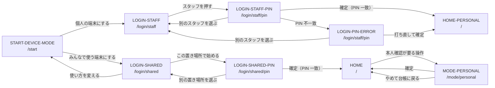
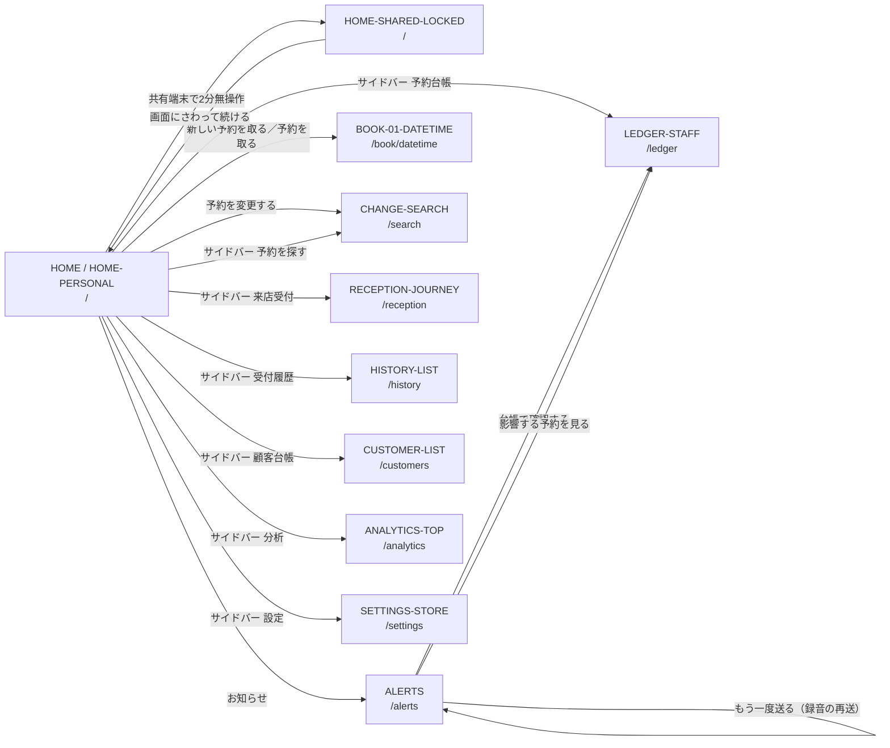
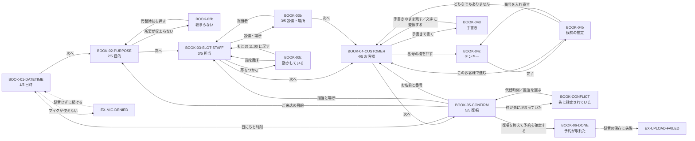
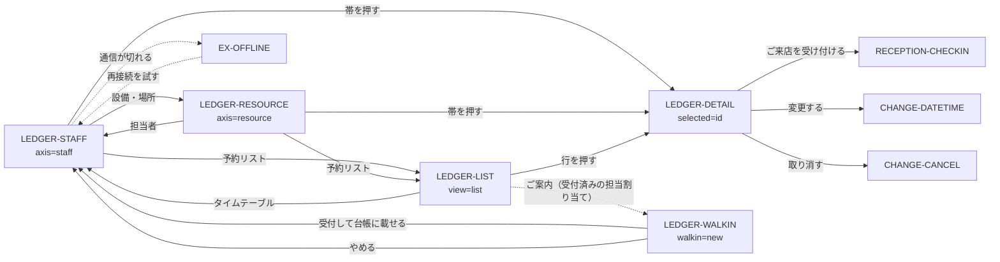
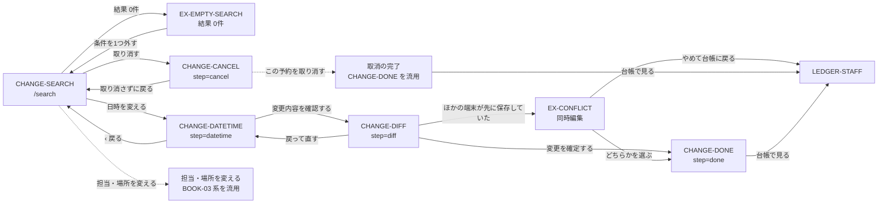
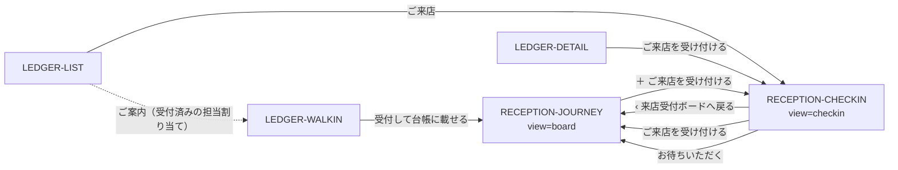
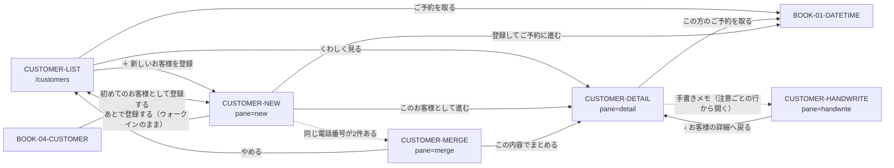
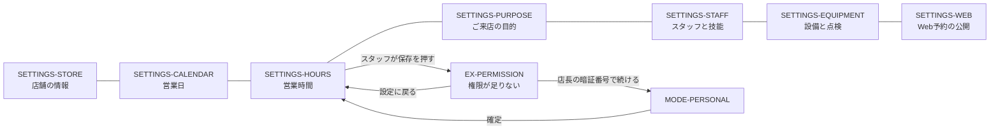
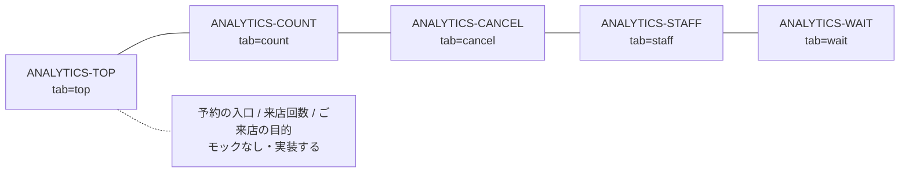
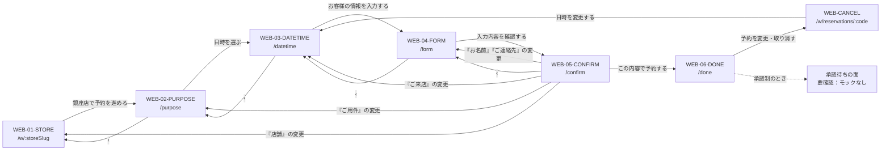

# glasses_management 設計 05 — 画面フロー

- サービス: `glasses_management`（`@app/glasses_management`）
- 見た目の正本: `docs/frontend/mockups/eye/`（`screens/*.html` 68本 + `images/*.png` 68枚 + `assets/eye.css`）
- 値の正本: `packages/ui/src/theme.css`（セマンティックトークン）。モックの生 hex を React に貼らない
- ルート・フェーズ・テーブル名の正本: 決定ブリーフ。本書はそれを変えない

本書が決めるのは **画面の骨格・ルートと画面の対応・遷移・工程の可否条件・例外面の置き場所・モックが描いていない状態の埋め方**である。
データモデルは `design/03-data-model.md`、API の正本は `design/04-api.md`、UC/AC の定義は各 `features/<NNN>-<slug>/spec.md` にある。
本書の API 列は「どの面を呼ぶか」の対応だけを示し、パス・スキーマの最終形は `design/04-api.md` に従う。

---

## 1. 端末と枠

| 項目 | 値 | 出どころ |
|---|---|---|
| 業務画面の枠 | iPad 11インチ 横向き **1194 × 834 pt** | モック `.device` |
| Web予約の枠 | iPhone **390 × 844 pt** | モック `.phone` |
| 触れる要素の最小 | **44 × 44 pt** | README 決め事 |
| テンキーのキー | 高さ **72 px**、3列 × 96px、gap 12px | `.keypad` / `.key` |
| PIN の枠 | 44 × 56 px × 6個 | `.pins i` |
| 主ボタン | `.btn` 最小高 **48px**、`.btn.big` **56px** | `.btn` |
| 入力欄 | `.field` 最小高 **52px**、文字 17px | `.field` |
| 選択の札 | `.choice` 最小高 **76px**、文字 17px/600 | `.choice` |
| 次へ（丸ボタン） | `.fab` **64 × 64 px** | `.fab` |
| 文字の段 | **本文の段は 3 つ**（見出し 22px / 本文 16px / 補足 13px）。それ以外の大きさはバー・札・目盛など**役割の決まった場所だけ**に使う（実装トークンは 8 段。`design/07-nfr.md` §3.2） | README 引き算の規準 |
| 余白 | 画面の外周 32〜44px、かたまりの間 24〜32px | README 引き算の規準 |
| 状態の伝え方 | 色だけに意味を持たせない。必ず文字を添える | README 決め事 |

**枠の内訳（iPad）**

```
statusbar 24px
appbar    64px
body      flex:1（残り 746px）   ← ここに骨格が入る
stepbar   76px                   ← 予約フロー・日時変更のみ
```

**枠の内訳（iPhone / Web予約）**

```
statusbar    44px
appbar       56px
webprogress   4px                ← ステップ数ぶんの帯
wrap         残り（下パディング 120px / 完了 140px / 確認・取消 152px）
sticky CTA   absolute left:28 right:28 bottom:32、width:100%
```

固定値の一覧（画面の中で違う値を使う場所）は `docs/frontend/mockups/eye/assets/eye.css` が唯一の出どころである。
実装では px と hex を直に書かず、`packages/ui/src/theme.css` のトークンへ翻訳する。

### 1.1 モックの CSS 変数 → `packages/ui/src/theme.css` のトークン

本書と survey は読みやすさのためモック側の変数名（`--brand` など）で場所を指す。**React に書いてよいのは右列の名前だけ**である。
値は決定ブリーフ §10 の表と同一 — ただし **3 色だけは決定ブリーフ §12.1 でアクセシビリティのために実装側を暗くしてある**
（`--line-strong` / `--ink-3` / `--brand-line`）。モックの画像は直さない。実装値の正本は `packages/ui/src/theme.css`、
コントラストの実測は `design/07-nfr.md` §2.5 にある。

| モック（`eye.css`） | 値 | 実装（`theme.css`） |
|---|---|---|
| `--canvas` | `#f1f4f2` | `--color-paper` |
| `--surface` | `#ffffff` | `--color-surface` |
| `--surface-2` | `#e9eeeb` | `--color-surface-2` |
| `--line` | `#d3dbd7` | `--color-line` |
| `--line-strong` | `#b6c2bc` → 実装 **`#778d82`** | `--color-line-strong`（§12.1 で暗くした） |
| `--ink` | `#16211d` | `--color-ink` |
| `--ink-2` | `#566761` | `--color-ink-muted` |
| `--ink-3` | `#7d8b85` → 実装 **`#626e69`** | `--color-ink-faint`（§12.1 で暗くした） |
| `--brand` | `#17705a` | `--color-pine` |
| `--brand-dark` | `#0f5645` | `--color-pine-deep` |
| `--brand-tint` | `#e4f0eb` | `--color-pine-soft` |
| `--brand-line` | `#9cc4b6` → 実装 **`#58947f`** | `--color-pine-line`（§12.1 で暗くした） |
| `--web` / `--web-tint` | `#1c5c8c` / `#e6eef5` | `--color-web` / `--color-web-soft` |
| `--walkin` / `--walkin-tint` | `#9a5a15` / `#fbeedd` | `--color-walkin` / `--color-walkin-soft` |
| `--alert` / `--alert-tint` | `#97302b` / `#fbe9e7` | `--color-danger` / `--color-danger-soft` |
| `--busy` / `--free` | `#cdd5d1` / `#eef6f2` | `--color-busy` / `--color-free` |
| `--grid` / `--grid-hour` | `#e7ecea` / `#cbd5d1` | `--color-grid` / `--color-grid-hour` |
| `--focus` | `#0a63c4` | `--color-focus` |
| `--r-s` / `--r-m` / `--r-l` / `--r-pill` | 8 / 12 / 16 / 999px | `--radius-ctl` / `--radius-card` / `--radius-panel` / **`--radius-full`** |
| `--sans` / `--mono` | iPadOS 既定 / SF Mono | `--font-sans` / `--font-mono` |

**モックに変数が無く、実装だけが持つトークン**（左列は「—」。役割は `design/07-nfr.md` §3.2 が正本）

| モック | 実装（`theme.css`） | 役割 |
|---|---|---|
| `--on-brand`（`:root` の外に直書き） | `--color-on-pine` `#ffffff` | 緑地の上の文字。生の `#fff` を書かない |
| — | `--color-on-danger` `#ffffff` | 赤地の上の文字 |
| — | `--color-focus-on-pine` `#ffffff` | **緑の面の上のフォーカスリング**。`--color-focus` は緑の上で 1.03:1 になって消える（§7.6） |
| — | `--color-amber` / `--color-amber-soft` `#7a5415` / `#fff6e5` | **失敗ではない注意**。用途は 3 つに限る — RECEPTION-CHECKIN の「要確認」の札／来店回数の「初めて」／設定の影響カード（`07-nfr.md` §3.2 が正本） |
| — | `--radius-circle` 50% / `--radius-none` 0 | 丸い FAB（`.fab` / `.back`）／角を落とす面 |
| — | `--text-hero` 〜 `--text-fine`（8 段） | 文字寸法。`07-nfr.md` §3.2 の表 |

**モックが `:root` の外に直書きしている生 hex**（モック README の「`:root` が唯一の出どころ」をモック自身が破っている箇所）

`assets/eye.css` は `#eceeed` `#e3e7e5` `#d9bb92` `#d9a9a4` `#9aa8a2` `#cfd6d2` `#a8bfd3` `#4d5b55` `#33413b` を
直書きしている。このうち **2 つは本書が名指しで使えと言っている部品の縁**で、`theme.css` には塗りしか無い。

| 部品 | モックの定義 | 本書での指定 | 実装 |
|---|---|---|---|
| `.card.warn`（赤） | `background: var(--alert-tint); border-color: #d9a9a4` | §3（SETTINGS-EQUIPMENT の影響カード）／§6（BOOK-CONFLICT） | 縁のトークンが無い。`border-danger`（`#97302b`）で代用するとモックより明らかに濃くなる |
| `.card.note`（茶） | `background: var(--walkin-tint); border-color: #d9bb92` | §3（SETTINGS-PURPOSE の影響カード） | 同上 |

**決定: 縁を 2 つトークンとして足す** — `--color-danger-line: #d9a9a4` / `--color-note-line: #d9bb92`。
`--color-danger`（`#97302b`）で代用するとモックより明らかに濃くなり、影響カードが「失敗」に見える。
残り 7 色（`#eceeed` `#e3e7e5` `#9aa8a2` `#cfd6d2` `#a8bfd3` `#4d5b55` `#33413b`）は**足さない** —
いずれも既存トークンの近傍にあり、`--color-surface-2` / `--color-line` / `--color-ink-faint` /
`--color-web-soft` / `--color-ink` / `--color-pine-deep` で代用する。生 hex は 1 つも React に書かない。

---

## 2. 画面の骨格

### 2.0 引き算の規準（`docs/frontend/mockups/eye/README.md` の表をそのまま置く）

発注元の指摘「シンプルさが足りない。余白の美しさを忘れないで」を受けて全画面を作り直した経緯そのものが、
この表である。**各 feature spec の T-0xx（デザインのパス1計画）はここを参照するだけにし、書き写さない。**

> **空いた場所を埋めるために要素を足さない。下や右が空いているのは正しい状態。**

| 規準 | 上限 |
|---|---|
| 主役 | 1画面に1つ |
| 白い箱（枠線つきのカード） | 3枚まで。並べたいだけの情報は罫線（`.lines`）か余白で区切る |
| 説明文（補足の段落） | 2つまで・各1行 |
| 一覧・表の行 / 選択の札 | 8つまで |
| 状態の札（`.tag`） | 3つまで |
| グラフ | 1つ |
| 文字の段 | 本文の段は 3 つ（見出し22px／本文16px／補足13px）。§1 の注も読む |
| 余白 | 画面の外周 32〜44px、かたまりの間 24〜32px |

守れている実例（実装者はここを「スカスカだから足す」と判断しないこと）: EX-EMPTY-SEARCH は右ペインの白い箱が
ちょうど 3 枚で下半分は空のまま、ANALYTICS-TOP はグラフ 1 枚＋罫線 3 行で下 1/3 は空である。

### 2.1 骨格の部品

| 部品 | 寸法・要点 |
|---|---|
| `.shell` | `grid-template-columns: 216px 1fr`。たたむと `.shell.rail` = `76px 1fr` |
| `.sidenav` | 背景 `--surface-2`、右罫線 `--line`、`padding:16px 14px`、gap 4px |
| `.sidenav.rail` | `padding:16px 10px`、項目は幅 52px の正方形、`font-size:0` でラベルを隠す（アイコンだけが残る） |
| `.navtoggle` | 最小高 44px。**たたんでいるときは「ひらく」、開いているときは「たたむ」**。目に見える文字と `aria-label`（「サイドバーをひらく」／「サイドバーをたたむ」）の**両方**を状態で入れ替える。モックはたたんだ 17 画面のうち 14 画面が「たたむ」のまま描いており（LEDGER 3 面だけが「ひらく」）、写すとラベルが動作の逆を言う。§8 の既知差分 #10 |
| `.sidenav .new` | ラベルは「予約を取る」（＋ は `::before` のアイコンが描く。§2.2）。最小高 52px、`--brand` 塗り、17px/700 |
| `.nav-item` | 最小高 46px、16px/600。`.on` は `--brand` 塗り + 白文字。件数バッジは `.n`（`--alert` 丸） |
| `.sidenav .group` | 「お店の運用」の見出し（13px） |
| `.sidenav .foot` | 端末名 + 使い方（12px）。共有は「銀座店 レジ横iPad／共有で使っています」、個人は「佐藤 美咲の iPad／個人で使っています」 |
| `.appbar` | 高さ 64px、`--brand` 地。左に `⌂`（7画面は持たない。§2.4）、中央左に店名 + 小見出し、右に `.barbtns` |
| `.datepill` | appbar 中央の日付ピル。`‹` / 日付 / `本日` / `›`。**LEDGER 5面 + EX-OFFLINE の 6画面だけ**が持つ |
| `.toolbar` | 高さ 56px、白地、下罫線。並べ替え `.segmented`・絞り込み・`.nowchip` を置く |
| `.split` | 既定 `340px 1fr`。実際に `.split` を使うのは 9画面で、上書きは 4通り: `252px 1fr`（ALERTS）/ `288px 1fr`（HISTORY-LIST）/ `300px 1fr`（CHANGE-DATETIME・EX-EMPTY-SEARCH）/ `1fr 330px`（BOOK-03・03b・03c）。ほかの2ペイン面は `.split` を使わず画面固有の grid を持つ（第2列は 300〜420px） |
| `.stepbar` | 高さ 76px。`.back`（48円）+ `.steps` + `.rec` + `.fab` |
| `.rec` / `.rec-float` | 録音中の表示。工程の帯に置く形と、右下 20/20 に常駐する形の2つ |

### 2.2 サイドバーの項目（並びは全画面で同一）

```
[たたむ／ひらく]              navtoggle
（HOME 系3画面のみ）トップ    nav-item data-icon="home"
（＋アイコン）予約を取る       button.new
予約台帳                      nav-item data-icon="ledger"
来店受付                      nav-item data-icon="reception"
予約を探す                    nav-item data-icon="search"
受付履歴                      nav-item data-icon="history"
顧客台帳                      nav-item data-icon="customer"
（ALERTS のみ）お知らせ 3     nav-item data-icon="alerts"
── お店の運用 ──              div.group
分析                          nav-item data-icon="analytics"
設定                          nav-item data-icon="settings"
（下端）端末名・使い方         div.foot
```

アイコンは `data-icon` の 9種（home / ledger / reception / search / history / customer / alerts / analytics / settings）+ `.new`（＋）+ `.navtoggle`。
`--icon` の data-URI SVG を `mask` で塗り、色は `currentColor` に追従させる（`.nav-item.on` で白へ反転する）。

`.new` のラベルは **「予約を取る」**にする。**「＋」はアイコンが描く** — `assets/eye.css` の
`.sidenav .new::before` が `--icon` の data-URI SVG（＋ の線画）を `mask` で必ず描くので、ラベルにも「＋」を
書くと ＋ が 2 つ出る。実際 38画面の PNG は「＋ ＋ 予約を取る」になっており（`images/ALERTS.png` /
`images/SETTINGS-EQUIPMENT.png` / `images/EX-EMPTY-SEARCH.png` のサイドバーで確認）、
正しく 1 つになっているのは **HOME 1 枚だけ**（`screens/HOME.html` = `<button class="new">予約を取る</button>`）である。
**正は HOME**。38画面のほうがモックの重複で、§8 の既知差分 #9 に書き出す。

**行き先とボタンのラベルに記号（`＋` `⌕` `‹` `›`）を混ぜない。記号はアイコン側が描く。**
同じ理由で HISTORY-LIST の `⌕ お客様名で探す` もラベルは「お客様名で探す」にする。

**行き先の名前は `予約を探す`**（`予約を検索` を使わない）。ほかの 6 項目（予約台帳・来店受付・受付履歴・顧客台帳・
分析・設定）がすべて短い和語の名詞句であり、ここだけ漢語サ変にする理由が無い。
**行き先の名前（`予約を探す`）と面の名前（`予約を変更する`）は 2 段で持つ** — 着いた先の見出しは
CHANGE-SEARCH / EX-EMPTY-SEARCH のとおり「予約を変更する」のままにする（探した先で何をするかを言っている）。
CHANGE-DATETIME の工程バー 1 番目「1　予約を探す」は行き先の名前と一致している。

### 2.3 どの画面がサイドバーを出すか

| 状態 | 画面数 | 画面 |
|---|---|---|
| **出さない** | 29 | 業務開始 6（START-DEVICE-MODE / LOGIN-STAFF / LOGIN-STAFF-PIN / LOGIN-SHARED / LOGIN-SHARED-PIN / LOGIN-PIN-ERROR）、MODE-PERSONAL、予約フロー 13（BOOK-01〜06 / 02b / 03b / 03c / 04b / 04c / 04d / BOOK-CONFLICT）、EX-MIC-DENIED、EX-UPLOAD-FAILED、Web予約 7（WEB-01〜06 / WEB-CANCEL） |
| **たたむ（rail 76px）が既定** | 17 | LEDGER-STAFF / LEDGER-RESOURCE / LEDGER-DETAIL / RECEPTION-JOURNEY / CUSTOMER-LIST / ANALYTICS 5面 / SETTINGS 7面 |
| **ひらく（216px）が既定** | 22 | HOME / HOME-PERSONAL / HOME-SHARED-LOCKED / ALERTS / LEDGER-LIST / LEDGER-WALKIN / RECEPTION-CHECKIN / HISTORY-LIST / HISTORY-EMPTY / CUSTOMER-DETAIL / CUSTOMER-NEW / CUSTOMER-MERGE / CUSTOMER-HANDWRITE / CHANGE-SEARCH / CHANGE-DATETIME / CHANGE-DIFF / CHANGE-CANCEL / CHANGE-DONE / EX-CONFLICT / EX-EMPTY-SEARCH / EX-OFFLINE / EX-PERMISSION |

**上の表が正**である。下の規則は表を覚えるための説明であって、表と食い違ったら表を採る。

1. **予約フローと業務開始の画面にはサイドバーを出さない**（README 明記）。Web予約（iPhone）も出さない。
2. 横に広い**盤面・グラフ・設定表**（時間軸の台帳・来店受付ボード・顧客一覧・分析・設定）は **rail** を既定にする。
3. **縦に読む一覧**（予約リスト・受付履歴・お知らせ）と、**台帳を離れて1件を扱う面**（来店受付・顧客の詳細/登録/統合/手書き・変更/取消）は **ひらく** を既定にする。
4. 規則 2 と 3 の両方に当たる 2画面はモックの実測に従う。LEDGER-DETAIL（盤面の上の popover）は **rail**、LEDGER-WALKIN（盤面の上の右パネル）は **ひらく**。
5. **上の表は「その面をはじめて開いたとき」の既定である。人が `.navtoggle` を押して変えたら、その選択を端末に覚える。**
   置き場所は `localStorage`（`ui.rail.<画面ID>` の真偽値 1 つだけ。顧客情報を含まないので §6.6 の禁止に触れない）。
   覚えるのは**画面 ID ごと**で、面をまたいで持ち回らない。端末を初期化したら既定へ戻る。
6. 上の表は**画面 ID ごと**（LEDGER-STAFF は rail だが LEDGER-LIST は ひらく、CUSTOMER-LIST は rail だが
   CUSTOMER-DETAIL は ひらく、RECEPTION-JOURNEY は rail だが RECEPTION-CHECKIN は ひらく）に既定を決めている。
   したがって**既定はルート単位では引けない。ルート＋クエリ（`view` / `pane` / `selected` / `walkin`）で引く**。
   P0 実装の `RAIL_BY_DEFAULT`（`src/web/shell/destinations.ts`）は行き先単位でしか持てないので、表のとおりにするには
   引き方を変える必要がある。

`.rail` は `.shell` と `.sidenav` の**両方**に付ける。rail のとき `.nav-item .n`・`.group`・`.foot` は
モックでは `display:none` になる。**実装では 2 点だけモックと変える** — ①行き先のラベルは DOM から消さず、
視覚だけを畳んで読み上げの名前は残す（§7.6）②未読件数はサイドバーから消える形になるので、appbar 側に置く（§2.4）。

### 2.4 上のバー（appbar）の中身

appbar は「左＝戻り口 / 中央左＝店名 + `<small>` の面の名前 / 右＝`.barbtns`」の3枠で固定である。モック 68画面の実測は次のとおり。

| 画面群 | 左 | 中央（店名 + `<small>`） | 右（`.barbtns`） |
|---|---|---|---|
| HOME | `⌂` | 「営業中　10:00–19:00」 | お知らせ 3 |
| HOME-PERSONAL | `⌂` | 「営業中　10:00–19:00」 | `.who`（佐藤 美咲／個人の端末）・お知らせ 2・業務を終える |
| HOME-SHARED-LOCKED | `⌂` | 「銀座店 レジ横iPad（みんなで使う端末）」 | `.tag.alert`「お客様の情報を隠しています」・業務を終える |
| ALERTS | `⌂` | 「お知らせとアラート」 | すべて既読にする（**お知らせボタンは無い**） |
| 台帳（LEDGER 5面 / EX-OFFLINE） | `⌂` | 「予約台帳」+ `.datepill` | お知らせ 3 |
| 来店受付（RECEPTION 2面） | `⌂` | 「来店受付」 | **なし** |
| 受付履歴（HISTORY 2面） | `⌂` | 「受付履歴」 | **なし** |
| 予約フロー（BOOK-01〜05・02b・03b・03c・04b〜04d・BOOK-CONFLICT） | `⌂` | 「新しい予約を取る」（04d のみ「新しい予約を取る　田中 花子 様」） | やめる |
| BOOK-06-DONE / EX-UPLOAD-FAILED | `⌂` | 「新しい予約を取る」 | 予約台帳・トップへ戻る |
| EX-MIC-DENIED | `⌂` | 「新しい予約を取る」 | ヘルプ・やめる |
| 変更・取消（CHANGE-DATETIME / DIFF / DONE） | `⌂` | 「予約の変更　EY-2608-0142」 | **なし** |
| CHANGE-CANCEL | `⌂` | 「予約の取り消し　EY-2608-0142」 | **なし** |
| CHANGE-SEARCH | `⌂` | 「予約を変更する」 | **なし** |
| EX-EMPTY-SEARCH | `⌂` | 「予約を変更する」 | お知らせ 3 |
| EX-CONFLICT | `⌂` | 「予約の変更　EY-2608-0142　田中 花子 様」 | お知らせ 3 |
| 顧客（CUSTOMER 5面） | `⌂` | 「顧客台帳」（＋ 対象者名。NEW は「新しいお客様を登録」） | お知らせ 3 |
| 分析 5面 / 設定 7面 | `⌂` | 「分析」／「設定」 | お知らせ 3 |
| EX-PERMISSION | `⌂` | 「設定　営業時間・定休日」 | お知らせ 3 |
| START-DEVICE-MODE | **なし** | 「端末のはじめの設定」 | ヘルプ |
| LOGIN-STAFF | **なし** | 「業務を始める　個人の端末」 | 2026年8月27日（木）本日・設定 |
| LOGIN-STAFF-PIN / LOGIN-PIN-ERROR | **なし** | 「業務を始める　個人の端末」 | やめる |
| LOGIN-SHARED | **なし** | 「業務を始める　みんなで使う端末」 | 別の店舗（丸の内店・新宿店）・設定 |
| LOGIN-SHARED-PIN | **なし** | 「業務を始める　みんなで使う端末」 | やめる |
| MODE-PERSONAL | `⌂` | 「銀座店 レジ横iPad（みんなで使う端末）」 | `.tag`「いまは共有モード」・やめる |
| Web予約 WEB-01・WEB-CANCEL | `‹` | 「EYE ご予約」+ 「ステップ 1 / 6　店舗」／「ご予約の確認・変更・取り消し」 | **なし** |
| Web予約 WEB-02〜05 | `‹` | 「EYE 銀座店」+ 「ステップ N / 6　◯◯」 | **なし** |
| Web予約 WEB-06-DONE | **なし** | 「EYE 銀座店」+ 「ステップ 6 / 6　ご予約が完了しました」 | **なし** |

**予約番号・電話番号のハイフンは常に半角ハイフン（U+002D）である。**モックの CHANGE-* 5 面は非改行ハイフン
（U+2011）で描いているが、実装はこれを引用しない（`design/06-use-cases.md` §13 が「保存・表示とも半角ハイフンに
統一する」と決めている）。上の表の「予約の変更　EY-2608-0142」も半角ハイフンで書いてある。

`⌂` を持たないのは業務開始 6画面（START-DEVICE-MODE / LOGIN-STAFF / LOGIN-STAFF-PIN / LOGIN-PIN-ERROR / LOGIN-SHARED / LOGIN-SHARED-PIN）と WEB-06-DONE の 7画面である。
お知らせボタンの件数はモックが HOME=3・HOME-PERSONAL=2・そのほか 3 で描き分けている。
**決定: 件数は「選択中店舗の未読の総数（3）」で全画面共通にする。個人端末でも同じ数を出す。**
ALERTS の左ペインが「すべて 3 ／ アラート（対応が必要）1 ／ お知らせ 2 ／ 対応済み 12」と分解を示しており、
HOME-PERSONAL の 2 は「お知らせ」カテゴリだけの数＝**対応が必要な 1 件が落ちている**。
バッジが対応必須のアラートを隠すのは事故なので採らない。§8 の既知差分 #11。

**未読件数バッジの置き場所**: モックがバッジを付けているのは
**appbar の `.badge`（28画面）と、サイドバーの「お知らせ」の行（`.n`、ALERTS のみ）**の 2 か所で、
**「トップ」の行にバッジを付けた画面は 1 枚も無い**。件数はお知らせに属する数なので意味の上でも合わない。
**appbar 側に置く**（下の §9 の決定と同じ）。細い柱（rail）でも消えない場所に置くこと（rail は台帳・受付・顧客・分析・設定の
5 面で既定なので、業務時間のほとんどがその状態である）。数字だけを置かず、親のボタンに
`aria-label="お知らせ 3件"` を付ける（§7.6）。

### 2.5 下の工程バー（stepbar）

| フロー | 工程 | stepbar を持つ画面 |
|---|---|---|
| 新規予約 | 1 日時 / 2 ご来店の目的 / 3 担当と場所 / 4 お客様 / 5 ご確認 | BOOK-01・02・02b・03・03b・03c・04・04b・04c・04d・05・BOOK-CONFLICT（**BOOK-06-DONE には無い**） |
| 予約の変更 | 1 予約を探す / 2 日時を変える / 3 ご確認 / 4 完了 | **CHANGE-DATETIME のみ**（DIFF / CANCEL / DONE は持たない） |
| Web予約 | 6段の `.webprogress`（帯のみ・文字なし） | WEB-01〜06。WEB-CANCEL は 2段（本人確認 → 表示） |

工程の札は `.step`（未通過）→ `.step.done`（通過）→ `.step.on`（現在）。
**✓ が付くのは BOOK-04・04b・04c・04d の done 札だけ**で、BOOK-05-CONFIRM と BOOK-CONFLICT の done 札には付いていない。
実装は「done には常に ✓ を付ける」に統一する（色だけで通過を示さないという README の決め事に合わせるため）。

### 2.6 録音の表示

| 形 | 置き場所 | 使う画面 |
|---|---|---|
| `.rec`（赤枠ピル） | stepbar の右、`.fab` の左 | BOOK-01・02・02b・03・03b・03c・04・04b・04c・04d・BOOK-CONFLICT・CHANGE-DATETIME |
| `.rec-float`（右下 20/20 の白カード・2px `--alert` 枠） | `.body` または `.inner` の中 | BOOK-05-CONFIRM・CHANGE-DIFF・CUSTOMER-NEW・RECEPTION-CHECKIN |
| `.float`（灰色版） | 右下 20/20 | EX-MIC-DENIED（「録音していません　--:--」）・EX-UPLOAD-FAILED（「録音は端末に保管中　03:24」） |

録音の許可を説明するだけの画面は置かない（README 明記）。マイクが使えないときは EX-MIC-DENIED を出す。

### 2.7 モックの部品 → 実装の置き場所

`assets/eye.css` は共有クラスを **80 種**持ち、画面ごとの `<style>` にローカルクラスがさらに 25〜35 種ある。
**どれを `@app/ui` の共有プリミティブにし、どれをサービス側で素の Tailwind で組むかを決めておかないと、
P1〜P10 の各フェーズが同じ部品を別々に作り直す**（`.appt` だけで LEDGER 5面・BOOK 3面・LEDGER-WALKIN・
EX-OFFLINE の 10 画面に出る）。`docs/frontend/DESIGN_RULE.md` §0-3 が必ず要求する判断である。

現在の `@app/ui` の輸出は `Button` / `TextInput` / `Textarea` / `Select` / `Field` / `Chip` / `Notice` / `Dialog` の 8 個で、
下のどれにも対応していない。

| モックのクラス | 置き場所 | 使う画面 |
|---|---|---|
| `.appt`（+`.web` `.walkin` `.alert` `.busy` `.free` `.under` `.clash` `.pick` `.placing` の 9 状態） | **`@app/ui`**（`Appointment`） | LEDGER 5面 / BOOK-03・03b・03c / LEDGER-WALKIN / EX-OFFLINE |
| `.tt` / `.tt-bg` / `.tt-grid` / `.tt-cell` / `.tt-head` / `.tt-name` | **`@app/ui`**（`TimeGrid`。role は `07-nfr.md` §2.3 の決着待ち） | LEDGER-STAFF / LEDGER-RESOURCE / LEDGER-WALKIN / BOOK-03・03b・03c / EX-OFFLINE |
| `.visits`（+`.first` `.many`） | **`@app/ui`**（`VisitCount`） | LEDGER / CUSTOMER-LIST / CUSTOMER-DETAIL / RECEPTION / HOME-PERSONAL |
| `.tag`（+`.alert` `.brand` `.walkin` `.web`） | **`@app/ui`**（既存の `Chip` に tone を足す） | 全域 |
| `.choice`（+`.on`）/ `.choices`（+`.c2` `.c3` `.c4`） | **`@app/ui`**（`ChoiceGroup`） | BOOK-02 / WEB-02 / SETTINGS / CHANGE-CANCEL |
| `.stepbar` / `.steps` / `.step`（+`.on` `.done`） | **`@app/ui`**（`StepBar`。`<ol>` + `aria-current="step"`。§7.6） | 予約フロー 12面 / CHANGE-DATETIME |
| `.keypad` / `.key`（+`.go` `.wide`）/ `.pins` | **`@app/ui`**（`Keypad`。`inputMode="none"`。`07-nfr.md` §2.2） | LOGIN-*-PIN / MODE-PERSONAL / BOOK-04c / CUSTOMER-NEW / EX-PERMISSION |
| `.popover` / `.pane` / `.panel` | **`@app/ui`**（浮く面のプリミティブ 1 つ。モーダルかどうかは `07-nfr.md` §2.2） | LEDGER-DETAIL / LEDGER-WALKIN / BOOK-04b ほか |
| `.card`（+`.bare` `.tint` `.warn` `.note`）/ `.card.warn.lead` | **`@app/ui`**（`Card` 1 プリミティブ + tone。下の決定） | 全域 |
| `.segmented` / `.tabs` / `.tab` | **`@app/ui`**（当たり判定 44pt。`07-nfr.md` §2.1(b)） | LEDGER 5面 / CUSTOMER-LIST / RECEPTION-JOURNEY / ANALYTICS 5面 |
| `.rec` / `.rec-float` / `.float` | **`@app/ui`**（`RecordingBadge`。`role="status"`） | §2.6 の表 |
| `.shell` / `.sidenav` / `.appbar` / `.toolbar` / `.split` / `.grouped` / `.lines` / `.row` | **サービス側**（`src/web/shell/` と `src/web/ui/`）。レイアウトなので共有しない | 全域 |
| `.nowchip` / `.nowline` / `.grip` / `.ghost` / `.fab` / `.datepill` | **サービス側**（台帳と予約フローにしか出ない） | LEDGER / BOOK-03c |
| 画面ごとの `<style>` のローカルクラス（SETTINGS-PURPOSE 35 / SETTINGS-EQUIPMENT 34 / ANALYTICS-COUNT 33 …） | **サービス側**。共有しない | 各 1 画面 |

**決定: 白い箱は `Card` プリミティブ 1 つ + tone（`plain` / `tint` / `warn` / `note`）に畳む。**
モックの 10 種は地色と縁の色が違うだけで構造（角 12px・内側の余白・見出し 1 行 + 本文）は同じであり、
DESIGN_RULE の NEVER 表「7 種のカードスタイル混在」に正面から当たる。`.card.warn.lead` は
`Card` の `tone="warn"` + `lead`（左帯 4px。`07-nfr.md` §3.2）とする。
**浮く面は別の 1 プリミティブ**（`Surface`）にまとめ、`.popover` / `.pane` / `.panel` / `.rec-float` / `.float` を
その配置違い（`anchored` / `side` / `floating`）として持つ — 影と z 順の決めが `Card` と別だからである。
本書 §3 と §6 が部品名で指定している `.card.warn` / `.card.note` / `.card.tint` は、この tone の名前で読み替える。

---

## 3. 画面一覧（68画面）

ルートは決定ブリーフ §5 のとおりで、本書は増やさない。**1つのルートが複数のモックを持つときは、クエリで状態を表す**。

| クエリ | 取りうる値 | 使うルート |
|---|---|---|
| `date` | `YYYY-MM-DD` | `/ledger` `/reception` `/analytics` |
| `axis` | `staff`（既定） / `resource` | `/ledger` `/book/slot` |
| `view` | `timetable`（既定） / `list` / `board` / `checkin` | `/ledger` `/reception` |
| `filter` | `all`（既定） / `upcoming` / `pending` | `/ledger` |
| `selected` | 対象の ID | `/ledger` `/search` `/history` `/customers` |
| `walkin` | `new`（受付パネルを開く） | `/ledger` |
| `subject` | 受け付ける予約またはウォークインの ID | `/reception`（`view=checkin` のとき必須） |
| `pane` | `detail` / `new` / `merge` / `handwrite` | `/customers` |
| `with` | まとめる相手の顧客 ID | `/customers`（`pane=merge` のとき必須） |
| `input` | `field`（既定） / `keypad` / `handwrite` | `/book/customer` |
| `step` | `datetime` / `diff` / `cancel` / `done` | `/search` |
| `tab` | `top` / `count` / `source` / `cancel` / `visits` / `staff` / `purpose` / `wait` | `/analytics` |
| `section` | `store` / `calendar` / `hours` / `purpose` / `staff` / `equipment` / `web` | `/settings` |

上の 13 個以外のクエリを足さない。値が範囲外・欠落のときは既定値へ落とし、404 にしない（`selected` / `subject` / `with` の指す行が無いときだけ「見つかりません」を本文に出す）。
`/settings` の第2サイドバーには 15 項目あるが、`section` の値はモックのある 7 項目にしか無い（§4.8）。

### 3.1 起動と認証（7画面）

| ルート | 画面ID | 役割 | サイドバー | 主な操作 | 使う API |
|---|---|---|---|---|---|
| `/start` | START-DEVICE-MODE | 端末の使い方を1回だけ決める（個人／共有） | なし | 「個人の端末にする」「みんなで使う端末にする」 | `POST /api/staff/terminals` |
| `/login/staff` | LOGIN-STAFF | 個人端末で業務を始めるスタッフを選ぶ。休みの人は押せない | なし | スタッフのタイルを押す | `GET /api/staff/stores/:storeId/staff` `GET /api/staff/stores/:storeId/staff-shifts` |
| `/login/staff/pin` | LOGIN-STAFF-PIN | 選んだ本人の 4〜6桁 PIN を入れる | なし | テンキー / 削除 / 確定 / 別のスタッフを選ぶ | `POST /api/staff/terminals/:terminalId/sessions` |
| `/login/staff/pin` | LOGIN-PIN-ERROR | PIN が違うときの面。残り回数と再設定の頼み先を同じ面に出す | なし | 店長に再設定を頼む / 別のスタッフを選ぶ / 打ち直す | `POST /api/staff/terminals/:terminalId/sessions` |
| `/login/shared` | LOGIN-SHARED | 共有端末の置き場所を選ぶ（置き場所が記録に残る名前になる） | なし | 置き場所を選ぶ / 使い方を変える / 別の店舗 | `GET /api/staff/terminals` `GET /api/staff/stores` |
| `/login/shared/pin` | LOGIN-SHARED-PIN | 店舗共通の PIN を入れる。できること・要本人確認の線引きを示す | なし | テンキー / 確定 / 別の置き場所を選ぶ | `POST /api/staff/terminals/:terminalId/sessions` |
| `/mode/personal` | MODE-PERSONAL | 共有端末で責任の残る操作の前だけ本人へ昇格する | なし | スタッフを選ぶ / PIN / 確定 / やめて台帳に戻る | `POST /api/staff/terminals/:terminalId/elevate` |

**共有モードでできること／本人確認が要ること**（LOGIN-SHARED-PIN が画面に出している線引き。`/mode/personal` を挟む条件の正本）

| 区分 | 操作（モックの文言） |
|---|---|
| 個人を選ばずにできる | 予約を受ける / 台帳を見る / ご来店を受け付ける |
| ご本人の確認が必要 | 録音の保全 / 注意ごとの公開 / 設定の変更 |

PIN は個人・店舗共通とも 4〜6桁（`.pins i` は常に 6枠で、4桁目から「確定」が押せる）。
LOGIN-PIN-ERROR の文言どおり **3回続けて違うと 30秒待つ**。
`terminals.pin_hash` は端末単位、個人 PIN はスタッフ単位で持つ（決定ブリーフ §3.6）。

### 3.2 ホームとお知らせ（4画面）

| ルート | 画面ID | 役割 | サイドバー | 主な操作 | 使う API |
|---|---|---|---|---|---|
| `/` | HOME | 共有端末のトップ。主操作2つと日付の帯だけを置く | ひらく（on=トップ） | 新しい予約を取る / 予約を変更する / 日付を選ぶ / お知らせ 3 | `GET /api/staff/stores` `GET /api/staff/alerts` |
| `/` | HOME-PERSONAL | 個人端末のトップ。右に自分の担当を出す | ひらく（on=トップ） | 主操作2つ / 担当の行 / お知らせ 2 / 業務を終える | `GET /api/staff/reservations` `GET /api/staff/alerts` |
| `/` | HOME-SHARED-LOCKED | 2分さわらないと名前・電話番号を伏せた状態 | ひらく（on=トップ・veil で覆う） | 画面にさわって続ける / 業務を終える | `POST /api/staff/terminals/:terminalId/sessions`（再開） |
| `/alerts` | ALERTS | お知らせとアラートの一覧。放置すると予約に響くものを上へ | ひらく（on=お知らせ 3） | 種別で絞る / もう一度送る / 台帳で確認する / 影響する予約を見る / すべて既読にする | `GET /api/staff/alerts` `POST /api/staff/alerts/read-all` `POST /api/staff/recordings/:id/retry` |

### 3.3 予約の5工程（13画面）

| ルート | 画面ID | 役割 | サイドバー | 主な操作 | 使う API |
|---|---|---|---|---|---|
| `/book/datetime` | BOOK-01-DATETIME | 1/5。日 → 時間の順に聞く。受け付けられる時刻だけ出す | なし | 日付を選ぶ / 時刻を選ぶ / 次へ | `GET /api/staff/stores/:storeId/calendar-exceptions` `GET /api/staff/availability` |
| `/book/purpose` | BOOK-02-PURPOSE | 2/5。目的を押すと所要時間が決まる | なし | 目的を選ぶ / お取りする時間（45・60・75・90分）を選ぶ / 次へ | `GET /api/staff/purposes` `GET /api/staff/availability` |
| `/book/purpose` | BOOK-02b-PURPOSE-CONFLICT | 2/5。先に伺った時刻では所要が収まらない状態。代わりの時刻を同じ面に出す | なし | 代替時刻（10:00–11:00 / 13:00–14:00 / 15:30–16:30）を選ぶ | `GET /api/staff/availability` |
| `/book/slot?axis=staff` | BOOK-03-SLOT-STAFF | 3/5。縦=担当・横=時間。先約と重なると警告と代わりの担当を出す | なし | 帯をつかんで動かす / 候補の担当を選ぶ / 担当はあとで決める | `GET /api/staff/availability` `GET /api/staff/stores/:storeId/staff` |
| `/book/slot?axis=resource` | BOOK-03b-SLOT-RESOURCE | 3/5。縦=設備・場所に入れ替えた同じ面 | なし | 帯を動かす / 候補の設備を選ぶ / 設備はあとで決める | `GET /api/staff/availability` `GET /api/staff/stores/:storeId/equipment` |
| `/book/slot` | BOOK-03c-DRAG | 3/5。帯をつかんで運んでいる最中。元の位置は影、置く先は点線 | なし | 指を離して確保 / もとの 11:00 に戻す | `GET /api/staff/availability` |
| `/book/customer?input=field` | BOOK-04-CUSTOMER | 4/5。電話番号から伺い、見つからなければ初めての方として登録する | なし | 番号を打つ / 名前・ふりがな / 手書きで書く / 初めてのお客様として登録する | `GET /api/staff/customers` `POST /api/staff/customers` |
| `/book/customer?input=field` | BOOK-04b-CUSTOMER-MATCH | 4/5。番号から候補を出し、選ぶだけで度数・前回担当・注意ごとを引き継ぐ | なし | 候補を選ぶ / どちらでもありません / 番号を入れ直す | `GET /api/staff/customers` `GET /api/staff/customers/:id` |
| `/book/customer?input=keypad` | BOOK-04c-KEYPAD | 4/5。受話器を持ったまま片手で番号を打つ | なし | テンキー / 削除 / 完了 | なし（入力のみ） |
| `/book/customer?input=handwrite` | BOOK-04d-HANDWRITE | 4/5。ご要望を書いたかたちのまま残す | なし | ペン・太さ・取り消し / 文字に変換する / 手書きのまま残す | `POST /api/staff/customers/:id/notes` |
| `/book/confirm` | BOOK-05-CONFIRM | 5/5。読み上げる文をそのまま大きく出し、言い直しの箇所へ戻す | なし | 4つの直し先へ戻る / 復唱を終えて予約を確定する | `POST /api/staff/reservations` |
| `/book/confirm` | BOOK-CONFLICT | 確定の瞬間に枠が取られていた状態。失われないものを先に示す | なし | 代替時刻を選ぶ / 担当を入れ替える | `GET /api/staff/availability` `POST /api/staff/reservations` |
| `/book/done` | BOOK-06-DONE | 予約番号・内容・お客様にお伝えすることを1面に置く | なし | 続けて予約を取る / 台帳で見る / トップへ戻る | `GET /api/staff/reservations/:id` |

### 3.4 予約台帳（5画面）

| ルート | 画面ID | 役割 | サイドバー | 主な操作 | 使う API |
|---|---|---|---|---|---|
| `/ledger?axis=staff&view=timetable` | LEDGER-STAFF | 縦=担当・横=時間。30分の薄い線と1時間の線を背景に通す | たたむ（on=予約台帳） | 日付を送る / 軸を切り替える / 表示を切り替える / 絞り込み / 帯を押す | `GET /api/staff/reservations` `GET /api/staff/walkins` `GET /api/staff/stores/:storeId/staff` |
| `/ledger?axis=resource&view=timetable` | LEDGER-RESOURCE | 縦=設備・場所。1予約が複数の設備を押さえていることを読む | たたむ（on=予約台帳） | 同上 | `GET /api/staff/reservations` `GET /api/staff/stores/:storeId/equipment` |
| `/ledger?view=list` | LEDGER-LIST | 同じ日を時間順に読む。左端のボタンだけで受け付けが進む | ひらく（on=予約台帳） | すべて／これから／確認待ちで絞る / ご来店・ご案内・内容を確認 | `GET /api/staff/reservations` `POST /api/staff/visits` |
| `/ledger?selected=<id>` | LEDGER-DETAIL | 台帳を見失わないまま、その予約の中身と次の操作を出す（popover 440px） | たたむ（on=予約台帳） | 録音を聞く / ご来店を受け付ける / 変更する / 取り消す | `GET /api/staff/reservations/:id` `POST /api/staff/recordings/:id/playback`＋`GET /api/staff/recordings/:id/stream` |
| `/ledger?walkin=new` | LEDGER-WALKIN | 台帳を見たまま店頭のお客様のご用件を伺う（右 400px パネル） | ひらく（on=予約台帳） | ご用件を選ぶ / 電話番号で探す / あとで登録する / 受付して台帳に載せる | `POST /api/staff/walkins` `GET /api/staff/customers` |

### 3.5 来店受付（2画面）

| ルート | 画面ID | 役割 | サイドバー | 主な操作 | 使う API |
|---|---|---|---|---|---|
| `/reception?view=board` | RECEPTION-JOURNEY | ご来店中のお客様がいまどの工程にいるかだけを1枚で見る | たたむ（on=来店受付） | ご来店中／本日すべて / ＋ ご来店を受け付ける | `GET /api/staff/visits/board` `GET /api/staff/walkins` |
| `/reception?view=checkin&subject=<id>` | RECEPTION-CHECKIN | ご予約のお客様がお着きになったときの1画面。確かめること3点を出す | ひらく（on=来店受付） | 3点を確かめる / ご来店を受け付ける / お待ちいただく / 来店受付ボードへ戻る | `GET /api/staff/reservations/:id` `POST /api/staff/visits` `GET /api/staff/customers/:id` |

### 3.6 予約の変更と取消（5画面）

| ルート | 画面ID | 役割 | サイドバー | 主な操作 | 使う API |
|---|---|---|---|---|---|
| `/search` | CHANGE-SEARCH | 名前か電話番号だけで目当ての1件へたどり着く | ひらく（on=予約を探す） | 名前・番号で探す / これから・今日・取消済み / 日時を変える / 担当・場所を変える / 取り消す / 録音を聞く | `GET /api/staff/reservations` `POST /api/staff/recordings/:id/playback`＋`GET /api/staff/recordings/:id/stream` |
| `/search?selected=<id>&step=datetime` | CHANGE-DATETIME | いまのご予約を左に置いたまま新しい時刻を選ぶ | ひらく（on=予約を探す） | 日を選ぶ / 時刻を選ぶ / 変更内容を確認する | `GET /api/staff/availability` |
| `/search?selected=<id>&step=diff` | CHANGE-DIFF | 変わる行だけを塗る。読み上げる言葉と通知の有無を同じ面に置く | ひらく（on=予約を探す） | 戻って直す / 変更を確定する | `PATCH /api/staff/reservations/:id` |
| `/search?selected=<id>&step=cancel` | CHANGE-CANCEL | 取り消しは戻せないので既定の操作を「戻る」に置く | ひらく（on=予約を探す） | 理由を選ぶ / 取り消さずに戻る / この予約を取り消す | `POST /api/staff/reservations/:id/cancel` |
| `/search?selected=<id>&step=done` | CHANGE-DONE | 変更後の姿とお客様にお伝えすることを1画面で確かめて終える | ひらく（on=予約を探す） | 台帳で見る / トップへ戻る | `GET /api/staff/reservations/:id` |

### 3.7 受付履歴（2画面）

| ルート | 画面ID | 役割 | サイドバー | 主な操作 | 使う API |
|---|---|---|---|---|---|
| `/history` | HISTORY-LIST | いつ誰がどの予約を受け付け、そのあと何が変わったかを追う | ひらく（on=受付履歴） | 期間・担当・結果で絞る / 1件を選ぶ / 予約を開く / 録音を再生する | `GET /api/staff/reception-sessions` `GET /api/staff/audit` `POST /api/staff/recordings/:id/playback`＋`GET /api/staff/recordings/:id/stream` |
| `/history` | HISTORY-EMPTY | 0件で行き止まりにしない。条件を1つ緩めたときの件数を先に出す | ひらく（on=受付履歴） | 条件を1つ緩める / 絞り込みをすべて外す | `GET /api/staff/reception-sessions` |

### 3.8 顧客台帳（5画面）

| ルート | 画面ID | 役割 | サイドバー | 主な操作 | 使う API |
|---|---|---|---|---|---|
| `/customers` | CUSTOMER-LIST | 名前があいまいでも来店回数・最終来店から手繰る | たたむ（on=顧客台帳） | 名前・電話番号で探す / 並べ方 / 絞り込み / くわしく見る / ご予約を取る / ＋ 新しいお客様を登録 | `GET /api/staff/customers` |
| `/customers?selected=<id>&pane=detail` | CUSTOMER-DETAIL | 度数の移り変わり・いまお使いのメガネ・注意ごとを一度に読ませる | ひらく（on=顧客台帳） | 内容を直す / この方のご予約を取る | `GET /api/staff/customers/:id` |
| `/customers?pane=new` | CUSTOMER-NEW | 電話番号を入れた時点で同じ番号の登録を知らせ、二重に作らせない | ひらく（on=顧客台帳） | 番号を打つ / このお客様として進む / 別の方なので新しく登録する / 登録してご予約に進む | `GET /api/staff/customers` `POST /api/staff/customers` |
| `/customers?pane=merge&with=<id>` | CUSTOMER-MERGE | 項目ごとに残すほうを選び、まとめたあとの姿を先に見せる | ひらく（on=顧客台帳） | 項目ごとに A / B / 両方を選ぶ / やめる / この内容でまとめる | `POST /api/staff/customers/merge` |
| `/customers?selected=<id>&pane=handwrite` | CUSTOMER-HANDWRITE | 手書きメモをそのまま台帳に残し、読み取った文字は人が直す | ひらく（on=顧客台帳） | サムネを選ぶ / 大きく・小さく・赤ペンも見る / 文字を直す / 注意ごととして登録を申し込む / 文字を保存する | `GET /api/staff/customers/:id/notes` `PATCH /api/staff/customers/:id/notes/:noteId` |

### 3.9 分析（5画面）

| ルート | 画面ID | 役割 | サイドバー | 主な操作 | 使う API |
|---|---|---|---|---|---|
| `/analytics?tab=top` | ANALYTICS-TOP | 前後7日の入り具合を1つのグラフで見て、週の数字を下に添える | たたむ（on=分析） | 対象の期間を選ぶ / 適用 / 店舗を選ぶ / タブを切り替える | `GET /api/staff/analytics` |
| `/analytics?tab=count` | ANALYTICS-COUNT | 日別・月別・時間帯別・曜日別 × ご来店日・受付日で予約数を数える | たたむ（on=分析） | 集計の種類 / かぞえる日 / 期間 / 適用 | `GET /api/staff/analytics` |
| `/analytics?tab=staff` | ANALYTICS-STAFF | だれに仕事が寄っているか。件数と90日以内の再来を1つの並びで読む | たたむ（on=分析） | 期間 / 適用 / 店舗 | `GET /api/staff/analytics` |
| `/analytics?tab=wait` | ANALYTICS-WAIT | 受付からご相談開始までの中央値。目安 8分の線を引く | たたむ（on=分析） | 期間 / 適用 / 店舗 | `GET /api/staff/analytics` |
| `/analytics?tab=cancel` | ANALYTICS-CANCEL | 取り消しを3つの出どころに分けて積み上げる。期間はレンジ指定 | たたむ（on=分析） | 開始月 − 終了月 / 適用 / 店舗 | `GET /api/staff/analytics` |

### 3.10 設定（7画面）

`/settings` は骨格の中にもう1枚のサイドバー（`.set` の `236px 1fr`、地色は `--surface-2`）を持つ。緑は `.sidenav` の1本だけに保つ。

| ルート | 画面ID | 役割 | サイドバー | 主な操作 | 使う API |
|---|---|---|---|---|---|
| `/settings?section=store` | SETTINGS-STORE | お客様に見せる店名・住所・道順・紹介文を1か所に集める | たたむ（on=設定 / 第2=店舗の情報） | 各行を直す / 書き直す / キャンセル / 保存 | `GET /api/staff/stores/:storeId`＋`PATCH /api/staff/stores/:storeId` |
| `/settings?section=calendar` | SETTINGS-CALENDAR | 定休日と臨時のお休みを2か月のカレンダーで切り替える | たたむ（on=設定 / 第2=営業日） | 日の丸を押す / この店舗で予約を受け付ける / 保存 | `GET /api/staff/stores/:storeId/calendar-exceptions`＋`POST /api/staff/stores/:storeId/calendar-exceptions`／`DELETE /api/staff/stores/:storeId/calendar-exceptions/:exceptionId` |
| `/settings?section=hours` | SETTINGS-HOURS | 通常の営業時間・曜日ごとの上書き・受付を止める時間帯・予約の間隔 | たたむ（on=設定 / 第2=営業時間） | 各行を直す / 止める時間帯を足す / 保存 | `GET /api/staff/stores/:storeId/business-hours`＋`PUT /api/staff/stores/:storeId/business-hours`／`GET`＋`PUT /api/staff/stores/:storeId/slot-rules`（予約の間隔） |
| `/settings?section=purpose` | SETTINGS-PURPOSE | 目的ごとに所要時間・必要な技能・必要な設備・Web公開を決める | たたむ（on=設定 / 第2=ご来店の目的） | 行を選ぶ / 所要時間を直す / Web予約に出す / ＋ 目的を足す / 保存 | `GET /api/staff/purposes`＋`PATCH /api/staff/purposes/:purposeId`／`PUT /api/staff/purposes/:purposeId/requirements`／`PUT /api/staff/purposes/order` |
| `/settings?section=staff` | SETTINGS-STAFF | 誰がどの目的を受け持てるかを技能で決める。並びが台帳の行になる | たたむ（on=設定 / 第2=スタッフと技能） | スタッフを選ぶ / 技能のチップ / 勤務時間 / PIN を作り直す / ＋ スタッフを足す / 保存 | `GET /api/staff/stores/:storeId/staff`＋`GET /api/staff/stores/:storeId/staff-shifts`／`PATCH /api/staff/stores/:storeId/staff/:staffId`／`PUT /api/staff/stores/:storeId/staff/:staffId/skills`／`PUT /api/staff/stores/:storeId/staff-shifts` |
| `/settings?section=equipment` | SETTINGS-EQUIPMENT | 設備・場所ごとに受け持つ目的と点検の予定を持たせる | たたむ（on=設定 / 第2=設備と点検） | 行を選ぶ / いま使える / 止める理由・期間 / ＋ 設備を足す / 保存 | `GET /api/staff/stores/:storeId/equipment`＋`PATCH /api/staff/stores/:storeId/equipment/:equipmentId`／`POST /api/staff/stores/:storeId/equipment/:equipmentId/maintenance` |
| `/settings?section=web` | SETTINGS-WEB | Web予約に何をどこまで出すかを決め、お客様の画面を並べて確かめる | たたむ（on=設定 / 第2=公開） | 公開する / 受け付ける時間 / 何日先まで / 確定の仕方 / お知らせ文 / 保存 | `GET /api/staff/web-booking-settings/:storeId`＋`PUT /api/staff/web-booking-settings/:storeId` |

**保存の前に影響を見せる**という共通のふるまいがある。実装は同じ部品にする。

| 画面 | きっかけ | 器 | 出す文 |
|---|---|---|---|
| SETTINGS-EQUIPMENT | 設備を止める | `.card.warn`（赤） | 「止めると影響するご予約　3件」＋ 日時・お客様・目的 |
| SETTINGS-PURPOSE | 所要時間を延ばす | `.card.note`（茶） | 「60分に延ばすと受けられなくなるWeb枠　2件」＋ 日時・理由 |
| SETTINGS-HOURS | 片付け時間・刻みを変える | 補足の1行 | 「木曜日に最後にお受けできるのは 18:20 です。」 |
| SETTINGS-WEB | 目的・お知らせ文を変える | `.pv`（お客様画面の縮小） | 「お客様の画面の見え方」 |

未保存は `setbar` 右の `.tag`「未保存の変更 N件」。**影響が出るとき（EQUIPMENT / PURPOSE）だけ `.tag.alert`（赤）** に変わる。

### 3.11 Web予約 — お客様向け（7画面・iPhone 390×844・未認証）

| ルート | 画面ID | 役割 | サイドバー | 主な操作 | 使う API |
|---|---|---|---|---|---|
| `/w/:storeSlug` | WEB-01-STORE | 近い順の3店舗から選ぶ | なし | 店舗を選ぶ / 銀座店で予約を進める | `GET /api/public/stores` |
| `/w/:storeSlug/purpose` | WEB-02-PURPOSE | ご用件を選ぶ。目安の分数だけを添える | なし | 目的を選ぶ / 日時を選ぶ | `GET /api/public/stores/:slug/purposes` |
| `/w/:storeSlug/datetime` | WEB-03-DATETIME | 一週間の空き具合を見せてから時刻を選ばせる。満は押せない | なし | 週を送る / 日を選ぶ / 時刻を選ぶ / お客様の情報を入力する | `GET /api/public/stores/:slug/availability` |
| `/w/:storeSlug/form` | WEB-04-FORM | 名前・ふりがな・電話番号・メールの4項目だけ伺う | なし | 4項目を入力 / 入力内容を確認する | なし（入力のみ） |
| `/w/:storeSlug/confirm` | WEB-05-CONFIRM | 送信の前に読み返す。行ごとに該当ステップへ戻れる | なし | 行の「変更」/ この内容で予約する | `POST /api/public/stores/:slug/bookings` |
| `/w/:storeSlug/done` | WEB-06-DONE | 予約番号・明細・道順・取り消し口だけを残す。戻るボタンを消す | なし | 地図・道順を見る / 予約を変更・取り消す | `GET /api/public/reservations/:code` |
| `/w/reservations/:code` | WEB-CANCEL | 本人確認のあとに開く。変更と取り消しの2つの出口だけ | なし | 日時を変更する / この予約を取り消す | `GET /api/public/reservations/:code` `POST /api/public/reservations/:code/cancel` |

**目的の名前は業務側と Web 側で違う**。これは表記ゆれではなく、`visit_purposes.name_internal` と `name_public` の2列（決定ブリーフ §3.2）である。

**正本は SETTINGS-PURPOSE の 6 行表**である（`目的の名前（店内）` = `name_internal`、`お客様に見せる名前` = `name_public`）。
その画面が編集している当の列であり、SETTINGS-WEB 右の「お客様の画面の見え方」プレビュー 4 件も一字一句この表記と一致する。
決定ブリーフ §11 の目的行（「フィッティング 30分」）は誤りで、**モックの 6 件が正**である
（「フィッティング」は目的ではなく**技能**で、SETTINGS-STAFF の「できること（技能）」に札として並ぶ）。

| `name_internal`（BOOK-02 / 設定） | `name_public`（お客様の面） | `name_short`（台帳・一覧） | 所要 | Web |
|---|---|---|---|---|
| メガネを新しく作る | 新しいメガネを作る | 新調相談 | 60分 | 公開しています |
| 今のメガネを調整したい | かけ具合の調整 | 調整 | 20分 | 公開しています |
| できあがりを受け取る | できあがりの受け取り | 受け取り | 20分 | 公開しています |
| 修理・部品交換 | 修理・部品の交換 | 修理 | 30分 | **お店で受けるだけ**（`is_web_published='0'`） |
| コンタクトの相談 | コンタクトのご相談 | コンタクト | 40分 | 公開しています |
| 視力測定だけ | 視力測定 | 視力測定 | 30分 | 公開しています |

**Web に公開するのは 5 件**（非公開は修理・部品交換だけ）。判定は `is_web_published` 単独で行い、
ほかの条件（技能・設備が足りるか）を公開の可否に混ぜない。SETTINGS-PURPOSE の Web 列が
「公開しています」×5 /「お店で受けるだけ」×1、SETTINGS-WEB が「公開する目的　5件」でこの数と一致する。

**WEB-02 の実画面の文字は `name_public` ではない。**WEB-02 は 6 件中 5 件で SETTINGS-PURPOSE と食い違う表記
（「メガネを新しく作る」「今のメガネを調整する」「できあがりを受け取る」「コンタクトレンズのご相談」「視力の測定だけ」）を
描き、さらに非公開のはずの「修理・部品の交換」まで出している。これはモック側の描き漏れ・写し間違いであり、
**実装は SETTINGS-PURPOSE 側へ正規化する**（§8 の既知差分 #2 / #3）。モック側は直さない。

`name_short` は **1〜5 文字**にする（正本は `design/03-data-model.md` §6.1 と `design/04-api.md` §4.4 の
`nameShort: 1..5`。値も §6.1 の 6 行と同じ `新調相談` / `調整` / `受け取り` / `修理` / `コンタクト` / `視力測定`）。
**30 分幅の帯には目的そのものを出さない**（お名前だけを出す。§4.4 の文字予算）ので、`name_short` の長さを
30 分帯の幅から決めない。`name_short` が出るのは 60 分以上の帯・HOME の一覧・設定の影響カードで、いずれも
5 文字が収まる（承認済みモックも `新調相談` を LEDGER-STAFF / LEDGER-RESOURCE / LEDGER-DETAIL / LEDGER-WALKIN /
CUSTOMER-LIST / CUSTOMER-DETAIL / HOME-PERSONAL の 7 画面で実際に描いており、帯の実測は `min-height: 54px` である）。使い分けは
**台帳の帯・HOME の一覧・設定の影響カード = `name_short`／詳細・復唱・受付・設定の表 = `name_internal`／
お客様の面（`/w/**`・確認メール）= `name_public`** の 3 通りに固定する。

WEB-CANCEL は「変更・取り消しは前日までにお願いいたします。」を出す。この期限は `web_booking_settings` から出す文言であり、画面にハードコードしない。
**決定: `web_booking_settings.change_deadline_days`（既定 `1` ＝前日まで）を足す。**
いまの `accept_from_hours`（受付開始）と `accept_until_days`（何日先まで）は**受け付ける側**の条件で、
確定したあとの変更・取消の締切をどちらも表せない。判定は
**「ご来店日の `change_deadline_days`（既定 `1`）日前の 23:59:59 JST まで」**で行い、過ぎていたら 409
`change_deadline_passed` を返して「お電話でお願いいたします」の面へ落とす（§7.8）。
**営業終了時刻を締切にしない** — 店舗ごと曜日ごとに締切が動いてお客様に説明できず、
`design/07-nfr.md` §10.3 の境界値（「前日 23:59 JST ちょうどは変更できる／+1 秒で 409」）も書き直しになる。
列そのものは `design/03-data-model.md` §11.1（`web_booking_settings`）に足す。

### 3.12 例外・状態の面（6画面）

| ルート | 画面ID | 役割 | サイドバー | 主な操作 | 使う API |
|---|---|---|---|---|---|
| `/settings?section=hours` | EX-PERMISSION | 店長だけができる操作に当たったとき。下書きを捨てない | ひらく（on=設定） | 設定に戻る / 店長の PIN で続ける（「この下書きを店長に依頼する」は Q-10 が解けるまで出さない） | `POST /api/staff/terminals/:terminalId/elevate`（依頼の受け取り先は `[要確認: Q-10 — いまの前提で進める]` が解けるまで未定なので、依頼のボタンは画面に出さない） |
| `/ledger?view=list` | EX-OFFLINE | 台帳は読めるが書けない。いつ時点の内容かを上に固定する | ひらく（on=予約台帳） | 再接続を試す | `GET /api/staff/reservations`（再試行） |
| `/search?selected=<id>&step=diff` | EX-CONFLICT | 同じ予約をほかの端末でも直していた。どちらも書き換えない | ひらく（on=予約台帳） | 相手の内容を残す / 自分の内容で上書きする / 1項目ずつ選ぶ / やめて台帳に戻る | `GET /api/staff/reservations/:id` `PATCH /api/staff/reservations/:id` |
| `/search` | EX-EMPTY-SEARCH | 探した条件を残し、どれを外せば見つかるかを件数つきで示す | ひらく（on=予約を探す） | 条件を1つ外す / ほかの探し方 / 顧客台帳で調べる / 新しく予約を取る | `GET /api/staff/reservations` |
| `/book/datetime` ほか予約フロー | EX-MIC-DENIED | マイクが切られている。受付は続けられることを先に言い切る | なし | 録音せずに続ける / もう一度確かめる / 受付をやめる | なし（端末の許可） |
| `/book/done` | EX-UPLOAD-FAILED | 予約は確定している。失敗したのは録音の保存だけだと言い切る | なし | このまま続ける / もう一度送る | `POST /api/staff/recordings/:id/retry` |

EX-CONFLICT はルートが `/search` 系なのに、モックのサイドバーは `on=予約台帳` になっている（同じルートの CHANGE-DIFF は `on=予約を探す`）。
実装は**ルートで決める**（`/search` 配下は常に `on=予約を探す`）。§8 の突き合わせではこの1点を差分として許す。

---

## 4. 遷移図

`href` はモックでは `#` かボタンのみで実リンクが無いため、**ボタンの文言から読み取れる遷移だけ**を実線で描く。
モックに描かれていない画面へ向かう線は破線にする。**行き先が決まったものは札から「要確認」を外し、
決めた内容を図の下に 1 文で書く**（線は破線のまま — モックに絵が無いことは変わらないため）。
札に「要確認」が残っているのは、発注元の返事を待っている 1 か所だけである（§4.10 の承認待ちの面。`[要確認: Q-01 — いまの前提で進める]`）。

### 4.1 起動と認証



補足: PIN は 4〜6桁。3回続けて違うと 30秒待つ（LOGIN-PIN-ERROR の文言「3回続くと、30秒お待ちいただきます。」）。

**「別の店舗」と「ヘルプ」は新しいルートを起こさない。**
- LOGIN-SHARED の「別の店舗」（丸の内店・新宿店）は、**同じ面の上に同じ組織の店舗一覧を開く**。選ぶと
  `/login/shared` を選択中店舗を替えて開き直す（`GET /api/staff/stores`）。店舗をまたいで**予約や顧客を見る**話ではない
  （それは §9 の発注元への確認に残っている）。
- START-DEVICE-MODE / EX-MIC-DENIED の「ヘルプ」は、**その面に重ねる 1 枚のシート**（`Surface` の `floating`）で、
  マイクの直し方 3 手順（EX-MIC-DENIED が本文に持っているもの）と店舗コードの問い合わせ先を出すだけにする。
  README「空いた場所を埋めるために要素を足さない」に従い、専用のヘルプ画面は作らない。

### 4.2 ホームと行き先



`予約を取る`（＋アイコン付き）・7つの行き先はサイドバーを持つ 39画面から同じように押せる。「お知らせ」はサイドバー項目としては ALERTS にしか無く、
ほかの画面では appbar 右のボタンが入口になる（§2.4 / §9）。
`⌂`（appbar 左）は `/` へ戻る。**業務開始 6画面と WEB-06-DONE には `⌂` が無い**（§2.4）。Web予約の左は `⌂` ではなく前の工程へ戻る `‹` である。

### 4.3 予約の5工程



`.back`（stepbar 左の `‹`）は1つ前の工程へ戻る。appbar の「やめる」は受付を破棄して `/` へ戻る（受付セッションは `outcome='discarded'` で残る）。

**appbar には「あとで続ける」も置く。**いまの出口が「やめる」1 つだけだと、電話が途中で切れた・ウォークインが
割り込んだときに**伺った内容を捨てる以外の道が無い**。「あとで続ける」を押した受付セッションは `outcome` を
入れないまま（進行中）残し、トップに「受けかけのご予約 1件」を出して工程の途中から戻れるようにする
（下書きの置き場所は `07-nfr.md` §5.3）。仮の押さえは解放し、戻ったときに取り直す。
同時に持てる受けかけの受付は **1 端末 1 件**で、2 件目を始めるときは先の 1 件を捨てるか続けるかを聞く。
「やめる」の確認は 2 択（**「入力をやめる」／「続ける」**）にし、録音は破棄せず `discarded` として残す。

### 4.4 台帳



日付は appbar の `.datepill`（`‹` / 日付 / `本日` / `›`）で送る。現在時刻は台帳の中では線（`.nowline`）だけを引き、文字は `.toolbar` の `.nowchip` に置く。
`.nowline` の位置はモックでは `calc(170px + (100% - 170px) * 0.1619)` とハードコードされている（11:08 = 10:00 開始から 68分 / 全 420分）。実装では現在時刻から算出する。

LEDGER-WALKIN（`walkin=new`）は新規のウォークイン（ウォークイン 005）を起こす面だが、**そこへ入るボタンがどのモックにも描かれていない**。
LEDGER-LIST の「ご案内」は既に受付済みのウォークイン 004 の行に付いており、担当を割り当てる操作と読める。だから上の線は破線にしてある。

**決定: ウォークインの入口は来店受付ボードの「＋ ご来店を受け付ける」1 か所にする。**
台帳から起こしたときは、**同じ受付パネルを台帳の上に重ねる**（`/ledger?walkin=new`）。
RECEPTION-JOURNEY の左上に「＋ ご来店を受け付ける」があり、LEDGER-WALKIN はその同じ「店頭のお客様を受け付けます」
パネルを台帳に重ねた状態を描いているので、面は 1 つで足りる。台帳の空きセルを押して起こす経路は作らない
（空きセルを押す操作は新規予約と衝突する）。台帳の toolbar にも同じラベルのボタンを 1 つ置く。

**受付パネルのご用件は 4 つ**（メガネを新しく作る 60分 / メガネを調整したい 20分 / できあがりを受け取る 20分 /
視力測定だけ 30分）。ここに無いご用件は**自由記述**（`walk_ins.purpose_note`）に残す — LEDGER-STAFF の
ウォークインの帯が「フレームの相談」という 6 目的に無い語を出しているのがその形である。

**台帳に置ける文字の予算**（`assets/eye.css` と iPad 1194×834 の実測。30 分帯に目的を出さない根拠）

| 項目 | 値 |
|---|---|
| 30 分 1 列の幅 | (1194 − 76 柱 − 170 名前列) ÷ 14 列 ≒ **67.7px** |
| 文字が置ける幅 | 67.7 − `.tt-cell` padding 8 − `.appt` padding 16 − border-left 4 = **約 40px** |
| お名前（`.appt b` = 14px） | 1 行 **2.8 字** |
| 本文（`.appt` = 13px） | 1 行 **3.0 字** |
| 高さ（`min-height:54px` − padding 12、`line-height:1.35`） | **2 行** |
| **30 分帯の文字予算** | **合計およそ 6 字** |

したがって **30 分幅の帯にはお名前だけを出し、来店回数の印も目的も出さない。お名前は姓＋様に落とす**
（モックは `松本 様` / `伊藤 様` と書き、同じ人を LEDGER-LIST は `松本 一郎 様` とフルネームで書いている）。
フルネームを出すと `佐々木 亮 様`（6 字）が溢れる。60 分以上の帯には来店回数の印と `name_short` を足せる。
**溢れを `overflow: hidden` に任せない** —「メガネを新し…」は業務上読めない。

**ウォークインの帯（「ご来店お待ち」）は時間軸に載せない。**最下段に固定した全幅の帯にし、行見出しに
待ち人数（「2名」）を出す（LEDGER-STAFF / LEDGER-WALKIN のウォークイン帯は 10:00 から右端まで通しで、
開始時刻に載っていない）。読み上げ上の扱いは `07-nfr.md` §2.3 の ③。

**帯の色と文字**: 赤い帯は「**担当が未定**」以外の意味を持たず、帯の中に必ずその文字を入れる。
緑の帯には出どころの語を書かない（緑が既定だから色に意味が乗らない）。青は「Web予約」、茶は「ウォークイン 004」
の語を必ず持つ。出どころの 4 語（**お電話 / 店頭 / Web予約 / ウォークイン**）はリスト（EX-OFFLINE）と
詳細（LEDGER-DETAIL）で文字にする。LEDGER-DETAIL の札「電話予約」は「お電話」に揃える（§8 の既知差分 #12）。

EX-OFFLINE は LEDGER-LIST と同じ列構成だが、**左端の「受け付け」列を落としている**（書き込みができないため）。
実装も通信断のときは受け付けボタンの列ごと出さない。

### 4.5 変更と取消



**決定: 「担当・場所を変える」は BOOK-03 系（BOOK-03-SLOT-STAFF / BOOK-03b-SLOT-RESOURCE / BOOK-03c-DRAG）を
そのまま流用する。**専用の面を起こさない — 選ぶものが同じで、覚え直しが要らない。工程バーの見出しだけを
「担当と場所を変える」に差し替え、確定は CHANGE-DIFF（差分の面）へ合流させる。

**決定: 取消の完了画面は CHANGE-DONE を取消向けの文言で流用する。**新しい画面 ID を作らない。文言は
**見出し「ご予約を取り消しました」／副文「この枠は、ほかのお客様にご案内できる状態に戻りました。」**とする
（CHANGE-CANCEL が事前に「取り消すと、この枠はすぐほかのお客様にご案内できる状態になります。」と予告しているので、
完了文はその予告の完了形にする）。CHANGE-DONE と同じ脚注「この操作は受付履歴に残ります（銀座店 レジ横iPad・11:12　
操作者 中村 彩）。」も出す。お客様向け（WEB-CANCEL のあと）は**「ご予約を取り消しました」＋「またのご来店を
お待ちしております。」**、メールを送れたときだけ「取り消しのお知らせをメールでお送りしました。」を足す。

### 4.6 来店受付



来店の工程は 6列（受付 / ご相談 / フレーム選び / 視力測定 / レンズ・お会計 / お渡し）。左端に「お客様」列が付くので、表としては 7列である。
セルの状態は「済みました」「対応中」「次にやること」「お待たせ中」の 4語だけを使い、空のセルは空のまま置く。
「済みました」「対応中」は時刻（`10:55` / `11:02〜`）を、「次にやること」は設備名（`視力測定機 A`）を、「お待たせ中」は経過分（`18分`）を添える。

列と `visit_events.stage`（決定ブリーフ §3.3 の7値）の対応:

| 列 | `stage` |
|---|---|
| 受付 | `received` |
| ご相談 | `consulting` |
| フレーム選び | `fitting` |
| 視力測定 | `measuring` |
| レンズ・お会計 | `checkout` |
| お渡し | **`handover`（新設）** |

`waiting` は列ではなく、**直前に済んだ列のセルに「お待たせ中 N分」として重ねて出す**。`left` はボードから行を落とす合図として使い、列を持たない。

**決定: `visit_events.stage` に `handover` を足して 8 値にする。**決定ブリーフ §3.3 の 7 値では 6 列を埋められず、
「お渡し」に `left`（退店）を当てることもできない — RECEPTION-JOURNEY の伊藤 健 様は「お渡し　対応中 11:04〜」
でありながら右上の「ご来店中 4名」に数えられており、`left` を当てるとご来店中から外れて人数が合わなくなるからである。
`fitting` は列の名前どおり「フレーム選び」に当てる。

**「お待たせ中」に変わる閾値は 15 分**（LEDGER-WALKIN の受付パネルが「いまお待ち 2名　目安 15分」。
RECEPTION-JOURNEY の 18 分は赤地の「お待たせ中」、LEDGER-STAFF の 6 分は通常）。
工程を進める操作は**行の「次にやること」欄を押す**。担当以外のスタッフも進められる（受付は手の空いた人がやる）。

### 4.7 顧客



手書きメモの「注意ごととして登録を申し込む」は**自動で昇格させない申し込み制**（`customer_notes.status` を `draft` のまま置き、承認で `published` にする）。
CUSTOMER-HANDWRITE には「‹ お客様の詳細へ戻る」があるが、**CUSTOMER-DETAIL 側に手書きメモへ入るボタンが描かれていない**ため、上の線は破線にしてある。
**決定: 入口は「注意ごと」の行から開く。**「内容を直す」（顧客の基本情報の編集）の中には入れない — 手書きは
注意ごと・ご要望に属する記録であり、氏名・電話番号の編集とは別の責任だからである。
**他店で書かれた手書き・度数も同じ組織なら見せる**（権限を足さない）。CUSTOMER-HANDWRITE は丸の内店で書かれた
メモを銀座店の端末に出しており、顧客の行は組織単位で 1 本である。
**「度数の移り変わり」のいま有効な行には「いま使っています」の札を添える**（緑・太字だけで示さない）。
CUSTOMER-HANDWRITE の操作はサムネ 3枚の切り替え・「新しく書く」・「大きく」「小さく」「赤ペンも見る」「紙を撮り直す」・読み取った文字の修正・「注意ごととして登録を申し込む」・「文字を保存する」である。
読み取り信頼度の低い箇所は点線で示し、画面に「点線の 3か所は読み取りに自信がありません。」を添える。

### 4.8 設定



第2サイドバーの項目は 5群 15項目で、全7画面で同じ並びを出す。

```
店舗の設定    店舗の情報 / 営業日 / 営業時間 / ご来店の目的 / スタッフと技能 / 設備と点検 / 予約のきまり
Web予約       公開 / 受付できる時間 / お知らせ文
顧客台帳      項目 / 注意ごと
端末とスタッフ 端末の登録 / PINと自動ロック
全般          通知・印刷
```

このうち **「予約のきまり」「受付できる時間」「お知らせ文」「項目」「注意ごと」「端末の登録」「PINと自動ロック」「通知・印刷」の 8項目はモックが無い**。

**決定: この 8 項目は実装範囲に入れない。第2サイドバーからも行ごと出さない。**
モック README「空いた場所を埋めるために要素を足さない」に従う。押しても何も無い行を 8 本置くほうが、
7 項目だけの短い一覧より壊れて見える。第2サイドバーは**モックのある 7 項目だけ**（店舗の情報 / 営業日 / 営業時間 /
ご来店の目的 / スタッフと技能 / 設備と点検 / Web予約の公開）を出し、群の見出しもそれに合わせて減らす。
`section` クエリの値も 7 つのままにする（§3）。8 項目を作ると決まったら、そのときに行を足す。

### 4.9 分析



タブは 8つ固定（トップ / 予約数 / 予約の入口 / 取り消し / 来店回数 / 担当者 / ご来店の目的 / お待ち時間）で、描かれているのは 5つ。
**決定: モックの無い 3 タブ（予約の入口 / 来店回数 / ご来店の目的）も作る。**タブが 8 つ描かれているので、
押して何も出ないのは壊れて見える。骨格は ANALYTICS-COUNT（期間セレクタ + グラフ 1 つ + 罫線の表）を流用し、
新しい部品を足さない。※ 設定の 8 項目（§4.8）と扱いが逆になるのは、**タブは既に画面に出ていて押せるから**である。
期間の指定は単月（`2026年 8月 ▾` + `適用`）が既定で、**取り消しだけがレンジ指定**（`2026年3月 ▾ − 2026年8月 ▾`）。店舗は右の `店舗：銀座店 ▾` で切り替える。

指標の定義（モックの文言そのまま）:

| 指標 | 定義 | 目安 |
|---|---|---|
| 予約数 | 集計の種類（日別・月別・時間帯別・曜日別）× かぞえる日（ご来店日・受付日） | — |
| 週の予約 | 予約とウォークインの件数を数える。同行者数の入力が無い現行仕様では「名」を出さない | — |
| 担当者ごとの件数 | ご来店日でかぞえる。「担当が未定」も1行として出す | — |
| 90日以内の再来 | 来店から90日以内に再来した割合 | — |
| お待ち時間 | **ご来店の受付**からご相談開始までの中央値 | **8分**（超えると赤） |
| 取消率 | 取り消し ÷ **来店予定だった予約の総数**（取消・ご来店なしを含む）。出どころは お客様のご都合 / 店舗の都合 / 予約の重複 / ご来店がなかった / Webからの取消 の5分類 | **10%以内** |

- **「1日あたり」の分母は営業日数**（定休日・臨時休業を除く）。2026年8月は31日から火曜（4・11・18・25）の4日を除く **27日**なので、
  **320 ÷ 27 = 11.851... → 11.9件**とする。ANALYTICS-COUNT モックの12.3件と26本は8月31日を落とした計算誤りなので、構成はモックを使い、この値だけを補正する。
- **目安の 3 つ（お待ち時間 8分・取消率 10%・再来 90日）は全店共通の固定値**にする。設定の第2サイドバー 15 項目に
  目安を編集する行が 1 つも無く、ANALYTICS-WAIT / ANALYTICS-CANCEL も読み取り専用の破線と札としてしか出していない。
- **標本が 20 件に満たない区分は率を「—」にし、件数だけ出す**（担当者別で 1 人あたり月 20 件を下回ると率が跳ねる）。
- **件数 0 の担当の行は出す**（その人が 0 件だったことが情報）。**受付 0 件の時間帯の棒は出さない**（軸は残す）。
- 集計が未完の期間があるときは「〜日ぶんはまだ集計中です」を期間セレクタの下に 1 行出す。
- グラフの系列は凡例の四角に**地模様（斜線・点）**を入れて色以外でも分ける（`07-nfr.md` §2.4）。
- **「予約」と「受付」を 1 語で書かない**。ANALYTICS-COUNT の 320 件は**ご予約の件数**、ANALYTICS-WAIT / STAFF の
  328 件は**ご来店の受付**（ウォークインを含む）で、別の指標として両立させる（`07-nfr.md` §3.4(d)）。

### 4.10 Web予約（iPhone）



WEB-05 は 5行（ご来店 / 店舗 / ご用件 / お名前 / ご連絡先）すべてに「変更」を持ち、行ごとに該当ステップへ戻す。
WEB-06 は appbar の `‹` ごと消して後戻りさせない（`⌂` も無い）。

予約番号はモックが Web で `EY-W-2608-0031`、店内で `EY-2608-0142` と描き分けている。
**決定: 番号は 2 本立てにする。**`reservations.code` は決定ブリーフ §3.3 のとおり **`EY-YYMM-NNNN` の 1 書式**のままにし、
Web のお客様に見せる番号は **`web_bookings.public_code`（`EY-W-YYMM-NNNN`）** を別の列で持つ。
表示のときだけ `W` を足す案は採れない — モックの Web は `EY-W-2608-0031`、店内は `EY-2608-0142` / `EY-2608-0187` で、
**同じ連番なら 0031 と 0142 が同月に共存しない**から、採番系統が別であることが番号自体から読める。
`NNNN` は**組織 × 接頭辞 × `YYMM`** の連番にする（店舗ごとにすると店舗をまたぐ検索で番号が衝突する）。
出どころの見分けは `reservations.source` で行い、画面では `--web` 色 + 「Web予約」の文字で示す。

Web 予約の本人確認番号は、対客・業務とも **`確認番号`** と書く（内部名は `web_bookings.management_code_hash`）。
`管理コード` はモック 68 画面に 1 件も出てこないので画面に出さない。WEB-06-DONE は「ご予約番号」と「確認番号」の
**2 つ**を出す（モックは前者しか描いていない。§8 の既知差分 #13）。

WEB-05 は「まだ確定していません。」、SETTINGS-WEB の既定は「お店が確かめてから確定する」なのに、WEB-06 は「ご予約が完了しました」と言い切っている。承認待ちを表す文言・画面がモックに無い（§9 の発注元への確認 #2）。
**自動確定の選択肢は持たない** — SETTINGS-WEB が「お店が確かめてから確定する」の 1 値しか描いておらず、
自動確定を足すと承認待ちの経路が二重になる。**公開する目的が 0 件のときは Web 予約を公開できない**（目的を選べない予約画面は成立しない）。
店舗の並び順は登録順（`stores.sort_order`）で、位置情報を使わない。

---

## 5. 予約フローの状態機械

「次へ」（`.fab`）が押せる条件は、モックの `.fab` の `disabled` 属性と `aria-label` がそのまま条件になっている。

### 5.1 新規予約（5工程）

| 工程 | 画面 | 「次へ」の形 | 有効 | 有効になる条件 | 無効のときの案内 |
|---|---|---|---|---|---|
| 1 日時 | BOOK-01-DATETIME | `.fab`「›」 | ○ | 日付が1つ選ばれている **かつ** 時刻が1つ選ばれている。満席・定休の枠は `disabled` で選べない | `aria-label="次へ進む"` |
| 2 目的 | BOOK-02-PURPOSE | `.fab`「›」 | ○ | 目的が1つ選ばれている **かつ** お取りする時間（45・60・75・90分）が1つ選ばれている **かつ** 選んだ時刻にその所要が収まる | `aria-label="次へ進む"` |
| 2 目的 | BOOK-02b-PURPOSE-CONFLICT | `.fab`「›」 | **×** | 所要が収まらない間は無効。代替時刻（10:00–11:00 / 13:00–14:00 / 15:30–16:30）を押すと工程2へ戻り有効になる | 画面に理由（「視力測定機が 11:30 から点検です。」）と「お時間だけ選び直せます。入力はそのまま残ります。」 |
| 3 担当と場所 | BOOK-03-SLOT-STAFF | `.fab`「›」 | **×** | 先約との重なり（`.appt.clash`）が 0 になったら有効。解消手段は ①候補の担当を押す ②帯を空き枠へ動かす ③「担当はあとで決める」 | 右に `.card.warn`「佐藤 美咲 に 11:00 の先約があります」＋ 同じ時刻で受けられる担当 |
| 3 担当と場所 | BOOK-03b-SLOT-RESOURCE | `.fab`「›」 | **×** | 同上（設備の重なりが 0）。「設備はあとで決める」でも可 | 右に `.card.warn`「視力測定機 A に 11:00 の先約があります」＋ 同じ時刻で使える設備 |
| 3 担当と場所 | BOOK-03c-DRAG | `.fab`「›」 | **×** | 指を離すまで無効。離した時点でその時刻を確保する | 右に `.card.tint`「指を離すと、この時刻で確保します」＋ 確保するもの（担当・設備・場所） |
| 4 お客様 | BOOK-04-CUSTOMER | `.fab`「›」 | **×** | お客様が決まると有効（既存を選ぶ／初めての方として登録する） | `aria-label="次へ進む　お客様が決まると進めます"` |
| 4 お客様 | BOOK-04b-CUSTOMER-MATCH | `.fab`「›」 | **×** | 候補を選ぶ／「どちらでもありません」を押すと有効 | `aria-label="次へ進む　お客様をお選びになると進めます"` |
| 4 お客様 | BOOK-04c-KEYPAD | `.fab`「›」 | **×** | 電話番号を打ち終える（残り桁数 0）と `完了` が押せ、`.fab` も有効 | `aria-label="次へ進む　番号を打ち終えると進めます"` / 補足「あと3桁で「完了」を押せます」 |
| 4 お客様 | BOOK-04d-HANDWRITE | `.fab`「›」 | ○ | お客様が決まったあとの面なので有効。手書きは任意 | — |
| 5 ご確認 | BOOK-05-CONFIRM | `.btn.primary.big`「復唱を終えて予約を確定する」 | ○ | `.fab` を使わない。仮の押さえ（11:18 まで）が生きている間は押せる | — |
| 5 ご確認 | BOOK-CONFLICT | `.fab`「›」 | **×** | 代替時刻（14:30 / 15:00 / 15:30）か担当の入れ替え（小林 学）を1つ選ぶと有効 | `aria-label="時刻か担当を選ぶと進めます"` |
| 完了 | BOOK-06-DONE | stepbar なし | — | 本文に「続けて予約を取る」「台帳で見る」、appbar に「予約台帳」「トップへ戻る」 | — |

BOOK-02b・03・03b・03c の `.fab` は `disabled` なのに `aria-label` が「次へ進む」だけで、押せない理由を持っていない。
§7.6 の「理由なしの `disabled` を置かない」に合わせ、**実装ではこの4画面にも理由を入れる**（例: 「次へ進む　時刻を選び直すと進めます」「次へ進む　重なりを解くと進めます」「次へ進む　指を離すと進めます」）。

**工程の札の状態**

- BOOK-01: `1 on` / 2〜5 未通過
- BOOK-02・02b: `1 done` / `2 on`
- BOOK-03・03b・03c: `1 done` `2 done` / `3 on`
- BOOK-04〜04d: `1 done ✓` `2 done ✓` `3 done ✓` / `4 on`
- BOOK-05: 1〜4 done / `5 on`
- BOOK-CONFLICT: `1 done` `2 done` / `3 on` / `4 done` / 5 未通過（工程3へ差し戻した状態）

**キャンセルと破棄**

appbar の「やめる」で受付を破棄する。破棄しても `reception_sessions`（`outcome='discarded'`）と `recordings` は残り、録音は録音終了から最低24時間保持する。

### 5.2 予約の変更（4工程）

| 工程 | 画面 | 進める操作 | 条件 |
|---|---|---|---|
| 1 予約を探す | CHANGE-SEARCH | 一覧から1件を選ぶ → 「日時を変える」 | 1件が選ばれている |
| 2 日時を変える | CHANGE-DATETIME | `.btn.primary.big`「変更内容を確認する」 | 日と時刻が選ばれている。満席は `disabled` |
| 3 ご確認 | CHANGE-DIFF | `.btn.primary.big`「変更を確定する」 | 差分が1行以上ある。競合したら EX-CONFLICT へ |
| 4 完了 | CHANGE-DONE | 「台帳で見る」「トップへ戻る」 | — |

CHANGE-DONE は「予約番号は変わりません」と明示する。**日時・担当・場所を変えても `reservations.code` は変えない**。
同画面の最終行「この操作は受付履歴に残ります（銀座店 レジ横iPad・11:12 操作者 中村 彩）。」は `audit_events` の `terminal_id` / `actor_id` / `occurred_at` から組み立てる。

取り消しは工程から外れた別の道で、CHANGE-CANCEL の `foot` は **左が `.btn.primary.big`「取り消さずに戻る」、右が `.btn.danger.big`「この予約を取り消す」**（既定の操作を「戻る」に置く逆転レイアウト）。
理由は4択（お客様のご都合 / 店舗の都合 / 予約の重複 / ご来店がなかった）で、**どれも選ばれていない状態から始める**。
理由は**必須**で、1 つも選ばずに「この予約を取り消す」を押しても取り消しは行われない（ボタンは押せない状態にし、
押せない理由を `aria-label` に持つ）。既定で「お客様のご都合」を入れておくと、店舗都合・重複の取消が押し間違いで
お客様都合として残り、ANALYTICS-CANCEL の内訳と受付履歴の説明が実態とずれる。取り消しは元に戻せないので、
**押す前に必ず 1 つ選ばせる**ほうが、既定の操作を「取り消さずに戻る」に置くこの面の設計とも揃う。
`reservations.cancel_reason` はこの4値に対応する固定コードで持ち、画面の日本語は表示側で当てる。
**「ご来店がなかった」を選んだときだけ `status='no_show'`、ほかの 3 つは `cancelled`** にする。
受付履歴の「結果」には「成立 / 取消 / ご来店なし」の 3 語を出す。「ご来店がなかった」は**来店受付ボードからも残せる**
（気づくのは受付の現場である）。

### 5.3 Web予約（6工程）

| 工程 | 画面 | CTA | 条件 |
|---|---|---|---|
| 1 店舗 | WEB-01-STORE | 「銀座店で予約を進める」 | 店舗が1つ選ばれている |
| 2 ご用件 | WEB-02-PURPOSE | 「日時を選ぶ」 | 目的が1つ選ばれている |
| 3 日にちと時間 | WEB-03-DATETIME | 「お客様の情報を入力する」 | 日と時刻が選ばれている。定休は `disabled`（em「定休」）、満は `disabled`（em「満」） |
| 4 お客様の情報 | WEB-04-FORM | 「入力内容を確認する」 | 4欄すべて入力されている |
| 5 ご確認 | WEB-05-CONFIRM | 「この内容で予約する」 | 常に押せる |
| 6 完了 | WEB-06-DONE | 「地図・道順を見る」「予約を変更・取り消す」 | `‹` を消して後戻りさせない |

工程3の枠は、工程2で選んだ目的の所要時間で絞る（「約60分でご案内できる日時です。」）。

---

## 6. 例外・状態の面（EX-*）をどの画面のどの状態として出すか

| 例外 | モック | 出す面（ルート） | 骨格 | きっかけ | 出し方 | 復帰 |
|---|---|---|---|---|---|---|
| 権限なし | EX-PERMISSION | `/settings?section=hours`（設定のどの面でも同じ形） | サイドバーひらく（on=設定）・全面差し替え | 店長だけができる操作を、権限「スタッフ」で保存しようとした（403） | `.card.warn.lead`（左 6px `--alert`）+ 「下書きは残っています」+ 右に店長 PIN のテンキー | 「設定に戻る」で元の面へ。「店長の暗証番号で続ける」で MODE-PERSONAL 相当の昇格 |
| 通信断 | EX-OFFLINE | `/ledger` | サイドバーひらく（on=予約台帳）・台帳の上に `.band` を挿す | 書き込み系のリクエストが失敗した／オフラインを検知した | 上に赤帯（`--alert-tint` 地・下 2px `--alert`）で「いまご覧の内容は 11:02 現在 のものです。」+ 「再接続を試す」+ 次の自動再試行時刻（11:09） | 台帳は読み取り専用で残す。確定・変更・受付だけを止める |
| 枠競合（新規） | BOOK-CONFLICT | `/book/confirm` | サイドバーなし・工程5から工程3へ差し戻す | 復唱後の確定で、仮の押さえが他端末に取られていた（409） | `.card.warn`「この枠は、ほかの端末で先に確定されました」+ 同じ担当で取れる時刻3件 + 時刻を変えない案1件 | 選び直すとその場で押さえ直して工程5へ |
| 枠競合（変更） | EX-CONFLICT | `/search?step=diff` | サイドバーひらく（on=予約台帳）・全面差し替え | 変更の確定で `version` が進んでいた（409） | 左右2枚（相手／自分）を並べ、違う項目だけを太字にして旧値に取り消し線。**選ぶまでどちらも書き換えない** | 「中村 彩 の内容を残す」／「あなたの内容で上書きする」／「1項目ずつ選ぶ」／「やめて台帳に戻る」 |
| 検索0件（予約） | EX-EMPTY-SEARCH | `/search` | サイドバーひらく（on=予約を探す）・右ペインだけ差し替え | 検索結果が 0件 | 左は条件をそのまま残し `.zero`「結果 0件」。右に「条件をひとつ外すと見つかります」を**件数つき3枚**＋「ほかの探し方」3行 | 条件を1つ外すと通常の CHANGE-SEARCH に戻る |
| 検索0件（履歴） | HISTORY-EMPTY | `/history` | サイドバーひらく（on=受付履歴）・本文を中央寄せに差し替え | 絞り込みの結果が 0件 | 「条件を変えると見つかります」を件数つき2行＋「絞り込みをすべて外す（46件）」 | 同上 |
| マイク拒否 | EX-MIC-DENIED | `/book/*`（予約フローのどの工程でも同じ形） | サイドバーなし・全面差し替え | `getUserMedia` がマイクを拒否された | 「マイクが使えないため、録音できません」+「ご予約の受付は、このまま最後まで続けられます。」+ 右に直し方3手順。右下は `.float`（灰）「録音していません --:--」 | 「録音せずに続ける」で工程へ戻る／「直したので、もう一度確かめる」で再判定／「受付をやめる」で破棄 |
| 録音アップロード失敗 | EX-UPLOAD-FAILED | `/book/done` | サイドバーなし・BOOK-06-DONE と入れ替え | 録音の R2 送信が失敗した（予約は確定済み） | **先に成功を言う**（✓ +「ご予約は確定しています」+ 予約番号）。そのあと `.card.warn.lead`「保存できなかったのは、この受付の録音だけです」+ 次の自動再送時刻（11:20）。右下 `.float`（灰）「録音は端末に保管中 03:24」 | 「このまま続ける」／「もう一度送る」。3回失敗したら ALERTS に「録音の保存に3回失敗しました」を積む |
| 共有端末の自動マスク | HOME-SHARED-LOCKED | `/`（共有端末のどの画面でも同じ形） | サイドバーごと `.veil` で覆う | 共有端末を **2分** さわらなかった | 名前と電話番号だけを `●●●●` にし、中央に 560px の `.lock`「お客様の情報を隠しています」 | 「画面にさわって続ける」で元へ／「業務を終える」で LOGIN-SHARED |

**共通のかたち**

- 失敗の面はどれも **①失われていないものを先に言う ②理由を1文で言う ③次の一手をボタンで出す** の順に並べる。
- 赤（`--alert`）だけで伝えず、必ず文字を添える（README 決め事）。
- 自動で再試行するものは**次の再試行時刻を必ず出す**（EX-OFFLINE「11:09 に自動でも試します」、EX-UPLOAD-FAILED「11:20 に自動でもう一度送ります」）。

---

## 7. モックが描いていない状態の補完方針

README「モックが描いていないこと」に挙がっているもの（読み込み中・ふりがなの自動入力・文字を大きくしたとき・Split View・VoiceOver の読み上げ順）と、
1状態しか描いていない画面の残りを、次の規準で埋める。**新しい色・新しい部品を足さない。**

### 7.1 読み込み中

| 対象 | 出し方 |
|---|---|
| 面ぜんたいの初回読み込み | 骨格（appbar・サイドバー・toolbar）は先に出し、本文の領域だけを `--surface-2` の無地で埋める。回るアイコンを置かない |
| 一覧・台帳 | 行の高さ（`.tt-cell` 64px / `.row` 62px / `.crow` 60px / `.hrow` 56px / `.grouped .gr` 52px）を保った灰色の帯を、**モックの行数と同じ本数**だけ置く |
| ボタンを押したあとの待ち | 押したボタンだけを `:disabled`（`--busy` 地・`--ink-3` 文字）にし、文言を「確定しています…」のように現在進行に変える。ほかのボタンは触れる状態のまま残す |
| 空き枠の再計算 | 時刻の札は残したまま `:disabled` にし、`aria-busy="true"` を付ける。札の数は変えない（レイアウトを跳ねさせない） |
| 待ちの上限 | 8秒を超えたら「時間がかかっています。」の1行を本文の上に足す。10秒で失敗として扱い §7.3 のエラー面へ落とす |

### 7.2 空

| 対象 | 出し方 |
|---|---|
| 検索・絞り込みの0件 | **EX-EMPTY-SEARCH / HISTORY-EMPTY と同じ形**。条件を残し、「条件を1つ緩めたときの件数」を先に数えて出す |
| その日に予約が1件も無い台帳 | 行（担当・設備）は消さずに出し、セルは空のまま。中央に「本日のご予約はまだありません。」の1行だけを置く |
| ご来店中が0名の受付ボード | 7列の見出し（お客様 + 6工程）と「ご来店中／本日すべて」「＋ ご来店を受け付ける」は残し、**行は1本も出さない**。表の下に「ご来店中のお客様はいません。」の1行を置く（空行の枠を先取りしない。枠を残すのは §7.1 の読み込み中だけ） |
| お知らせ0件 | 「新しいお知らせはありません。」の1行。左の種別（すべて／アラート／お知らせ／対応済み）は残す |
| 顧客の度数・メガネが未登録 | 表の枠は出し、値の位置に「ご登録がありません」（`--ink-3`）。CUSTOMER-MERGE がこの表記を使っている |

### 7.3 エラー

| 種類 | 出し方 | 復帰 |
|---|---|---|
| 401（未認証・期限切れ） | 全面を `/login/shared` か `/login/staff` に差し替える。入力中の内容は下書きとして保持し、再ログイン後に戻す | 再ログイン |
| 403（権限不足・**保存が跳ねられた**＝未保存の下書きがある） | **EX-PERMISSION と同じ形**。下書きを捨てない | 設定に戻る／店長の PIN |
| 403（権限不足・**そもそも開けない**＝下書きが無い） | EX-PERMISSION の形を当てない（「この下書きを店長に依頼する」「設定に戻る」が下書きの存在を前提にしている）。**サイドバーは残したまま本文だけを 1 枚のカードに差し替え**、「この画面は店長だけがご覧になれます」＋「前の画面に戻る」。対象は `design/04-api.md` の `StorePermission` を持たないスタッフが開いた面 — `audit.read` が無い `/history`（生の監査）、`analytics.read` が無い `/analytics`、`customer.history` が無い `/customers?pane=detail` の履歴、`recording.read` が無い「録音を聞く」（`/ledger?selected=`） | 前の画面に戻る |
| 409（競合） | 新規は **BOOK-CONFLICT**、変更は **EX-CONFLICT**。どちらも「失われていないもの」を先に出す | 選び直す |
| 503（未同期 `not_synced`） | 面ぜんたいに `.card.warn` 1枚で「お店の情報を取り込んでいます。しばらくしてからお試しください。」＋「もう一度試す」 | 再試行 |
| 通信断（オフライン検知・fetch 失敗） | **EX-OFFLINE と同じ帯**。読める内容はそのまま残し、書き込みだけを止める。帯の文は「通信が切れています」「いまご覧の内容は 11:02 現在 のものです。」 | 再接続を試す |
| **500（`internal_error`）** | **EX-OFFLINE と分ける。**通信は生きているので「通信が切れています」と言うと嘘になる。押した操作の近くに 1 行で「**うまく処理できませんでした。入力はそのまま残っています。もう一度お試しください。**」＋「もう一度試す」 | もう一度試す |
| 入力の誤り | 欄の下に 13px `--alert` の1行。欄の枠は 2px `--alert`。**まとめてページ上部に集めない**（どの欄かが遠くなるため）。この 1 行だけは `role="alert"` でよい（`design/07-nfr.md` §2.3）。文言は下の表 | その場で直す |

**入力の誤りに出す 1 行**（モック 68 画面に 1 件も描かれていないので、ここで固定する。DESIGN_RULE §4 に従い
「入れてください」ではなく**何が足りないか**を書く。お客様向け `/w/**` は左列、業務面は敬語を 1 段落とした右列を使う）

| 欄 | 未入力（対客 / 業務） | 書式違反（対客 / 業務） |
|---|---|---|
| お名前 | お名前を伺えていません。／ お名前が入っていません。 | — |
| ふりがな | ふりがなを伺えていません。／ ふりがなが入っていません。 | ひらがなでご入力ください。／ ひらがなで入力してください。 |
| お電話番号 | お電話番号を伺えていません。／ お電話番号が入っていません。 | 10桁か11桁の番号をご入力ください。／ 10桁か11桁で入力してください。 |
| メールアドレス | メールアドレスを伺えていません。／ — | `@` を含む形でご入力ください。／ — |
| 文字数超過（紹介文・お知らせ文） | — | 200文字まででお願いします。（いまは 213文字です） |

**保存を拒むときの型は 2 文**にする —「〜のため保存できません。〜を直してください。」。
**保存が成功したときは「保存しました」**（`role="status"` の控えめな知らせ）を出し、同時に「未保存の変更 N件」の札を消す。
一部だけ保存できない状態は作らず（`db.batch()` で全部通すか全部落とす）、落ちたら
「保存できませんでした。入力はそのまま残っています。」を出す。設定 7 画面すべてで同じ文にする。

**403（保存が跳ねられた）の本文はテンプレートで持つ。**EX-PERMISSION の本文は「営業時間と定休日」決め打ちだが、
同じ面を設定のどの画面でも出すので、1 文目の主語を差し替えられる形にする。

> **{対象}を変えられるのは 店長 だけです。{操作者}（{役割}）の権限では保存できません。{対象}はまだ何も変わっていません。**

`{対象}` は第2サイドバーの項目名（`営業時間と定休日` / `ご来店の目的` / `設備と点検` / `スタッフと技能` /
`店舗の情報` / `Web予約の公開`）、`{操作者}` は `staff.display_name`、`{役割}` は `スタッフ` / `店長` の 2 値。

**決定: §3 の画面一覧に「この画面を開くのに要る権限」の列を足す。**`StorePermission` は 19 値あり、
列が無いと 403（開けない）の分岐を実装できるのは 4 面ぶんだけになる。列は**いま足し**、いまの時点で確実に言えるのは
上の 4 面（`/history` の生の監査 = `audit.read`／`/analytics` = `analytics.read`／`/customers?pane=detail` の履歴 =
`customer.history`／「録音を聞く」= `recording.read`）と、設定 7 画面の保存が店長だけであることだけなので、
残りは `—`（権限を要求しない）で置く。サーバ側で何を強制するかが決まった時点（§9 の発注元への確認 #3）で
その列だけを埋め直せば済み、68 画面を読み直さずに済む。

### 7.4 幅 375px（Split View / Slide Over）

iPad の Split View で幅が 375px まで縮んだときの決め。**別画面を作らず、同じ画面の並びを落とす。**

| 部品 | 375px での扱い |
|---|---|
| `.shell` | サイドバーを `rail`（76px）に固定する。`.navtoggle` は押せるが、ひらいても本文を覆う overlay として出す。**overlay のサイドバーは開いている間モーダルとして扱う** — `role="dialog"` + `aria-modal="true"`、Esc と外側タップで閉じる、閉じたら `.navtoggle` へフォーカスを戻す（`design/07-nfr.md` §2.2 のモーダルの 2 つ目がこれ） |
| `.split` | 2ペインをやめて 1カラムに積む。左ペイン（絞り込み・一覧）を先、右ペイン（詳細）を後ろに置く |
| `.tt`（台帳の時間軸） | 横スクロールにする。名前列（170px）は `position:sticky; left:0` で残す。列幅は縮めない |
| `.stepbar` | 高さ 76px を保つ。`.steps` の札は現在の工程1つだけ（「3 担当と場所」）にし、ほかは `…` に畳む |
| `.keypad` | 3列 × 96px を保つ（72px のキーは縮めない）。入らないときはテンキーを下へ回り込ませる |
| `.popover`（440px） | 幅 375px 以下ではシート（下から出る全幅のパネル）に置き換える。出入りの動きは `design/07-nfr.md` §2.6 の 3 つ目（200ms。`prefers-reduced-motion: reduce` では移動なしで即座に出す） |
| `.rec-float` / `.float` | 右下 20/20 を保つ。重なる操作ボタンがある面では bottom を 84px へ上げる |
| 主操作 | 1画面の主役は1つのまま。`.btn.big`（56px）と 44pt の下限を崩さない。**幅は固定値で持たず上限で持つ**（`w-full max-w-*`）。器の幅に従わせる |

375px より狭い幅（Slide Over の最小）は対象外とする。

### 7.5 文字を 200% に拡大したとき

| 決め | 内容 |
|---|---|
| 基準 | Dynamic Type 相当。本文 16px を基準に **200%（32px 相当）まで**、レイアウトが壊れずに読めること |
| 高さ | 行の高さ（`.tt-cell` 64px / `.row` 62px / `.crow` 60px / `.hrow` 56px / `.grouped .gr` 52px）は **最小値**として扱い、文字が入らなければ伸ばす。`height` ではなく `min-height` で書く（CUSTOMER-LIST の `.crow` だけモックが `height: 60px` の固定になっているので、実装では `min-height` に直す） |
| 折り返し | 名前・目的・注意ごとは折り返す。時刻・予約番号・度数（`--mono`）は折り返さず、入らなければ行を伸ばす |
| 省略 | `text-overflow: ellipsis` を使ってよいのは「覚えておくこと」（CUSTOMER-LIST の `.mm`）だけ。名前・時刻・金額は省略しない |
| 表 | 200% で列が入らない表（度数の移り変わり・差分表・比べる表）は横スクロールの器に入れる。ヘッダー行を `sticky` にする |
| グラフ | 分析のグラフは 200% で軸ラベルが重なるため、**目盛りを 5本から 3本へ間引く**。棒の数は減らさない |
| ボタン | `.btn` の文字は縮めない。1行に並ばなければ縦に積む（`.actions` を `flex-direction: column`） |
| サイドバー | 216px に「予約台帳」「来店受付」が収まらなくなるので、200% では**柱（アイコンだけ・76px）へ自動で倒す**。倒しても行き先の名前が読み上げで引けること（`aria-label` か `sr-only` の文字を残す。§7.6） |
| 工程バー | §7.4 の 375px と同じ扱いにする。`.steps` の札 5 枚は 1 行に並ばないので、現在の工程 1 枚だけにし、残りを `…` に畳む。`.stepbar` の高さ 76px は最小値として扱い、文字が入らなければ伸ばす |
| 器の `overflow` | 200% で溢れたぶんが消えないよう、本文の器は `overflow: auto`、サイドバーは `overflow-y: auto` にする。`overflow: hidden` を外枠に置かない |

### 7.6 VoiceOver

**アクセシビリティの正本は `design/07-nfr.md` §2（§2.1〜§2.9）である。**この節は同じ決めを画面の言葉で言い直した
ものなので、食い違ったら `07-nfr.md` §2 を採る。live 領域の一覧（7 か所）と台帳の role は `07-nfr.md` §2.3 にある。

読み上げ順は **DOM の順** に合わせ、`tabindex` の並べ替えを使わない。

| 対象 | 決め |
|---|---|
| 読む順（iPad の骨格） | appbar（店名 → 面の名前 → 日付 → お知らせ）→ サイドバー → toolbar → 本文 → stepbar → 常駐の録音表示。statusbar はモックが紙の上で再現しただけで実装は描かない（`design/07-nfr.md` §1.1） |
| ランドマーク | アプリバー = `<header>`、サイドバー = `<nav aria-label="画面の切り替え">`、本文 = `<main>`、右の要約 = `<aside>` の 4 つを各画面に 1 つずつ。**工程バーは `<nav>` にしない** — 中身は押せない `<span class="step">` なので、`<nav>` にするとローターに「ナビゲーション」として出るのに移動先が無い。`<ol aria-label="予約の工程　全5工程">` + 現在の札に `aria-current="step"` にし、工程を戻る手段は左端の `.back`（48pt）だけにする（`07-nfr.md` §2.3） |
| 細い柱（rail）のとき | ラベルを DOM から消さない。`aria-label`（または `sr-only` の文字）で**行き先の名前を必ず残す**。アイコンは `aria-hidden="true"` なので、消すとボタンが名前を持たなくなる。rail は台帳・受付・顧客・分析・設定の 5 面で既定＝業務時間のほとんどがこの状態である |
| 現在地 | `.nav-item.on` / `.sitem.on` / `.tab.on` に `aria-current="page"`。台帳で選択中の行は `aria-current="true"`（HISTORY-LIST の `.hrow.on` がこの形）。モックが `aria-current="page"` を付けているのは設定7画面の `.sitem.on` だけなので、`.nav-item.on` と `.tab.on` は実装で足す |
| 状態を色で伝えない | `.appt.web` / `.walkin` / `.alert` / `.busy` / `.free` は帯の中に文字（「Web予約」「先約」「いま空いています」）を必ず持つ |
| 件数 | バッジ（`.badge` / `.n`）は数字だけを置かず、`aria-label="お知らせ 3件"` を親のボタンに付ける |
| 進捗 | `.pins` は「暗証番号　6桁のうち4桁を入力済み」、`.webprogress` は「全6ステップのうち1つ目です」、`.play .bar` は「再生位置 54パーセント」（モックの実文言） |
| 押せない理由 | `:disabled` のボタンは理由を `aria-label` に持つ（「次へ進む　お客様が決まると進めます」）。理由なしの `disabled` を置かない。**処理中は `disabled` 属性を使わない** — `aria-busy="true"` + `aria-disabled="true"` にしてフォーカスを保ち、文字色も落とさない（「確定しています…」は無効化の表示ではなく状態の情報なので、読めなくなると押した直後の利用者に何も伝わらない） |
| その場で変わるところ | `role="status"`（`aria-live="polite"`）を置くのは **`07-nfr.md` §2.3 の 7 か所だけ**（録音の状態・0件・重複候補の件数・通信断の帯・空き枠の再計算・仮押さえの残り時間の警告・縦向きの案内）。取り消しの確認だけ `role="alertdialog"`。通信断・失敗の帯を `role="alert"`（assertive）にしない |
| グラフ | `<div role="img" aria-label="...">` に要点を1文で入れる（モックの「8月20日から9月3日までの予約件数。最も多いのは8月29日の17件、火曜日は定休日で0件」がこの形） |
| 手書き | 出力側は `.canvas` の SVG に `role="img"` + `aria-label`（読み取った文字。信頼度が低い箇所は「読み取りに自信がありません」を添える）。入力側の代替は BOOK-04-CUSTOMER の「キーボードで入力」（`.btn.quiet` 48pt）で、これが WCAG 2.1.1 の充足根拠になる。ポインタの扱い（Apple Pencil / 手のひら誤爆 / `touch-action`）は `07-nfr.md` §2.9 |
| フォーカスの見え方 | 白・下地・薄い緑の面 → `:focus-visible { outline: 3px solid var(--color-focus); outline-offset: 2px }`（共有部品は `focusRing`）。**緑地（appbar の `⌂`・`.barbtn`・`.datepill` と その中の `‹ › 本日`、`--color-pine` 塗りの主操作）の上に載る操作 → `--color-focus-on-pine`**（共有部品は `focusRingOnPine`）。`--color-focus` は緑の上で 1.03:1 になって消える。`outline: none` を書かない |
| フォーカスの移動 | 面が差し替わったとき（例外面・LEDGER-DETAIL の詳細・LEDGER-WALKIN のパネル・375px のシート）は、その面の見出し（`h2`）へフォーカスを移し、閉じたら開いた要素へ戻す。**入力中に出る逐次検索の候補（BOOK-04b）だけは例外で、フォーカスを移さない**（移すと電話番号の残りの桁が打てない。`07-nfr.md` §2.2）。閉じ方は `07-nfr.md` §2.2 の「非モーダルの閉じ方」 |

### 7.7 ふりがなの自動入力

BOOK-04-CUSTOMER / CUSTOMER-NEW / WEB-04-FORM の「ふりがな」は、名前の入力から自動で埋める。
自動で入れた値は**必ず人が直せる**状態のまま置き、確定時に上書きしない。
**決定: 「自動で入れました」の 1 行を欄の下に出す**（`--color-ink-muted` の 13px。札ではなく文にする）。
人が一度でも触れたらその 1 行を消す。自動で入った値が正しいかどうかを口頭で確かめるのは受付の人なので、
自動で入ったこと自体が見えていないと確かめる手がかりが無い。

読むタイミングは `07-nfr.md` §2.9 が正本である — 日本語入力の変換確定中（`compositionstart` 〜 `compositionend`）は
値を読まず、`compositionend` で 1 回だけ埋め、人が一度でも触れた欄は二度と上書きしない。

### 7.8 お客様向け Web 予約（`/w/**`）の状態

§7.1〜§7.3 は対象がすべて iPad の業務画面である（台帳・受付ボード・お知らせ・顧客・設定・予約フロー）。
`/w/**` は §7.4（375px）と §7.7（ふりがな）にしか出てこないので、状態をここで埋める。
**原則は §6 の共通のかたち**（①失われていないものを先に言う ②理由を1文 ③次の一手をボタン）を iPhone 幅で流用する。
**新しい色・新しい部品を足さない。**

| 面 | 状態 | 出し方 |
|---|---|---|
| 全面 | 初回読み込み | `.appbar` と `.webprogress` は先に出し、`wrap` の中だけを `--surface-2` の無地で埋める。回るアイコンを置かない（§7.1 と同じ） |
| 全面 | 通信断 | 業務側の EX-OFFLINE と同じ帯（`role="status"`）を `wrap` の先頭に出す。「電波の届くところでもう一度お試しください。」＋「もう一度試す」。**入力は消さない** |
| WEB-01-STORE | 公開店舗が 0 件（全店 `is_published='0'`） | 「ただいま Web でのご予約を承っておりません。」＋ 店舗の電話番号を出す。sticky CTA は出さない |
| WEB-02-PURPOSE | Web 公開の目的が 0 件 | 同上の文言 + 電話番号。工程を進めさせない |
| WEB-03-DATETIME | その週に空きが 1 つも無い | 週の表は出したまま「この週に空きがありません。」の 1 行を置き、**次に空きのある週へ跳ぶボタン**（「9月7日の週を見る」）を 1 つだけ出す |
| WEB-04-FORM | 送信中 | 押した CTA を「送信しています…」に変え `aria-busy="true"`。`disabled` 属性ではなく `aria-disabled="true"` にしてフォーカスを保つ（`07-nfr.md` §2.3 の「理由なしの disabled を置かない」と同じ理由） |
| WEB-05-CONFIRM | 送信の瞬間に枠を取られた（409） | 業務側の BOOK-CONFLICT と同じ考え方を 1 カラムで。「この時間は、ちょうど埋まってしまいました。」＋ 同じ目的で取れる時刻 3 件 ＋「日時を選び直す」 |
| WEB-06-DONE | 承認制（`requires_approval`）のとき | 発注元への確認（§9 の #2）。「ご予約が完了しました」と言い切れないので文言を変える必要がある。**返事が来るまでの暫定**は 見出し「ご予約を承りました」＋「お店で確かめたうえで確定し、あらためてメールでお知らせします。確定までお席の確保はできておりません。」 |
| WEB-06-DONE | 確定した ＆ 確認メールを送れなかった | 見出しは「ご予約が完了しました」のまま、副文を「**この画面のご予約番号と確認番号をお控えください。メールはお送りできませんでした。**」に差し替える。**送信成功を偽装しない**（`07-nfr.md` §5.7） |
| WEB-CANCEL | 確認番号が違う／期限切れ（401 `invalid_management_code`） | 「**ご予約番号か確認番号が違います。お送りしたメールの番号をお確かめください。**」＋ 入力し直せる欄を残す。**予約の有無を漏らさない**（存在しない番号と期限切れを同じ文言にする）。入力欄のラベルは「ご予約番号」と「確認番号」 |
| WEB-CANCEL | 非公開店舗の slug（404 `not_published`） | 同上の文言（存在を漏らさない。`07-nfr.md` §6.2） |

---

## 8. 画面とモック画像の対応表

実装後に Playwright（`e2e/mock-compare.spec.ts`）で突き合わせる基準。
画像は `docs/frontend/mockups/eye/images/<画面ID>.png`、HTML は `docs/frontend/mockups/eye/screens/<画面ID>.html`。
突き合わせるのは **`id="screen"` の要素の中身だけ**（`.caption` は撮影範囲の外）。

| # | ルート（実装） | 画面ID | 画像 | 枠 |
|---|---|---|---|---|
| 1 | `/start` | START-DEVICE-MODE | `images/START-DEVICE-MODE.png` | 1194×834 |
| 2 | `/login/staff` | LOGIN-STAFF | `images/LOGIN-STAFF.png` | 1194×834 |
| 3 | `/login/staff/pin` | LOGIN-STAFF-PIN | `images/LOGIN-STAFF-PIN.png` | 1194×834 |
| 4 | `/login/staff/pin`（誤り） | LOGIN-PIN-ERROR | `images/LOGIN-PIN-ERROR.png` | 1194×834 |
| 5 | `/login/shared` | LOGIN-SHARED | `images/LOGIN-SHARED.png` | 1194×834 |
| 6 | `/login/shared/pin` | LOGIN-SHARED-PIN | `images/LOGIN-SHARED-PIN.png` | 1194×834 |
| 7 | `/mode/personal` | MODE-PERSONAL | `images/MODE-PERSONAL.png` | 1194×834 |
| 8 | `/`（共有） | HOME | `images/HOME.png` | 1194×834 |
| 9 | `/`（個人） | HOME-PERSONAL | `images/HOME-PERSONAL.png` | 1194×834 |
| 10 | `/`（自動マスク） | HOME-SHARED-LOCKED | `images/HOME-SHARED-LOCKED.png` | 1194×834 |
| 11 | `/alerts` | ALERTS | `images/ALERTS.png` | 1194×834 |
| 12 | `/book/datetime` | BOOK-01-DATETIME | `images/BOOK-01-DATETIME.png` | 1194×834 |
| 13 | `/book/purpose` | BOOK-02-PURPOSE | `images/BOOK-02-PURPOSE.png` | 1194×834 |
| 14 | `/book/purpose`（収まらない） | BOOK-02b-PURPOSE-CONFLICT | `images/BOOK-02b-PURPOSE-CONFLICT.png` | 1194×834 |
| 15 | `/book/slot?axis=staff` | BOOK-03-SLOT-STAFF | `images/BOOK-03-SLOT-STAFF.png` | 1194×834 |
| 16 | `/book/slot?axis=resource` | BOOK-03b-SLOT-RESOURCE | `images/BOOK-03b-SLOT-RESOURCE.png` | 1194×834 |
| 17 | `/book/slot`（ドラッグ中） | BOOK-03c-DRAG | `images/BOOK-03c-DRAG.png` | 1194×834 |
| 18 | `/book/customer?input=field` | BOOK-04-CUSTOMER | `images/BOOK-04-CUSTOMER.png` | 1194×834 |
| 19 | `/book/customer`（候補） | BOOK-04b-CUSTOMER-MATCH | `images/BOOK-04b-CUSTOMER-MATCH.png` | 1194×834 |
| 20 | `/book/customer?input=keypad` | BOOK-04c-KEYPAD | `images/BOOK-04c-KEYPAD.png` | 1194×834 |
| 21 | `/book/customer?input=handwrite` | BOOK-04d-HANDWRITE | `images/BOOK-04d-HANDWRITE.png` | 1194×834 |
| 22 | `/book/confirm` | BOOK-05-CONFIRM | `images/BOOK-05-CONFIRM.png` | 1194×834 |
| 23 | `/book/confirm`（競合） | BOOK-CONFLICT | `images/BOOK-CONFLICT.png` | 1194×834 |
| 24 | `/book/done` | BOOK-06-DONE | `images/BOOK-06-DONE.png` | 1194×834 |
| 25 | `/ledger?axis=staff&view=timetable` | LEDGER-STAFF | `images/LEDGER-STAFF.png` | 1194×834 |
| 26 | `/ledger?axis=resource&view=timetable` | LEDGER-RESOURCE | `images/LEDGER-RESOURCE.png` | 1194×834 |
| 27 | `/ledger?view=list` | LEDGER-LIST | `images/LEDGER-LIST.png` | 1194×834 |
| 28 | `/ledger?selected=<id>` | LEDGER-DETAIL | `images/LEDGER-DETAIL.png` | 1194×834 |
| 29 | `/ledger?walkin=new` | LEDGER-WALKIN | `images/LEDGER-WALKIN.png` | 1194×834 |
| 30 | `/reception?view=board` | RECEPTION-JOURNEY | `images/RECEPTION-JOURNEY.png` | 1194×834 |
| 31 | `/reception?view=checkin` | RECEPTION-CHECKIN | `images/RECEPTION-CHECKIN.png` | 1194×834 |
| 32 | `/search` | CHANGE-SEARCH | `images/CHANGE-SEARCH.png` | 1194×834 |
| 33 | `/search?step=datetime` | CHANGE-DATETIME | `images/CHANGE-DATETIME.png` | 1194×834 |
| 34 | `/search?step=diff` | CHANGE-DIFF | `images/CHANGE-DIFF.png` | 1194×834 |
| 35 | `/search?step=cancel` | CHANGE-CANCEL | `images/CHANGE-CANCEL.png` | 1194×834 |
| 36 | `/search?step=done` | CHANGE-DONE | `images/CHANGE-DONE.png` | 1194×834 |
| 37 | `/history` | HISTORY-LIST | `images/HISTORY-LIST.png` | 1194×834 |
| 38 | `/history`（0件） | HISTORY-EMPTY | `images/HISTORY-EMPTY.png` | 1194×834 |
| 39 | `/customers` | CUSTOMER-LIST | `images/CUSTOMER-LIST.png` | 1194×834 |
| 40 | `/customers?pane=detail` | CUSTOMER-DETAIL | `images/CUSTOMER-DETAIL.png` | 1194×834 |
| 41 | `/customers?pane=new` | CUSTOMER-NEW | `images/CUSTOMER-NEW.png` | 1194×834 |
| 42 | `/customers?pane=merge` | CUSTOMER-MERGE | `images/CUSTOMER-MERGE.png` | 1194×834 |
| 43 | `/customers?pane=handwrite` | CUSTOMER-HANDWRITE | `images/CUSTOMER-HANDWRITE.png` | 1194×834 |
| 44 | `/analytics?tab=top` | ANALYTICS-TOP | `images/ANALYTICS-TOP.png` | 1194×834 |
| 45 | `/analytics?tab=count` | ANALYTICS-COUNT | `images/ANALYTICS-COUNT.png` | 1194×834 |
| 46 | `/analytics?tab=staff` | ANALYTICS-STAFF | `images/ANALYTICS-STAFF.png` | 1194×834 |
| 47 | `/analytics?tab=wait` | ANALYTICS-WAIT | `images/ANALYTICS-WAIT.png` | 1194×834 |
| 48 | `/analytics?tab=cancel` | ANALYTICS-CANCEL | `images/ANALYTICS-CANCEL.png` | 1194×834 |
| 49 | `/settings?section=store` | SETTINGS-STORE | `images/SETTINGS-STORE.png` | 1194×834 |
| 50 | `/settings?section=calendar` | SETTINGS-CALENDAR | `images/SETTINGS-CALENDAR.png` | 1194×834 |
| 51 | `/settings?section=hours` | SETTINGS-HOURS | `images/SETTINGS-HOURS.png` | 1194×834 |
| 52 | `/settings?section=purpose` | SETTINGS-PURPOSE | `images/SETTINGS-PURPOSE.png` | 1194×834 |
| 53 | `/settings?section=staff` | SETTINGS-STAFF | `images/SETTINGS-STAFF.png` | 1194×834 |
| 54 | `/settings?section=equipment` | SETTINGS-EQUIPMENT | `images/SETTINGS-EQUIPMENT.png` | 1194×834 |
| 55 | `/settings?section=web` | SETTINGS-WEB | `images/SETTINGS-WEB.png` | 1194×834 |
| 56 | `/settings?section=hours`（403） | EX-PERMISSION | `images/EX-PERMISSION.png` | 1194×834 |
| 57 | `/ledger`（通信断） | EX-OFFLINE | `images/EX-OFFLINE.png` | 1194×834 |
| 58 | `/search?step=diff`（409） | EX-CONFLICT | `images/EX-CONFLICT.png` | 1194×834 |
| 59 | `/search`（0件） | EX-EMPTY-SEARCH | `images/EX-EMPTY-SEARCH.png` | 1194×834 |
| 60 | `/book/*`（マイク拒否） | EX-MIC-DENIED | `images/EX-MIC-DENIED.png` | 1194×834 |
| 61 | `/book/done`（送信失敗） | EX-UPLOAD-FAILED | `images/EX-UPLOAD-FAILED.png` | 1194×834 |
| 62 | `/w/:storeSlug` | WEB-01-STORE | `images/WEB-01-STORE.png` | 390×844 |
| 63 | `/w/:storeSlug/purpose` | WEB-02-PURPOSE | `images/WEB-02-PURPOSE.png` | 390×844 |
| 64 | `/w/:storeSlug/datetime` | WEB-03-DATETIME | `images/WEB-03-DATETIME.png` | 390×844 |
| 65 | `/w/:storeSlug/form` | WEB-04-FORM | `images/WEB-04-FORM.png` | 390×844 |
| 66 | `/w/:storeSlug/confirm` | WEB-05-CONFIRM | `images/WEB-05-CONFIRM.png` | 390×844 |
| 67 | `/w/:storeSlug/done` | WEB-06-DONE | `images/WEB-06-DONE.png` | 390×844 |
| 68 | `/w/reservations/:code` | WEB-CANCEL | `images/WEB-CANCEL.png` | 390×844 |

**突き合わせの決め**

- 基準日時は 2026年8月27日（木）11:08 JST に固定する（`Date.now()` に依存させない。時刻は引数で注入する）。
- **statusbar の時計は突き合わせの対象から外す**。モックは画面ごとに違う時刻を描いており（業務開始 6画面のうち 5画面と HOME が `9:41`、LOGIN-PIN-ERROR が `9:42`、
  業務中の大半が `11:08`、受付の進行に沿った面が `11:04`〜`11:15`、WEB-CANCEL が `18:42`）、基準日時 1点では一致させられない。
  HOME は `9:41` なのに appbar が「営業中　10:00–19:00」と書いており、モック内でも整合していない。
  同じ理由で `.rec` / `.rec-float` の経過時間（`00:42`〜`03:26`）も対象外にする。
- 比べるのは **骨格・行数・文言・触れる大きさ**。1px の差分でテストを落とさない。
- モック間または決定ブリーフとの間で食い違っていた値は、**決定ブリーフ §11 の世界観データを正として実装側で正規化する。モック側は直さない**（承認済みの画像であるため）。
  差分として許すのは次の 11点で、`e2e/mock-compare.spec.ts` に既知差分として書き出す。
  **モック同士で食い違っている seed の値**（同じ人の担当件数・同じ予約の時刻や所要・注意ごとの件数など）の全量は
  `design/06-use-cases.md` §13 にあり、そちらを 1 つに寄せてから突き合わせる。

| # | モックの値 | 実装の値（正） | 出る画面 |
|---|---|---|---|
| 1 | 店長「山田 大輔」 | **差分ではない。モックが正**（SETTINGS-STAFF の「スタッフ 6名」で、山田 大輔の行だけが「店長・販売・受付」「本日はお休み」）。決定ブリーフ §11 の「高橋 慎輔（店長）」が誤りなので、そちらを直す。店舗のスタッフ 6 名は 佐藤 美咲 / 高橋 健 / 中村 彩 / 小林 学 / 渡辺 由紀 / **山田 大輔（店長）** | LOGIN-STAFF / MODE-PERSONAL / ANALYTICS-STAFF / SETTINGS-STAFF / SETTINGS-STORE / EX-PERMISSION / HISTORY-LIST / BOOK-04d |
| 2 | 目的「コンタクトの相談 40分」 | **差分ではない。モックが正**（SETTINGS-PURPOSE の 6 行表が目的の唯一の正本）。決定ブリーフ §11 の「フィッティング 30分」が誤りで、**フィッティングは目的ではなく技能**である（SETTINGS-STAFF の「できること（技能）」に札として並ぶ）。技能の語彙は 視力測定 / 加工 / 販売・受付 / フィッティング / コンタクトの相談 / 修理・部品交換 の 6 つ | BOOK-02 / 02b / WEB-02 / SETTINGS-STAFF |
| 3 | WEB-02 が「修理・部品の交換」を出す | 修理・部品交換は `is_web_published='0'`（ブリーフ §11） | WEB-02 |
| 4 | Web の予約番号 `EY-W-2608-0031` | **差分ではない。モックが正**。`reservations.code` は `EY-YYMM-NNNN` のまま、お客様に見せる番号は `web_bookings.public_code`（`EY-W-YYMM-NNNN`）を別に持つ（§4.10） | WEB-06 / WEB-CANCEL |
| 5 | CHANGE-CANCEL だけ `カウンター 1`（「相談」を落とす）／ SETTINGS-PURPOSE だけ `視力測定機Aが空きません`（空白なし） | **設備・場所は 7 件**（決定ブリーフ **§12.3**。§11 の 5 件は誤りで、モックの SETTINGS-EQUIPMENT と LEDGER-RESOURCE に出ている 7 件が正）。**表記はモックのまま**（`視力測定機 A` / `視力測定機 B` / `検査室 1` / `相談カウンター 1` / `相談カウンター 2` / `フィッティング台` / `加工室`。空白を含む）。正規化するのは左の 2 件だけ | CHANGE-CANCEL / SETTINGS-PURPOSE |
| 6 | 目的名の表記ゆれ。**同じ 1 件**（田中 花子 様 8/27 11:00）を BOOK-* / LEDGER-LIST / CHANGE-* / RECEPTION-* は `メガネを新しく作る` と書き、台帳の帯・顧客一覧・顧客詳細・HOME-PERSONAL は `新調相談・視力測定` / `新調相談`、SETTINGS-EQUIPMENT の影響カードは `新しく作る` と書いている（4 表記。BOOK-05-CONFIRM の復唱文には 5 つ目の `視力測定とメガネの新調` がある） | **これは表記ゆれではなく幅の制約**である（台帳の帯は 30分幅・最小 54px 高しかない）。`name_internal` / `name_public` に加えて **`name_short`（1〜5 文字）** を持ち、§3.11 の 3 通りの使い分けに従う。復唱文は `name_internal` をそのまま読み、複数選んだときは「と」でつなぐ | BOOK-02 / BOOK-05 / WEB-02 / LEDGER 5面 / CUSTOMER-LIST / CUSTOMER-DETAIL / HOME-PERSONAL / SETTINGS-EQUIPMENT |
| 7 | 田中 花子 様の前回来店日・銀座駅の出口 | ブリーフ §11 の seed | CUSTOMER-* / WEB-01 |
| 8 | EX-CONFLICT のサイドバー `on=予約台帳` | ルートで決める（`/search` は `on=予約を探す`） | EX-CONFLICT |
| 9 | サイドバーの `.new` が「＋ 予約を取る」と書いてあり、`::before` のアイコンと合わせて **＋ が 2 つ**出ている | ラベルは「予約を取る」。＋ はアイコン（`add`）が描く（§2.2）。**正は HOME 1 枚** | `.sidenav` を持つ 38画面（HOME を除く） |
| 10 | たたんだ 17画面のうち 14画面が `.navtoggle` を「たたむ」のまま描いている（LEDGER 3面だけが「ひらく」） | 状態で入れ替える（たたんでいるとき「ひらく」・開いているとき「たたむ」。§2.1） | ANALYTICS 5面 / CUSTOMER-LIST / RECEPTION-JOURNEY / SETTINGS 7面 |
| 11 | HOME-PERSONAL のお知らせ件数だけ 2（ほかは 3） | **未読の総数 3 で全画面共通**（§2.4） | HOME-PERSONAL |
| 12 | LEDGER-DETAIL の札「電話予約」／ CHANGE-* の予約番号・電話番号に非改行ハイフン U+2011 | 出どころの語は「お電話」に揃える（4 語は お電話 / 店頭 / Web予約 / ウォークイン）。ハイフンは常に半角 U+002D（§2.4） | LEDGER-DETAIL / CHANGE-DATETIME / DIFF / CANCEL / DONE / EX-CONFLICT |
| 13 | WEB-06-DONE が「ご予約番号」しか描いていない | **「ご予約番号」と「確認番号」の 2 つ**を出す（`04-api.md` §7 の決めに従う。WEB-CANCEL がその 2 つを要求するため）。語は `確認番号` で固定し、`管理コード` を画面に出さない | WEB-06-DONE / WEB-CANCEL |

**決定: `visit_purposes` に `name_short`（1〜5 文字）を足す。**溢れを `overflow: hidden` に任せる案は採らない —
「メガネを新し…」は業務上読めないうえ、30 分帯には目的そのものを出さない（§4.4 の文字予算）。
値は §3.11 の表のとおり（新調相談 / 調整 / 受け取り / 修理 / コンタクト / 視力測定）。長さの正本は
`design/03-data-model.md` §6.1（1〜5 文字・NOT NULL）と `design/04-api.md` §4.4（`nameShort: 1..5`）である。

---

## 9. 残した不明点

発注元（EYE）への問いの**台帳は `design/09-open-questions.md`（全 12 件）**である。本節はそのうち
**この文書の画面に効く 4 件**（Q-07 / Q-01 / Q-03 / Q-04）を、画面の側から見た影響つきで並べ直したものにすぎない。
問いを増やすときは 09 に行を足してから本節に書く。
「モックが描いていない・行き先が無い」たぐいの論点は、モックの実測と設計判断で決着させて本文に断定で書いた
（下の「決着させたもの」）。暫定案は「返事が来るまでこれで作る」という意味で、返事が来たら差し替える。

| # | 聞くこと | 決まらないと作れないもの | 暫定案（＝いまの前提。このとおりに作る） |
|---|---|---|---|
| 1 | `[要確認: Q-07 — いまの前提で進める]` スタッフのログインと暗証番号の再確認を、既存の admin（社員名簿の持ち主）に任せてよいですか | 最初のトークンをどこで得るか。いまの設計は「端末はすでにトークンを持っている」前提で始まっており、START-DEVICE-MODE / LOGIN-STAFF / LOGIN-SHARED / MODE-PERSONAL の 4 面が宙に浮いている。`/start` は業務開始より前の画面で JWT を持たない | admin に任せる（`/api/internal/domain-auth/login` `/refresh` `/pin/verify` が既にある）。`ADMIN` の service binding と PIN 用の鍵を決定ブリーフ §1 に足す |
| 2 | `[要確認: Q-01 — いまの前提で進める]` Web予約が「お店が確かめてから確定する」設定のとき、確定するまでの間、お客様に何と伝えますか（完了画面・確認メール・自動で取り消したときの連絡の 3 か所） | WEB-05-CONFIRM → WEB-06-DONE の分岐、承認待ちの通知メール文面、自動取消の連絡、`web_bookings.status='pending'` のお客様向け表示。Web 予約（P8）が丸ごと止まる | 完了画面の見出しを「ご予約を承りました」に変え、その下に「お店で確認のうえ、本日中にご連絡いたします。確定までお席の確保はできておりません。」を出す。確定後に「ご予約が確定しました」のメールを送り、取消時は「今回はお受けできませんでした」を送る |
| 3 | `[要確認: Q-03 — いまの前提で進める]` 録音を聞くこと・お客様をおまとめすること・分析を見ること・監査を見ることを、店長だけに絞りますか（admin が配る analytics.read / customer.history / recording.read / attention.publish をサーバ側で強制しますか） | §7.3 の 403（開けない）の分岐、EX-PERMISSION が出る条件、CUSTOMER-MERGE / LEDGER-DETAIL / HISTORY-LIST / ANALYTICS-* の入口、§3 に足す「要る権限」列の値 | 4 つともサーバで強制する（強制しないと admin が配る値が飾りになる）。録音の再生とおまとめは個人モード（本人の PIN）を必須にする |
| 4 | `[要確認: Q-04 — いまの前提で進める]` 別の店舗の予約・お客様を、どの立場の人がどこまで見られるべきですか（「丸の内店・新宿店のご予約も含める」検索は要りますか） | 店舗境界の原則（すべてを選択中店舗にスコープする）の例外規定、CHANGE-SEARCH の検索範囲、チェーン管理者・監査担当という役割を作るかどうか、テナント分離テストの表 | 作らない。すべて選択中店舗の中だけ。店舗をまたぐ確認はヘッダーで店舗を切り替えて行う。役割は「店長」と「スタッフ（設定は見るだけ）」の 2 段のまま（SETTINGS-STAFF の「できる役割」が 2 値しか出さない） |

**アクセシビリティ・トークン・寸法の発注元への確認**は `design/07-nfr.md` §13 に 5 件ある
（Q-05 端末への入れ方 / Q-06 時間制限 / Q-10 下書きの承認運用 / Q-02 録音の保持 / Q-08 バックアップの持ち主）。
同じ問いをここに重ねて置かない。残り 3 件（Q-09 / Q-11 / Q-12）は画面の骨格に効かないので 09 だけが持つ。

### 決着させたもの

いずれも**承認済みモックの実測・決定ブリーフ・設計判断**で決めた。決定は本文の各節に断定で書いてある。

| 節 | 決めたこと |
|---|---|
| §1.1 | `.card.warn` / `.card.note` の縁を `--color-danger-line` / `--color-note-line` として足す。残り 7 色は足さず既存トークンで代用する |
| §2.1 / §8 #10 | `.navtoggle` はたたんでいるとき「ひらく」、開いているとき「たたむ」。目に見える文字と `aria-label` の両方を入れ替える |
| §2.2 | サイドバーの行き先は **`予約を探す`**（面の名前は「予約を変更する」のまま）。ラベルに記号（`＋` `⌕`）を混ぜない |
| §2.3 | たたむ／ひらくは面ごとの既定を初期値にし、人が変えたら `localStorage` に画面 ID ごとで覚える |
| §2.4 / §8 #11 | お知らせの件数は**選択中店舗の未読の総数（3）で全画面共通**。常設の入口は上のバーのバッジで、サイドバーの「お知らせ」行は ALERTS を開いている間の現在地表示 |
| §2.4 | サイドバーの「トップ」は HOME 系 3 画面にだけ置く。ほかの画面は上のバー左の `⌂` を `/` への出口にする |
| §2.7 | 白い箱は `Card` 1 プリミティブ + tone に畳む。浮く面は `Surface` 1 プリミティブにまとめる |
| §3.11 | 対客の目的名の正本は **SETTINGS-PURPOSE の「お客様に見せる名前」**。目的は 6 件、Web 公開は 5 件（非公開は修理・部品交換だけ） |
| §3.11 | Web 予約の変更・取消の締切は `web_booking_settings.change_deadline_days`（既定 1 ＝前日まで）を足して持つ |
| §4.1 | LOGIN-SHARED の「別の店舗」と START-DEVICE-MODE / EX-MIC-DENIED の「ヘルプ」は新しいルートを起こさない |
| §4.3 | 予約フローの appbar に「あとで続ける」を置く。「やめる」の確認は 2 択で、録音は `discarded` として残す |
| §4.4 | ウォークインの入口は「＋ ご来店を受け付ける」1 か所。台帳では同じパネルを重ねる。30 分帯は姓＋様だけ（文字予算およそ 6 字） |
| §4.5 | 「担当・場所を変える」は BOOK-03 系を流用。取消の完了画面は CHANGE-DONE を取消向けの文言で流用 |
| §4.6 | 来店進捗は `fitting`＝フレーム選び、**`handover`（新設）**＝お渡し。「お待たせ中」の閾値は 15 分 |
| §4.7 | CUSTOMER-HANDWRITE へは「注意ごと」の行から入る。他店で書かれた手書き・度数も同じ組織なら見せる |
| §4.8 | 設定の第2サイドバーは**モックのある 7 項目だけ**。残り 8 項目は行ごと出さない |
| §4.9 | 分析のモックが無い 3 タブは**作る**（タブが押せる形で描かれているため）。目安 3 つは全店共通の固定値 |
| §4.10 / §8 #4 | `reservations.code` は `EY-YYMM-NNNN` のまま、Web は `web_bookings.public_code`（`EY-W-YYMM-NNNN`）を別に持つ。本人確認番号の呼び名は **`確認番号`** |
| §5.2 | 取消の理由は**未選択から始めて必須**。「ご来店がなかった」だけ `no_show`、ほかは `cancelled` |
| §7.3 | 500 は EX-OFFLINE と分ける。入力の誤り・保存の成否・403 の本文を文言表とテンプレートで固定する。§3 の画面一覧に「要る権限」の列を足す |
| §7.7 | ふりがなを自動で入れたら「自動で入れました」の 1 行を欄の下に出す |
| §8 #1 / #2 | 店長は **山田 大輔**、目的は**モックの 6 件**（コンタクトの相談 40分を含む）。決定ブリーフ §11 の該当行が誤りなので、そちらを直す |
| §8 #6 | 台帳・一覧に出す短い目的名（`name_short`。**1〜5 文字**）を足す |
| §8 #12 | 出どころは 4 語（お電話 / 店頭 / Web予約 / ウォークイン）。ハイフンは常に半角 U+002D |
| §8 #13 | WEB-06-DONE は「ご予約番号」と「確認番号」の 2 つを出す |
