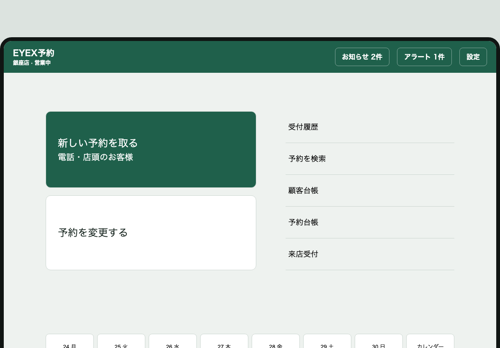
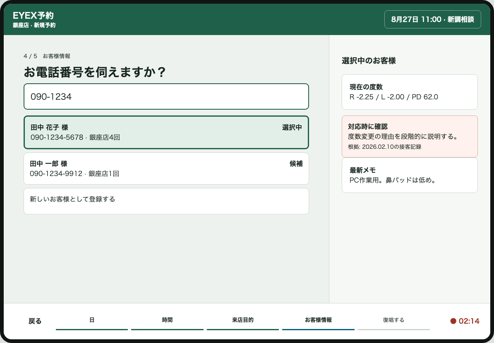
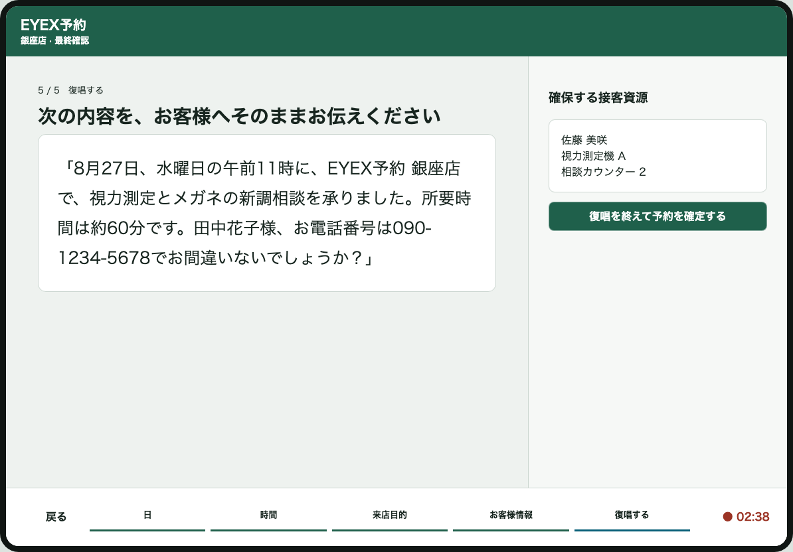
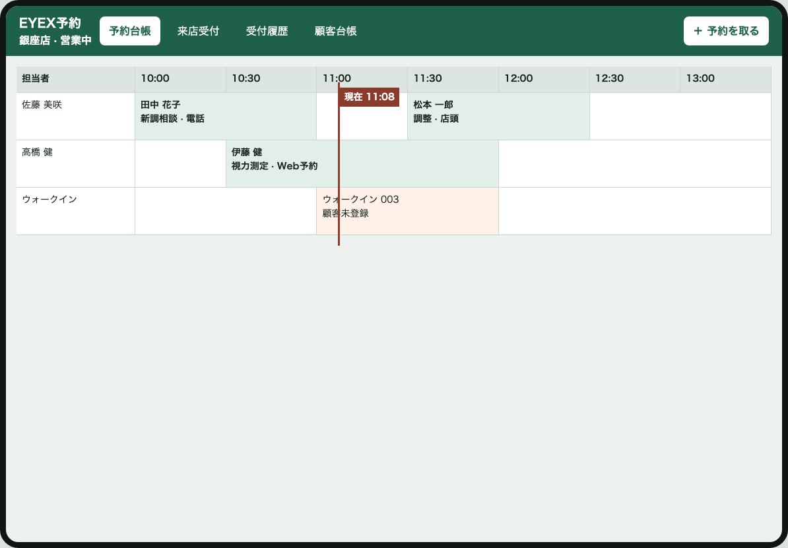
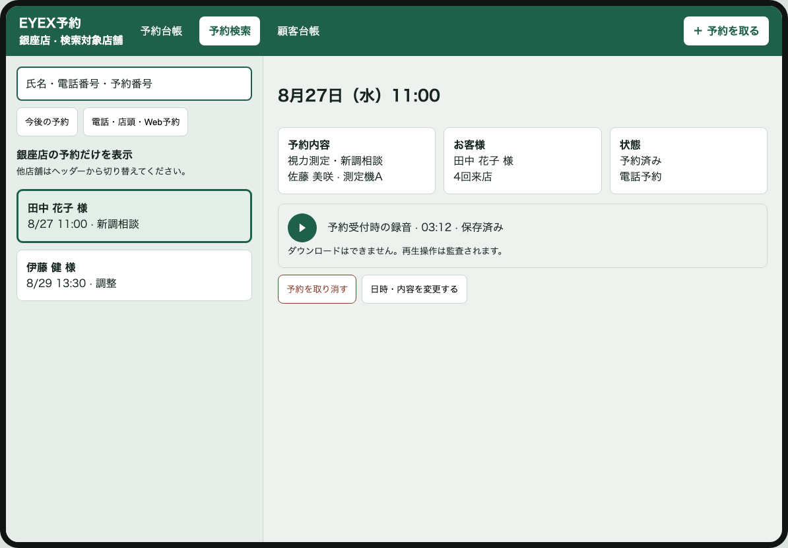

# EYEX予約 画面設計

- 更新日: 2026-08-26
- 対象: `services/glasses_reservation`
- 状態: 中核画面の方向性は人間承認済み。監査で判明した管理画面・例外状態・アクセシビリティ証跡を追加中のため、全画面承認済みとは扱わない。店舗間送客・横断空き枠検索は対象外。

## 1. 設計の基準

EYEX予約は、複数店舗を持つ眼鏡店チェーンの店舗スタッフが、横向きiPadから電話・店頭予約を
すばやく正確に登録するためのサービスである。顧客向けWeb予約も同じ予約枠を利用するが、
店舗スタッフ向け画面を第一優先とする。

TORETAの外観を複製せず、次のUX原則を取り込む。

1. トップ画面で、最頻操作を説明なしに選べる。
2. 電話の会話順に画面が進み、スタッフが表示文をそのまま読み上げられる。
3. 入力領域、顧客・予約の補助情報、現在の工程、録音状態を同時に見せる。
4. 予約登録と顧客台帳への情報蓄積を分断しない。
5. Web予約、電話予約、店頭予約を同じ空き枠・予約台帳へ集約する。

## 2. 承認済み画面

- 操作モック: [`approved.html`](../../../../../docs/frontend/mockups/eyex-reservation/approved.html)
- モック資産台帳: [`README.md`](../../../../../docs/frontend/mockups/eyex-reservation/README.md)

- スタッフ画面モック: [`staff-approved.html`](../../../../../docs/frontend/mockups/eyex-reservation/staff-approved.html)

### 2.1 トップ

目的は、スタッフが電話を受けた直後に迷わず予約受付を開始できること。一般的なダッシュボードや
集計値を先に見せず、操作の入口を中心にする。

#### 情報構造

- 上部: EYEX予約、選択中の店舗、店舗の営業状態、お知らせ、アラート、ヘルプ、設定。
- 左の主操作:
  - `新しい予約を取る` — 電話または店頭予約を開始する。
  - `予約を変更する` — 既存予約の変更・取消・再調整を開始する。
- 右の副操作:
  - `受付履歴` — 当日受け付けた予約を時系列で確認する。
  - `予約を検索` — 氏名、電話番号、日時、予約番号から予約を探す。
  - `顧客台帳` — 来店記録、眼鏡情報、接客メモを確認する。
- 下部: 前後3日を含む日付ストリップとカレンダー。

#### 操作要件

- `新しい予約を取る` を最も目立つ位置に置く。
- 主操作は説明文を含めても1タップで開始できる。
- 店舗切替後も、選択店舗と営業状態を上部に常時表示する。
- 日付を選ぶと、その日の予約台帳へ移動する。
- 横向きiPadを基準とし、主要タップ領域は44pt以上にする。

### 2.2 予約入力フロー

順序は固定する。

1. 日
2. 時間
3. 来店目的
4. お客様情報
5. 復唱する

下部の工程ナビゲーションに5段階を常時表示し、完了済み、現在、未完了を色だけに依存せず
位置と文言でも区別する。戻る操作では入力済みの内容を保持する。

会話順は変更しない。時間工程で選ぶのはお客様の希望時刻であり、確定済みの資源枠ではない。
来店目的を選択した直後に、所要時間、必要技能、設備、同時受付数を使って受付可否を再検証する。
希望時刻を確保できない場合は、日・希望時刻・入力済み内容を保持し、同一店舗の代替時刻を提示する。

#### 読み上げ文言

画面の質問はシステムの説明ではなく、スタッフが電話口でそのまま発話できる文章にする。

| 工程 | 主文言 | 補足 |
|---|---|---|
| 日 | ご来店予定の日を伺えますか？ | 今日から予約可能期間内の日付を表示する。 |
| 時間 | ご来店予定の時刻を伺えますか？ | 選択日で受付可能な時間だけを有効にする。 |
| 来店目的 | 今回のご来店目的を伺えますか？ | 視力測定、新調相談、フレーム・レンズ相談、調整、修理、受取、補聴器相談など。 |
| お客様情報 | お電話番号を伺えますか？ | 入力途中から既存顧客候補を表示する。 |
| 復唱する | 次の内容を、お客様へそのままお伝えください | 完全な文章を表示し、読み上げを録音する。 |

### 2.3 お客様情報

#### 電話番号検索

- 電話番号は数字の入力途中から検索する。
- 表示上は読みやすい形式へ整形するが、検索時はハイフンの有無を区別しない。
- 候補には氏名、完全な電話番号、主利用店舗、来店回数を表示する。
- 候補が複数ある場合、システムが勝手に確定しない。スタッフが選択する。
- 該当者がいない場合は `新しいお客様として登録する` を表示する。
- 同一人物と思われる重複候補は、この画面で自動統合しない。

#### 顧客選択後の右パネル

顧客を選択すると、予約入力を維持したまま右側へ次を表示する。

- 氏名、電話番号、来店回数、最終来店日、主利用店舗。
- 最近の来店履歴。店舗をまたぐ履歴も表示する。
- 次回接客に有用なメモ。生活用途、説明方法、フィッティング傾向など。
- 対応時の注意事項。

注意事項は単に `要注意人物` と断定表示しない。対応に必要な具体的事実、記録者、記録日を表示し、
人格評価、曖昧な評判、差別につながる属性は記録対象にしない。閲覧・登録・公開・改訂・非表示化の
権限は設定画面で組織共通または店舗別に管理し、すべての操作を監査する。

### 2.4 iPadマイク録音

録音対象は電話回線ではなく、予約受付中にiPadのマイクが取得する周囲音である。主目的は、
スタッフが予約内容を復唱した証跡を残し、聞き間違いによる予約事故を確認できるようにすること。
録音の主対象は固定電話で話す店員の復唱であり、電話回線から相手方音声を直接取得しない。ただし、
iPadの環境マイクには店内の周囲音が混入し得るため、録音を公開情報として扱わず、目的外利用を禁止する。

#### 表示要件

- 予約フロー中は録音中であること、録音点、経過時間を常時表示しない。限られたiPad画面では、質問文と入力を優先する。
- マイク権限がない場合は、録音できない理由と設定方法を表示する。
- 録音停止・中断・保存失敗は、予約確定前に明示する。
- マイク権限拒否・録音保存失敗など、スタッフの回復操作が必要な異常時だけ理由と次の操作を表示する。

#### 録音範囲と保存

- 予約受付開始から復唱終了までを1つの受付・録音セッションとして扱う。受付セッションは予約成立前から存在し、予約を破棄しても識別できる。
- 復唱画面も通常の録音状態表示を設けず、確定後に保存状態を確認できるようにする。
- 予約確定時に録音を停止し、予約と関連付ける。
- 成立した予約の録音は録音完了から最低30日間保持する。
- 予約受付を破棄した場合も、録音終了から最低24時間保持する。
- 最低保持期間中は通常削除と手動削除を許可しない。期間経過後は運用設定に従って削除可能とする。
- 90日などの実保存期間は運用設定として変更可能にするが、削除日を保証する契約値として扱わない。
- 録音本体は公開URLを持たない専用のCloudflare R2 Object Storageへ保存する。
- D1には音声本体を入れず、受付セッションID、任意の予約ID、組織ID、店舗ID、録音主体、開始・終了時刻、終了理由、長さ、MIME type、
  byte数、R2 object key、保存状態、保持期限、削除状態を保持する。
- object keyは推測可能な氏名・電話番号を含めず、組織スコープとランダムIDから構成する。
- 再生は認証・組織・店舗・ロールを検証した短期限アクセス、またはWorker経由のストリーミングとし、
  R2バケットを公開しない。
- 保存時暗号化と通信時TLSを前提とし、再生・削除・保持延長を監査記録へ残す。
- R2 Lifecycleによる期限削除と、D1側の削除予定・削除結果の照合を行う。
- 録音保存失敗時は予約の成立状態と録音状態を分離し、`録音を保存できていません` と再試行状況を表示する。
- 選択中店舗の全スタッフが録音を再生できる。店舗管理者以上だけが理由付きで保全指定と解除を行える。
- 保全指定中は最低保持期間経過後も削除しない。解除時点で通常の削除条件を満たす場合は削除対象へ戻す。
- 音声ファイルのダウンロード機能は提供しない。再生、保全指定、解除、削除を監査記録へ残す。
- 顧客向けの録音同意フローは設けない。

### 2.5 復唱する

復唱画面は、入力項目の一覧ではなく、スタッフがそのまま読み上げられる一続きの文章を主役にする。

表示例:

> 8月27日、水曜日の午前10時30分に、EYEX予約 銀座店で、視力測定とメガネの新調相談を
> 承りました。所要時間は約60分です。田中花子様、お電話番号は090-1234-5678で
> お間違いないでしょうか？

#### 動作要件

- 日時は曜日、午前・午後を含む自然な日本語へ変換する。
- 店舗名、来店目的、所要時間、氏名、電話番号を必ず含める。
- 入力不足がある場合は復唱工程へ進めない。
- スタッフが復唱を終え、内容に誤りがないことを確認してから `復唱を終えて予約を確定する` を押す。
- 確定時は、スタッフ・設備・所要時間を含む予約資源を再検証する。
- 他の予約により枠が失われた場合は確定せず、入力内容を保ったまま代替時間を提示する。

### 2.6 予約台帳

#### 目的

電話、店頭、Web、ウォークインの予約を同じ時間軸で確認し、現在の店舗がこれから受け入れられる
お客様と、確認が必要な予約を一目で判断する。

#### 表示

- 日付、今日へ戻る操作、担当者・設備の表示切替。
- 担当者ごとの予約ブロック。氏名、来店目的、時間、予約元を表示する。
- 担当未定、設備未確保、Web予約確認待ち、顧客未登録を通常予約と区別する。
- 当日のみ `現在 HH:mm` 付きの現在時刻ラインを表示する。
- 予約またはウォークインを選択すると、台帳を隠さず右側の詳細だけを更新する。

#### ウォークイン

- `ウォークイン <当日連番>` を仮識別子とする。
- 顧客未登録、来店目的、受付時刻、現在の担当・工程を表示する。
- 詳細から `氏名・電話番号から既存顧客を探す` と `新しい顧客として登録する` を実行できる。
- 顧客を関連付けると、ウォークインの来店・接客履歴を顧客台帳へ移さず参照関係で保持する。
- 顧客を登録しないまま退店しても履歴を削除しない。

#### 状態

- 予約済み、来店済み、取消、無断キャンセル。
- ウォークイン顧客未登録、既存顧客紐付け済み、新規顧客登録済み。
- 担当未定、設備未確保、確認待ち、競合。
- 営業時間外、担当者休憩、設備停止。
- 当日、過去日、未来日。

### 2.7 予約検索・変更

#### 検索

- 単一検索欄で氏名、氏名かな、電話番号、予約番号を検索する。検索対象は常に選択中店舗へ固定する。
- プレースホルダーは `氏名・電話番号で検索` とする。
- 電話番号はハイフン、空白、全角・半角を正規化する。
- 氏名は空白の有無とかな表記を許容する。部分一致は候補として表示し、勝手に確定しない。
- 今後の予約、期間、予約元、状態で絞り込める。店舗を変更するフィルターは置かず、他店舗はヘッダーから明示的に切り替える。
- 結果一覧と選択中の予約詳細を同時に表示する。

#### 予約詳細と録音

- 日時、店舗、来店目的、顧客、担当、設備、予約元、受付者、更新履歴を表示する。
- iPad録音がある場合、録音日時、録音者、長さ、再生位置を表示する。
- 再生、一時停止、シーク、再生速度変更、音量調整を提供する。
- 録音がない予約にはプレイヤーを表示せず、`録音なし` と理由を表示する。
- 閲覧権限のない利用者には録音の存在と操作を表示しない。

#### 変更・取消

- `日時・内容を変更する` を主操作とする。
- 変更時は元の予約を保持したまま代替枠を探し、新しい枠の確保に成功してから切り替える。
- 取消は理由と確認を必須とし、録音、変更前内容、実行者、実行日時を監査履歴へ残す。
- 競合時は変更前の予約を失わず、代替候補を提示する。

### 2.8 顧客台帳

#### 初期表示の優先順位

1. 現在有効な度数。左右、PD、ADD、測定日、測定店舗、記録者。
2. 最新の顧客メモ。生活用途、フィッティング傾向、説明方法。
3. 現在保有するメガネ。用途、作成日、保証、最終調整。
4. 根拠、記録者、記録日を持つ対応上の注意事項。
5. 時系列の接客・来店履歴。

#### 検索と履歴

- 氏名、氏名かな、電話番号で検索する。
- 店舗をまたぐ顧客情報を、権限のあるスタッフが同一画面で確認できる。
- 現在値と過去値を明確に分け、古い度数を現在値として表示しない。
- 来店履歴には店舗、担当者、来店目的、測定、調整、メモ、関連予約を表示する。
- 度数は眼鏡作製の補助情報であり、診断・電子カルテとして扱わない。

### 2.9 来店受付・接客進捗

#### 目的

予約・ウォークインの受付後に、お客様がどの工程にいて、誰が次に対応し、どのくらい待っているかを
店舗全員で共有する。

#### 表示と操作

- 左側に店内のお客様を表示し、受付からの経過時間を常時更新する。
- 主領域は受付・相談、フレーム、視力測定、レンズ・調整の工程別に表示する。
- 各工程へ担当者、開始時刻、経過時間、必要設備を表示する。
- `次にご案内` と引き継ぎメモを明示する。
- 工程開始、完了、差戻し、担当変更、設備変更を記録する。
- 予約時の想定工程と実際の工程を分離し、変更を許容する。
- 長時間待機、担当不在、設備停止を警告する。

## 3. 視覚・iPadOS要件

- 題材: 検眼機器の清潔感と、受付で迷わない業務道具。
- Lens green `#286B55`: ブランド、主要ナビゲーション、確定操作。
- Exam white `#F7F8F6`: 作業面。
- Measurement cyan `#31ABD0`: 現在の工程、次へ進む操作。
- Adjustment coral `#EE654F`: 予約変更など、主予約とは異なる操作。
- Attention red `#B74834`: 根拠のある注意情報と破壊的操作に限定。
- 本文: IBM Plex Sans JP。
- 時刻・電話番号・経過時間: IBM Plex Mono。
- 角丸は操作部品に限定し、同一画面で過剰なカード分割をしない。
- 画面遷移で台本、録音状態、入力済み予約条件の位置を安定させる。
- タッチ、物理キーボード、トラックパッドで操作可能にする。
- Dynamic Type相当の文字拡大、WCAG AA、可視フォーカスを満たす。

## 4. 状態設計

承認済み画面の実装時は、静的モックに加えて次を用意する。

- 初期状態。
- 入力途中。
- 候補0件、1件、複数件。
- 新規顧客。
- 顧客選択済み。
- 注意事項あり・なし。
- マイク権限確認中、録音中、一時停止、権限拒否、保存失敗。
- 予約枠競合、代替枠あり・なし。
- オフラインまたは一時的な通信失敗。
- iPad横向きフルスクリーン、Split View縮小幅、375px以上のWeb表示。

## 5. 画面設計一覧

次の画面はすべて承認済みの視覚語彙と操作原則を継承する。

1. 受付履歴。
2. 複数店舗切替。
3. 顧客向けWeb予約。
4. 店舗・サービス・スタッフ・設備設定。
5. 分析。

### 受付履歴

操作モック: [`reception-history-approved.html`](../../../../../docs/frontend/mockups/eyex-reservation/reception-history-approved.html)

- 予約台帳の予約日時順とは分け、受付、変更、取消、ウォークイン受付が発生した順に表示する。
- 氏名、電話番号、予約番号で検索し、受付経路、操作種別、要確認状態で絞り込む。
- 一覧と選択イベントの予約内容、顧客、受付者、iPad録音、変更履歴を同時表示する。
- `要確認` フィルターは提供するが、問題のない受付イベントも履歴から削除しない。
- Web予約、電話、店頭、ウォークイン、変更、取消を経路・操作種別として明示する。

## 5.1 次回レビュー対象の共通ユースケース

### 複数店舗切替

操作モック: [`store-switch-approved.html`](../../../../../docs/frontend/mockups/eyex-reservation/store-switch-approved.html)

- 複数店舗を担当するスタッフは、権限のある店舗へ作業対象を明示的に切り替えられる。
- 切替候補には店舗名、営業状態、運用警告を表示する。他店舗の空き枠数、空き時刻、担当者、設備状況は表示しない。
- 店舗横断の空き枠検索、空き枠比較、他店舗候補の自動提示、店舗間送客フローは作らない。
- 他店舗の予約を扱う場合は、その店舗へ切り替えた後、その店舗の予約台帳・予約入力から操作する。
- 店舗切替時に、検索条件、選択予約、入力中の予約内容を別店舗へ自動で持ち越さない。
- 未保存入力がある場合は切替を止め、現在店舗で続けるか破棄するかを明示的に選ばせる。
- 切替後は上部バー、予約台帳、予約入力、顧客台帳、分析に選択店舗名を表示する。
- 店舗切替の実行者、切替元、切替先、日時を監査記録へ残す。
- 店舗切替の入口は、全スタッフ画面のヘッダーにある選択店舗名とする。
- 店舗候補はポップオーバーで表示し、専用の店舗選択画面を通常フローへ挟まない。

### 顧客向けWeb予約

操作モック: [`web-booking-complete-approved.html`](../../../../../docs/frontend/mockups/eyex-reservation/web-booking-complete-approved.html)

- 店舗選択、来店目的、日時、お客様情報、確認、完了の短い流れとする。
- スマートフォンを第一基準とし、顧客には社内用語、技能名、設備名、予約資源を見せない。
- 満席時は空のカレンダーだけを見せず、選択店舗の前後日時と別日候補を提示する。他店舗の空きは混在させない。
- Web予約では音声録音を行わず、同意文面の版、同意日時、入力・確定履歴を保持する。
- 二重送信を防ぎ、成立不明時は予約番号検索や問い合わせ先を案内する。
- 変更・取消は本人確認後に自分の予約だけを対象とする。
- 情報構造は一問一答とし、`来店目的 → 日時 → お客様情報 → 確認 → 完了` の順に進む。
- 現在の店舗と選択済み内容を予約しおりとして常時表示する。
- 空き枠一覧表を最初から見せず、来店目的と所要時間を確定してから日時を表示する。

### 設定

設計画面: [`settings-complete-approved.html`](../../../../../docs/frontend/mockups/eyex-reservation/settings-complete-approved.html)

SP設計画面: [`settings-responsive-approved.html`](../../../../../docs/frontend/mockups/eyex-reservation/settings-responsive-approved.html)

- 設定対象を店舗、来店目的、スタッフ、設備、予約ルールに分ける。
- 全店共通値と店舗上書きを同じ画面で混同させず、適用元を明示する。
- 設定変更前に影響する未来予約、公開中のWeb枠、競合件数を表示する。
- 下書き、公開待ち、公開済み、公開予約、競合ありを区別する。
- 営業時間外のシフト、技能不足、設備停止と予約枠公開などの矛盾を保存前に示す。
- 初回設定と大きな変更は、`店舗と営業時間 → 来店目的 → スタッフと技能 → 設備と点検 → Web予約公開 → 影響確認と公開` の順に進む。
- 各工程の完了・編集中・未完了を左側に常時表示する。
- 日常修正では設定一覧から対象へ直接移動でき、ガイドを最初からやり直す必要はない。
- 来店目的の編集画面で、顧客向けWeb予約に表示される文言と所要時間をプレビューする。
- SPでは6工程を `○—○—○—○—○—○` の丸と線でヘッダー直下へ常時固定表示する。
- 工程は `店舗 → 目的 → スタッフ → 設備 → Web予約 → 確認` とし、略語の `Web` だけでは表示しない。
- `現在工程 / 全6工程` と残り工程数を併記する。完了はチェック、現在は塗りつぶし、未完了は白い丸で示す。
- SPの編集項目は1列化し、プレビューと公開前の影響確認は下部シート、保存・次へは画面下部固定とする。

#### 標準来店目的テンプレート

| スタッフ向け名称 | 顧客向け文言 | 初期所要時間 | 初期技能 | 初期設備 | Web初期値 |
|---|---|---:|---|---|---|
| 視力測定・新調相談 | メガネを新しく作りたい | 60分 | 眼鏡作製技能 | 視力測定機・相談席 | 公開 |
| フレーム・レンズ相談 | フレームやレンズを相談したい | 30分 | 接客 | 相談席 | 公開 |
| フィッティング調整 | 今のメガネを調整したい | 20分 | 調整 | 調整台 | 公開 |
| 修理相談 | メガネの修理を相談したい | 30分 | 修理受付 | 調整台 | 公開 |
| メガネ受取 | 完成したメガネを受け取りたい | 20分 | 受渡・調整 | 調整席 | 公開 |
| 視力測定のみ | 視力を測りたい | 45分 | 眼鏡作製技能 | 視力測定機 | 非公開 |
| 補聴器相談 | 補聴器について相談したい | 90分 | 補聴器対応技能 | 防音室 | 非公開 |

この表は新規店舗へ提示する初期テンプレートであり、全店共通設定または店舗別上書きで変更できる。
来店目的を非公開・無効化しても既存予約と履歴は削除しない。

#### Web予約設定

- 店舗単位で非公開、公開予約、公開中、受付停止を設定する。
- 公開開始日時、受付終了日時、公開する来店目的、曜日・時間帯を設定する。
- 予約可能日数、直前受付期限、顧客による変更・取消期限を設定する。
- 店舗名、アクセス、電話番号、顧客向け注意事項をプレビューする。
- 公開前に、受付可能枠、営業時間外、技能不足、設備不足、既存予約との競合を確認する。
- 受付停止は新規Web予約だけを止め、成立済み予約を取り消さない。

#### 顧客情報・注意事項設定

- 注意事項の権限は組織共通値を初期値とし、許可された店舗だけ店舗別に上書きできる。
- 閲覧、登録、公開、改訂、非表示化の各操作について、スタッフ、店舗管理者、エリア責任者、
  本部管理者のロール単位で許可を設定する。
- 登録方式は `即時公開` または `管理者確認後に公開` から選択する。
- 共有範囲は権限店舗だけ、またはチェーン全体から選択する。共有範囲にかかわらず、利用者自身の
  店舗・顧客閲覧権限を越えて表示しない。
- 初期値は、全スタッフが公開済み情報を閲覧し、確認待ちで登録でき、店舗管理者以上が公開・改訂・
  非表示化できる構成とする。
- 閲覧、登録、公開、改訂、非表示化の監査は無効化できない。
- 公開済みの本文は直接上書きせず、改訂版を作成する。削除ではなく非表示化し、過去版を監査目的で保持する。
- 入力フォームは発生した事実、発生日時、根拠、推奨対応を必須とし、人格評価、憶測、差別につながる
  属性を記録しないよう案内する。
- 完全共有モードでは閲覧と確認待ち登録までを許可できるが、公開・改訂・非表示化には管理者の個人認証を必須とする。

### 分析

操作モック: [`analytics-approved.html`](../../../../../docs/frontend/mockups/eyex-reservation/analytics-approved.html)

- 売上ダッシュボードではなく、予約・来店運用の改善判断を主目的とする。
- 予約数、来店率、取消、無断キャンセル、待ち時間、工程所要時間を扱う。
- 指標ごとに定義、期間、JST基準、最終更新、集計対象を確認できる。
- 店舗間比較は規模差を考慮し、件数と率を併記する。
- 個人評価へ短絡しないよう、小標本や権限外の個人内訳を表示しない。
- KPIカードを並べず、指標を一つ選んで時間帯・工程・原因候補の順に掘り下げる。
- 主指標には比較期間、目標、対象件数を併記する。
- 原因候補は断定せず、根拠となる対象件数と確認先を表示する。

## 6. スタッフ画面レビューで確定した追加要件

### 6.1 ウォークインと顧客情報の後入力

- 予約なしの来店者は、受付順に `ウォークイン <連番>` の仮識別子を発行する。
- 顧客情報が未入力でも、来店受付と接客開始を妨げない。
- 台帳のウォークイン行、来店受付画面、未登録一覧に `顧客未登録` を表示する。
- ウォークインカードの詳細から、氏名・電話番号による既存顧客検索、または新規顧客登録を行う。
- 既存顧客を選択すると、仮識別子の来店・接客記録をその顧客へ関連付ける。
- 顧客情報を登録せず退店することは許可するが、未登録の事実と対応履歴は残す。
- 後から顧客を関連付ける操作には、実行者・日時・変更前後を監査履歴として残す。

### 6.2 予約台帳の現在時刻

- 当日の台帳には、時刻グリッドの該当位置を通る `現在 HH:mm` 付きの縦線を表示する。
- ラインには `現在 HH:mm` を表示し、色だけで現在位置を表現しない。
- 過去日・未来日の台帳には現在時刻ラインを表示しない。
- 時刻更新で予約カードの選択やスクロール位置を失わない。

### 6.3 予約検索と録音再生

- 予約検索の単一検索欄で、氏名、氏名かな、電話番号、予約番号を検索できる。
- 電話番号はハイフンと全角・半角の差を正規化して検索する。
- iPad録音が関連付いた予約は、予約詳細で録音日時、録音者、長さ、再生位置を表示する。
- 再生、一時停止、シーク、再生速度変更、音量調整をキーボードとタッチで操作できる。
- 音声の読み込み・再生失敗時は、予約内容を隠さず回復方法を表示する。
- 選択中店舗の全スタッフが再生できる。再生者または完全共有端末、再生日時、対象予約を監査記録へ残す。

### 6.4 顧客台帳の初期表示

顧客を選択した直後は、履歴より上に現在有効な情報を表示する。

1. 現在の度数。左右、PD、ADD、測定日、測定店舗。
2. 最新の顧客メモ。用途、フィッティング傾向、説明方法など。
3. 現在保有しているメガネ。用途、作成日、保証・調整情報。
4. 根拠、記録者、記録日を持つ対応上の注意事項。
5. その下に時系列の接客・来店履歴。

古い度数は履歴として保持するが、現在有効な度数と視覚的に混同させない。度数情報は眼鏡作製の
補助情報であり、眼科の診断・電子カルテとして表示しない。

### 6.5 2026年版HIGの適用方針

- 横向きiPadでは、一覧・選択・詳細を同時に見せ、不要な全画面遷移とモーダルを減らす。
- 検索対象が左一覧の場合、検索欄をサイドバー上部に置く。
- ツールバーは左にナビゲーションと画面名、右に検索・追加などの主要操作をまとめる。
- 主要操作は44×44pt以上を標準とし、操作間隔も確保する。
- 選択状態は背景ハイライトと文言・境界の組み合わせで示す。
- タッチ、物理キーボード、トラックパッド、Dynamic Type相当の文字拡大へ対応する。
- ウィンドウ縮小時は、詳細パネル、補助列の順に折り畳み、主作業を最後まで維持する。
- Web実装ではiPadOSのネイティブ素材を偽装せず、階層、適応、入力方式、アクセシビリティの原則を適用する。

### 6.6 個人利用と完全共有iPad

EYEX予約は利用者を必ず個人へ帰属できるとは仮定せず、個人モードと完全共有モードを明確に分ける。

#### 個人モード

- スタッフ本人のアカウントでログインし、予約、顧客閲覧、設定変更などの操作主体を個人として記録する。
- オーナー、店舗管理者、エリア責任者、本部管理者も同じ個人アカウントモデルを用い、付与ロールで権限を決める。

#### 完全共有モード

- 店舗管理者が `銀座店 レジ横iPad` のような端末名で、iPadを店舗へ登録する。
- 予約受付、台帳閲覧、来店処理などの日常業務では、スタッフ選択やPIN入力を要求しない。
- 操作主体を個人へ推測せず、店舗、共有端末、日時、対象データを監査記録へ残す。録音者表示も共有端末名とする。
- 利用者は必要な場合だけスタッフを選択し、4〜6桁の個人PINでその操作セッションを個人モードへ切り替えられる。
- 無操作時は顧客情報を隠し、店舗の業務開始画面へ戻す。具体的な無操作時間はセキュリティ設定で変更可能にする。
- 共通パスワードは配布せず、管理者による端末登録で共有セッションを発行する。
- 店舗管理者は紛失・交換した端末の共有セッションを遠隔失効できる。失効端末は次の通信時に業務データへアクセスできない。

#### 個人認証が必要な操作

完全共有モードから次の操作を始める場合は、権限を持つ管理者の個人PINまたは個人ログインで再認証する。

- 注意事項の公開、改訂、非表示化。
- 録音の保全指定と解除。
- ロール、注意事項権限、店舗設定などの管理設定変更。

認証成功後の監査記録には共有端末と認証した個人の両方を残す。認証せずにこれらの操作を実行する経路は設けない。

## 7. 完成画面インベントリ

画面名だけで完成判定しない。各画面は通常、loading、empty、validation、403、409、network failure、stale dataのうち該当する状態を持ち、回復操作を必ず示す。

| 領域 | 必須画面・状態 | 主な反映先 |
|---|---|---|
| 共通 | 業務開始、個人ログイン、共有端末ロック、個人モード切替、再認証、通知センター | 全スタッフ画面 |
| 予約 | トップ、日、希望時刻、来店目的、顧客候補0/1/複数、新規顧客、復唱、競合、録音例外、完了 | 予約・録音・顧客 |
| 台帳 | 通常、ウォークイン未登録、後入力、担当/設備警告、現在時刻、同時更新 | 来店受付・顧客 |
| 検索 | 選択店舗固定検索、詳細、変更、取消、録音各状態、競合 | 予約台帳・監査 |
| 顧客 | 現在情報、履歴、編集、重複確認、統合、誤関連解除、注意事項 | 予約・来店受付 |
| Web予約 | 店舗検索、店舗詳細、目的、日時、顧客情報、確認、完了、本人確認、変更、取消、成立照会 | 選択店舗の台帳 |
| 店舗設定 | 営業時間、休業、臨時営業、来店目的、スタッフ、技能、勤務、設備、点検 | 空き枠・台帳・Web予約 |
| 公開管理 | 設定一覧、差分、影響予約、レビュー、公開予約、公開結果、部分再試行、版履歴、復元 | 全設定反映先 |
| Web予約設定 | 公開状態、公開期間、目的、曜日・時間、受付期限、変更取消期限、店舗情報プレビュー | 顧客向けWeb予約 |
| 顧客・注意事項設定 | 権限表、共有範囲、登録方式、確認待ち、公開、差戻し、却下、改訂、非表示 | 顧客候補・顧客台帳 |
| 端末・セキュリティ | 共有iPad登録・一覧・失効、無操作時間、PIN再設定 | 共有端末セッション |
| 録音運用 | 保存期間、保存失敗、保全一覧、保全・解除、削除予定・結果 | 予約詳細・受付履歴 |
| 監査 | 検索、イベント詳細、変更前後、主体・共有端末、相関ID | 全管理操作 |
| 分析 | 各指標、期間比較、空、欠損、小標本抑制、集計失敗 | 店舗改善 |

## 8. 設定の閉ループ

設定は入力して終わりにせず、次の一方向フローを正とする。

`編集 → 下書き → レビュー → 影響確認 → 公開予約または即時公開 → 実行前再検証 → 反映結果 → 監視 → 必要なら旧版から新規下書きを作成`

- 状態は `下書き / 確認待ち / 公開予約 / 公開中 / 受付停止` とする。
- `競合あり / 反映失敗 / 要再検証` は状態ではなく警告として併記する。
- 公開結果には版ID、対象店舗、成功・失敗、反映枠数、Web予約と台帳への反映時刻を表示する。
- 部分失敗は失敗店舗だけを同じ冪等キーで再試行する。
- ロールバックは過去版を直接再公開せず、過去版から新規下書きを作り、差分と影響を再確認する。
- 共通値を上書き中の店舗には適用元と差分を表示し、`共通値へ戻す` を明示操作として提供する。
- 未来予約への影響は、代替資源割当、例外維持、顧客連絡を予約単位で解消する。ブロッキング項目が残る間は公開しない。

### 8.1 設定の所有と反映先

| 設定 | スコープ | 主な編集者 | 反映先 | 復旧 |
|---|---|---|---|---|
| 営業時間・休業・受付停止 | 組織既定＋店舗上書き | 店舗管理者以上 | 予約日、希望時刻、Web枠、台帳警告 | 版復元 |
| 来店目的・文言・所要時間 | 組織既定＋店舗上書き | 店舗管理者以上 | 会話文、復唱、Web選択肢、空き枠 | 上書き解除・版復元 |
| 技能・勤務・休憩 | 店舗 | 店舗管理者以上 | 空き枠、担当候補、警告 | 版復元 |
| 設備・点検 | 店舗 | 店舗管理者以上 | 空き枠、台帳、来店進捗 | 版復元 |
| Web予約公開 | 店舗 | 店舗管理者以上 | 顧客Web、台帳 | 受付停止・版復元 |
| 注意事項権限 | 組織既定＋店舗上書き | 本部管理者 | 顧客候補、台帳、レビュー | 上書き解除・版復元 |
| 録音保存期間 | 組織既定＋店舗上書き | 本部管理者 | R2削除予定、録音運用 | 最低値検証・版復元 |
| 共有端末無操作時間 | 組織既定＋店舗上書き | 店舗管理者以上 | PIIマスク、業務開始画面 | 既定値へ戻す |
| 警告・通知条件 | 組織既定＋店舗上書き | 店舗管理者以上 | アラート、通知センター、分析 | 既定値へ戻す |

## 9. 状態機械と競合

### 9.1 予約と録音

- 予約受付: `入力中 → 再検証中 → 成立 / 破棄 / 成立不明`。
- 録音: `未確認 → 権限確認 → 録音中 → 停止 → 送信中 → 保存済み / 保存失敗 → 保全中 / 削除予定 → 削除済み`。
- 二つの状態は独立させ、予約成立後の録音保存失敗を予約取消として扱わない。
- マイク権限要求前に、スタッフへ取得目的、閲覧者、最低保持期間を短く説明し、明示操作でブラウザ権限要求を開く。
- 権限拒否時はSafari設定への回復導線と、店舗運用で録音なし予約を許すかを表示する。
- 顧客向け録音同意フローは作らない。ただしブラウザが表示するマイク利用インジケータを隠そうとしない。

### 9.2 同時編集

- 予約、顧客、ウォークイン、注意事項、設定は版番号を持つ。
- 古い版の保存は409として拒否し、最新値、自分の入力、差分を並べる。
- 利用者は自分の入力を破棄するか、最新値へ再適用する。
- 登録、変更、取消、録音メタデータ送信は冪等キーで重複を防ぐ。

### 9.3 一時通信失敗

- 予約入力の一時保持は端末、店舗、受付セッションへ限定し、別店舗へ持ち越さない。
- 共有端末ではブラウザ永続ストレージへ平文PIIを残さない。
- 共有セッション失効、明示破棄、保持期限到来を再送より優先する。
- 復帰時は枠、権限、顧客版、設定版を再検証する。

## 10. HIG・Webアクセシビリティ実装基準

- 操作可能要素はnativeのbutton、a、input、select、textareaを第一選択とする。
- 主要操作だけでなく全操作のhit areaを44×44 CSS px以上にし、隣接操作との間隔を確保する。
- 本文は原則16px相当以上とし、補助文字も固定7〜11pxにしない。remと利用者倍率を使う。
- 200%文字拡大時に固定高とoverflow hiddenで内容を切らない。3列は2列、1列へ順に再配置する。
- 全画面に論理的Tab順、可視focus、Enter/Space、Escape、フォーカス復帰を設ける。
- ステップはordered listと`aria-current=step`相当で伝え、完了、現在、未完了を文言でも示す。
- 通常文字はWCAG AA 4.5:1以上、UI境界と大文字は3:1以上を自動検査する。
- `#31ABD0`と`#EE654F`に白い通常文字を載せない。文字色または背景トークンをAAへ調整する。
- iPad横向き、Split View最小幅、Stage Manager、Display Zoom、Safe Area、物理キーボード、トラックパッドを検証する。
- 共有端末は`visibilitychange`相当の画面非表示時にPIIをマスクし、履歴、autocomplete、cacheへPIIを残さない。

## 11. スクリーンショット完成条件

- 合成overviewだけでなく、各画面を原寸の個別PNGとして保存する。
- 各PNGを `screen_id / state_id / UC / AC / viewport / source` で台帳化する。
- 主要画面は通常、empty、validation、403、409、network failureの該当状態を撮る。
- iPad業務画面は横向き通常、Split View、200%文字拡大、キーボードfocusを撮る。
- Web予約と設定は375pxを含むSP版を撮る。
- マイク権限、録音保存失敗、共有端末ロック、再認証は連続状態として撮る。
- 画像だけで検証できないVoiceOver、Tab順、Escape、フォーカス復帰はテスト記録を併記する。

## 12. 却下した方向

- 一般的な管理ダッシュボードをトップにする案。予約受付開始までの判断が増える。
- 顧客検索を最初に置く案。電話で自然に聞く日・時間・来店目的の順序と合わない。
- 担当者と設備を同じ行として重複表示するだけの予約台帳。眼鏡店の工程を表現できない。
- TORETAの配色・形状の完全模倣。操作原則だけを継承し、EYEX予約として設計する。
- 店舗を横断して空き枠を検索・比較し、選択中店舗のまま他店舗予約を入力する案。店舗境界と運用責任が曖昧になる。
